# Biplots in 1D

This vignette illustrates how to create one-dimensional biplot. The
biplotEZ vignette demonstrates many functions of the functions in the
package. The vignette will serve as a supplement to the biplotEZ
vignette.

## One-dimensional PCA biplot

One-dimensional PCA biplots are obtained by specifying `dim.biplot = 1`
in the call to [`PCA()`](../reference/PCA.md).

The one-dimensional representation of the data is displayed by the
colour points on the top horizontal line. The accompanying calibrated
variable axes are displayed as horizontal lines below. The variable name
is displayed on the side to which the variable increases.

[`biplot`](../reference/biplot.md)`(``iris``)`` ``|>`` `[`PCA`](../reference/PCA.md)`(``group.aes ``=`` ``iris``$``Species``,dim.biplot ``=`` ``1``)`` ``|>`` `[`plot`](https://rdrr.io/r/graphics/plot.default.html)`(``)`` ``#> Warning: The ggplot2 engine does not yet support 1D biplots; falling back to`` ``#> base graphics.`

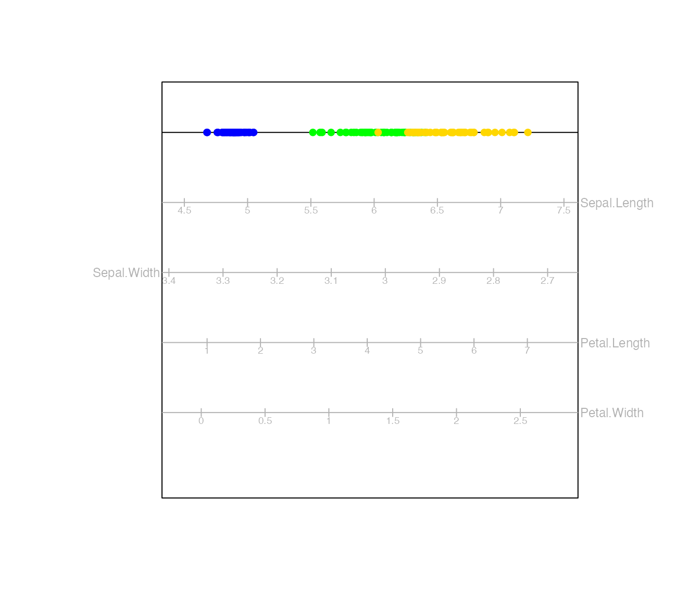

## One-dimensional CVA biplot

Similarly for a CVA 1d biplot, `dim.biplot = 1` is specified in the call
to [`CVA()`](../reference/CVA.md). The one-dimensioal CVA biplot
displays the one-dimensional linear combination that maximises the
between class variance, relative to the within class variance.

[`biplot`](../reference/biplot.md)`(``iris``)`` ``|>`` `[`CVA`](../reference/CVA.md)`(``classes ``=`` ``iris``$``Species``,dim.biplot ``=`` ``1``)`` ``|>`` `` `[`axes`](../reference/axes.md)`(``col``=``"black"``)`` ``|>`` `[`plot`](https://rdrr.io/r/graphics/plot.default.html)`(``)`` ``#> Warning: The ggplot2 engine does not yet support 1D biplots; falling back to`` ``#> base graphics.`

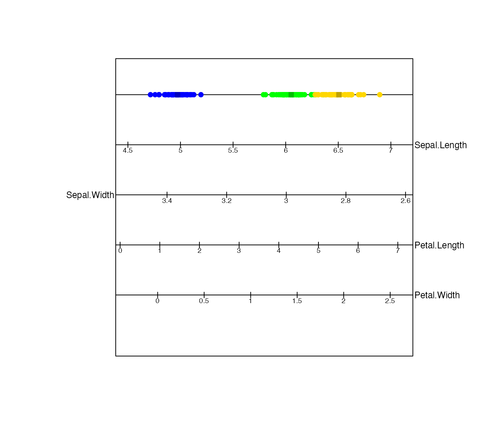

### Classification using `classify()`

CVA models can be employed as a classifier. New observations are
classified to the nearest class mean, where the means are indicated by
the shaded squares on the scatter line. The classification regions are
displayed above the scatter line using
[`classify()`](../reference/classify.md).

`bp`` ``<-`` `[`biplot`](../reference/biplot.md)`(``iris``)`` ``|>`` `[`CVA`](../reference/CVA.md)`(``classes ``=`` ``iris``[``,``5``]``,dim.biplot ``=`` ``1``)``|>`` `` `[`axes`](../reference/axes.md)`(``col``=``"black"``)`` ``|>`` `` `` `[`classify`](../reference/classify.md)`(``borders ``=`` ``TRUE``,opacity ``=`` ``1``)``|>`[`plot`](https://rdrr.io/r/graphics/plot.default.html)`(``)`` ``#> Warning: The ggplot2 engine does not yet support 1D biplots; falling back to`` ``#> base graphics.`

The [`print()`](https://rdrr.io/r/base/print.html) function provides the
misclassification rate, as well as the confusion matrix, of the CVA
classifier applied to the training data.

[`print`](https://rdrr.io/r/base/print.html)`(``bp``)`` ``#> Object of class biplot, based on 150 samples and 5 variables.`` ``#> 4 numeric variables.`` ``#> 1 categorical variable.`` ``#> 3 classes: setosa versicolor virginica `` ``#> `` ``#> Misclassification rate is 0.02 `` ``#> `` ``#> Confusion matrix `` ``#> Reference`` ``#> Prediction setosa versicolor virginica`` ``#> setosa 50 0 0`` ``#> versicolor 0 48 2`` ``#> virginica 0 1 49`

## One-dimensional CA biplot

Similarly for a CA 1d biplot, `dim.biplot = 1` is specified in the call
to [`CA()`](../reference/CA.md). The one-dimensional biplot is
constructed from the first columns of $`\mathbf{U\Lambda^\gamma}`$ and
\$&\mathbf{V\Lambda^{1-\gamma}}\$.

Consider the `HairEyeColor` example again as discussed in
`CA in biplotEZ`:

[`biplot`](../reference/biplot.md)`(``HairEyeColor``[``,,``2``]``, center ``=`` ``FALSE``)`` ``|>`` `[`CA`](../reference/CA.md)`(``variant ``=`` ``"Princ"``, `` `` dim.biplot``=``1``, lambda.scal ``=`` ``T``)`` ``|>`` `[`plot`](https://rdrr.io/r/graphics/plot.default.html)`(``)`` ``#> Warning: The ggplot2 engine does not yet support 1D biplots; falling back to`` ``#> base graphics.`

## The function `interpolate()`

[`interpolate()`](../reference/interpolate.md) allows for new
observations or axes to be added to the biplot.

### The function `newsamples()`

The process of adding new samples to the biplot, called interpolation
utilises the functions [`interpolate()`](../reference/interpolate.md)
and [`newsamples()`](../reference/newsamples.md). These functions work
in the same way as in the call to the two-dimensional biplot. The
function [`interpolate()`](../reference/interpolate.md) accepts the
argument `newdata` to specify a matrix or data frame containing the new
samples to be interpolated. The function
[`newsamples()`](../reference/newsamples.md) operates the same way as
[`samples()`](../reference/samples.md) in that the user can specify the
aesthetics of the interpolated samples.

[`biplot`](../reference/biplot.md)`(``iris``[`[`c`](https://rdrr.io/r/base/c.html)`(``1``:``50``,``101``:``150``)``,``1``:``4``]``)``|>`` `[`PCA`](../reference/PCA.md)`(``dim.biplot ``=`` ``1``)`` ``|>`` `[`axes`](../reference/axes.md)`(``col``=``"black"``)`` ``|>`` `` `` `[`interpolate`](../reference/interpolate.md)`(``newdata ``=`` ``iris``[``51``:``100``,``1``:``4``]``)`` ``|>`` `[`newsamples`](../reference/newsamples.md)`(``col``=``"purple"``)`` ``|>`` `[`plot`](https://rdrr.io/r/graphics/plot.default.html)`(``)`` ``#> Warning: The ggplot2 engine does not yet support 1D biplots; falling back to`` ``#> base graphics.`

### The function `newaxes()`

To interpolate new variables to the biplot, the function
[`interpolate()`](../reference/interpolate.md) and
[`newaxes()`](../reference/newaxes.md) are called. The function
[`interpolate()`](../reference/interpolate.md) accepts the argument
`newvariable` to specify a matrix or data frame of the same number of
rows in the data specified in [`biplot()`](../reference/biplot.md)
containing the new variables to be interpolated. The function
[`newaxes()`](../reference/newaxes.md) allows the user to specify the
aesthetics of the interpolated variables.

[`biplot`](../reference/biplot.md)`(``iris``[``,``1``:``3``]``)``|>`` `[`PCA`](../reference/PCA.md)`(``dim.biplot ``=`` ``1``)`` ``|>`` `[`axes`](../reference/axes.md)`(``col``=``"black"``)`` ``|>`` `` `` `[`interpolate`](../reference/interpolate.md)`(``newvariable ``=`` ``iris``[``,``4``]``)`` ``|>`` `` `` `[`newaxes`](../reference/newaxes.md)`(``col``=``"darkred"``,X.new.names ``=`` ``"Petal.Width"``)`` ``|>`` `[`plot`](https://rdrr.io/r/graphics/plot.default.html)`(``)`` ``#> Warning: The ggplot2 engine does not yet support 1D biplots; falling back to`` ``#> base graphics.`

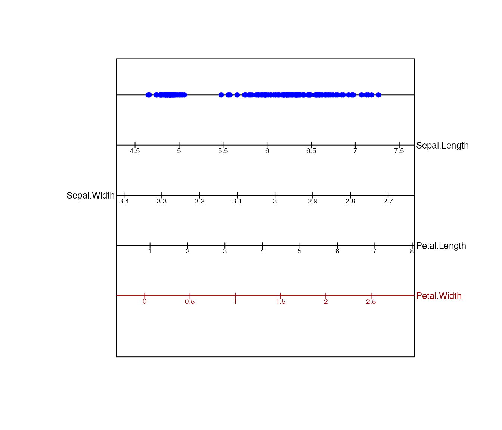

## The function `prediction()`

### Predicting Samples

To add the prediction of samples on the biplot, the
[`prediction()`](../reference/prediction.md) function is used. The
`predict.samples` argument takes in a vector indicating either the row
numbers of the samples to predict or set to TRUE indicating to predict
all samples. In the example below, the predictions for samples 100 to
150 are shown. The aesthetics for the display of the predictions are
arguments in the [`axes()`](../reference/axes.md) function:
`predict.col` and `predict.lwd`.

[`biplot`](../reference/biplot.md)`(``iris``)`` ``|>`` `` `` `[`PCA`](../reference/PCA.md)`(``group.aes ``=`` ``iris``$``Species``,dim.biplot ``=`` ``1``,show.class.means ``=`` ``TRUE``)`` ``|>`` `` `` `[`axes`](../reference/axes.md)`(``col``=``"black"``,predict.col ``=`` ``"darkred"``)`` ``|>`` `` `` `[`prediction`](../reference/prediction.md)`(``predict.samples``=``100``:``150``)`` ``|>`` `[`plot`](https://rdrr.io/r/graphics/plot.default.html)`(``)`` ``#> Warning: The ggplot2 engine does not yet support 1D biplots; falling back to`` ``#> base graphics.`

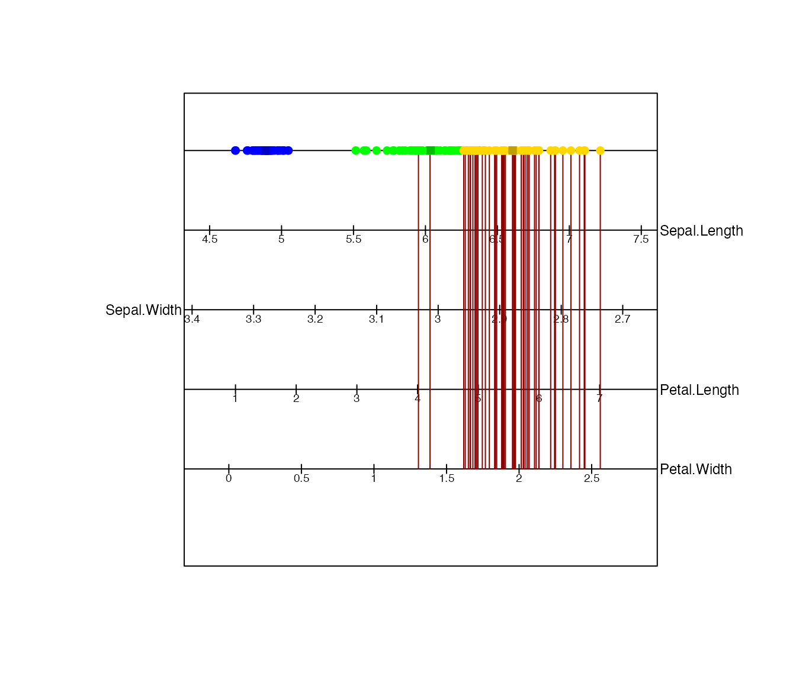

### Predicting Group Means

Similarly, to add the prediction of group means, the function
[`prediction()`](../reference/prediction.md) is used. The argument
`predict.means` takes in a vector specifying which group means to
predict. In the example below, only the first group means is predicted.
Important to note that the argument `show.class.means` must be set to
TRUE in the [`PCA()`](../reference/PCA.md) function.

[`biplot`](../reference/biplot.md)`(``iris``)`` ``|>`` `` `` `[`PCA`](../reference/PCA.md)`(``group.aes ``=`` ``iris``$``Species``,dim.biplot ``=`` ``1``,show.class.means ``=`` ``TRUE``)`` ``|>`` `` `` `[`axes`](../reference/axes.md)`(``col``=``"black"``,predict.col ``=`` ``"darkred"``)`` ``|>`` `[`means`](../reference/means.md)`(``label``=``TRUE``,which``=``1``:``3``)``|>`` `` `[`prediction`](../reference/prediction.md)`(``predict.means ``=`` ``1``)`` ``|>`` `[`plot`](https://rdrr.io/r/graphics/plot.default.html)`(``)`` ``#> Warning: The ggplot2 engine does not yet support 1D biplots; falling back to`` ``#> base graphics.`

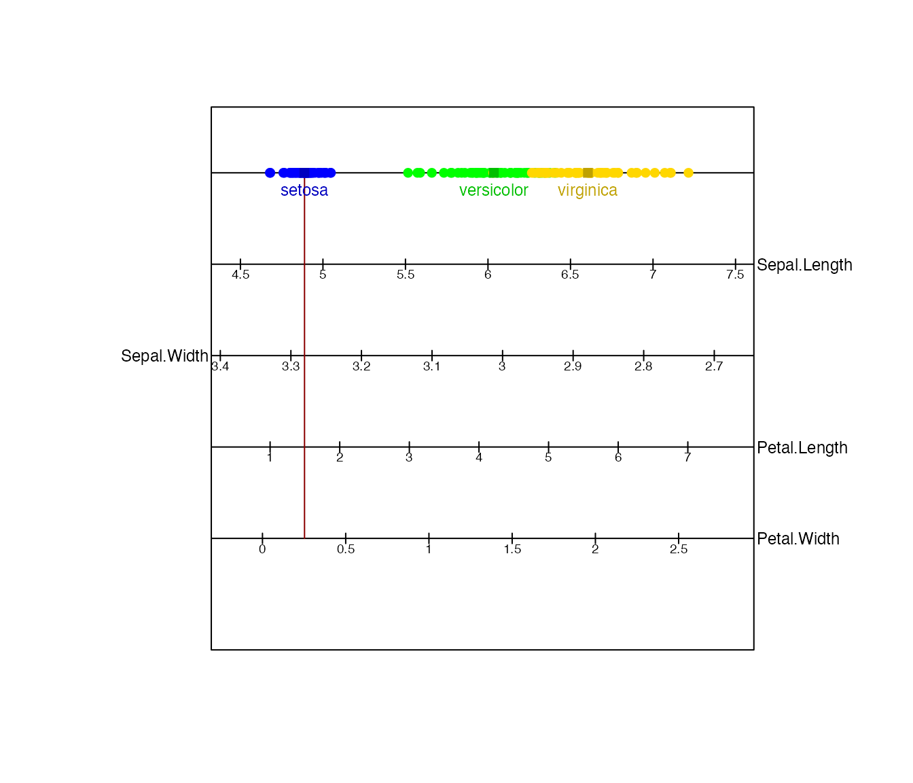

## Ellipses and Alpha bags

Ellipses are added to a 1d biplot using the
[`ellipses()`](../reference/ellipses.md) function which works in the
same way as a 2d biplot. In one dimension concentration ellipses are
simply a confidence interval. The concentration interval is indicated
using rectangles spanning the range of the interval.

[`biplot`](../reference/biplot.md)`(``iris``)`` ``|>`` `[`PCA`](../reference/PCA.md)`(``group.aes ``=`` ``iris``[``,``5``]``,dim.biplot ``=`` ``1``)`` ``|>`` `` `` `[`axes`](../reference/axes.md)`(``col``=``"black"``)`` ``|>`` `` `` `[`ellipses`](../reference/ellipses.md)`(``)`` ``|>`` `[`plot`](https://rdrr.io/r/graphics/plot.default.html)`(``)`` ``#> Computing 1.96 -ellipse for setosa `` ``#> Computing 1.96 -ellipse for versicolor `` ``#> Computing 1.96 -ellipse for virginica`` ``#> Warning: The ggplot2 engine does not yet support 1D biplots; falling back to`` ``#> base graphics.`

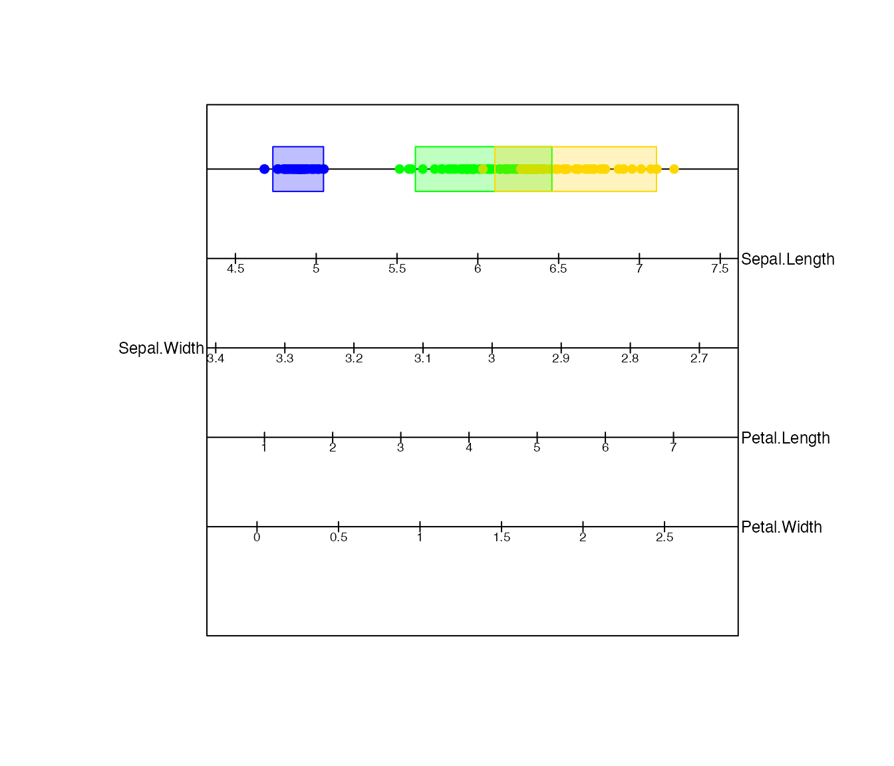

The one-dimensional representation of an Alpha bag will simply be an
empirical interval. The empirical interval is indicated using rectangles
spanning the range of the interval.

[`biplot`](../reference/biplot.md)`(``iris``)`` ``|>`` `[`PCA`](../reference/PCA.md)`(``group.aes ``=`` ``iris``[``,``5``]``,dim.biplot ``=`` ``1``)`` ``|>`` `` `` `[`axes`](../reference/axes.md)`(``col``=``"black"``)`` ``|>`` `` `` `[`alpha.bags`](../reference/alpha.bags.md)`(``alpha ``=`` ``0.7``)`` ``|>`` `[`plot`](https://rdrr.io/r/graphics/plot.default.html)`(``)`` ``#> Computing 0.7 -bag for setosa `` ``#> Computing 0.7 -bag for versicolor `` ``#> Computing 0.7 -bag for virginica`` ``#> Warning: The ggplot2 engine does not yet support 1D biplots; falling back to`` ``#> base graphics.`

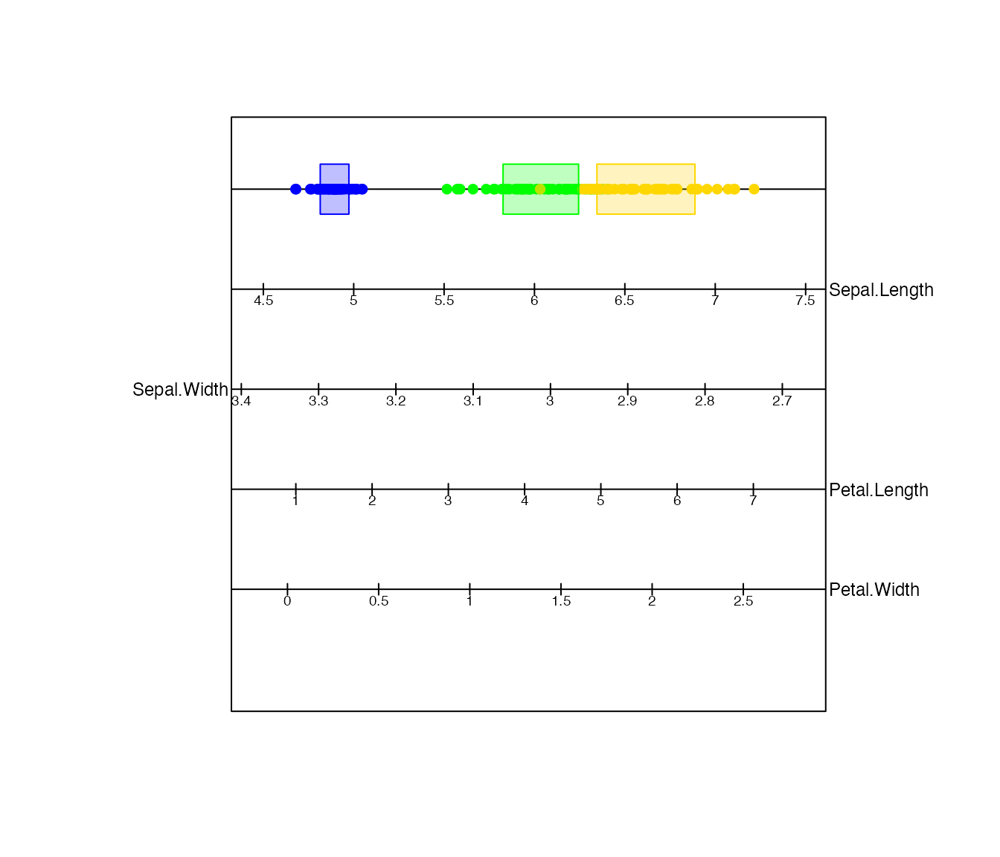

## The function `density1D()`

Overlapping points make the distribution of points on the scatter line
difficult to identify. [`density1D()`](../reference/density1D.md) uses
kernel density estimation (KDE), which adds a density plot to the
one-dimensional biplot.

[`biplot`](../reference/biplot.md)`(``iris``)`` ``|>`` `[`PCA`](../reference/PCA.md)`(``dim.biplot ``=`` ``1``)`` ``|>`` `` `` `[`axes`](../reference/axes.md)`(``col``=``"black"``)`` ``|>`` `` `[`density1D`](../reference/density1D.md)`(``)`` ``|>`` `[`plot`](https://rdrr.io/r/graphics/plot.default.html)`(``)`` ``#> Warning: The ggplot2 engine does not yet support 1D biplots; falling back to`` ``#> base graphics.`

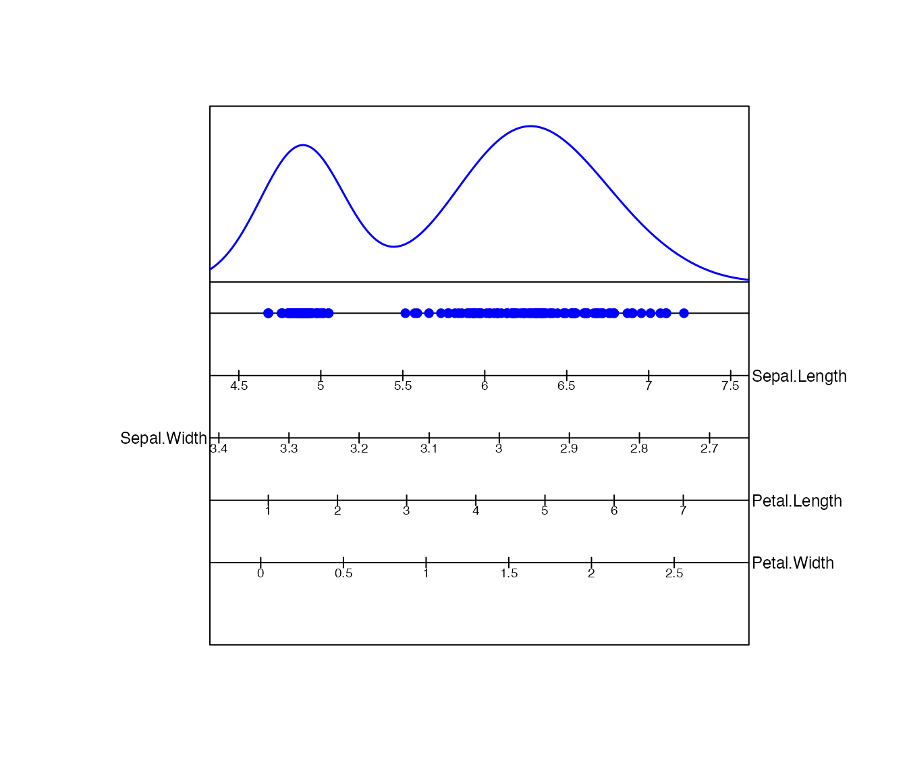

This KDE may be too smooth to display the distribution of the data. By
changing the parameters of the KDE, we are able to address this issue.
The bandwidth and kernel used in
[`density1D()`](../reference/density1D.md) are controlled by the
arguments `h=` and `kernel=`, respectively. The bandwidth `h` can take
any positive value, see
[`?stats::density`](https://rdrr.io/r/stats/density.html) for more
detail. `kernel` can take on any kernel supported by
[`stats::density()`](https://rdrr.io/r/stats/density.html).

[`biplot`](../reference/biplot.md)`(``iris``)`` ``|>`` `[`PCA`](../reference/PCA.md)`(``dim.biplot ``=`` ``1``)`` ``|>`` `[`axes`](../reference/axes.md)`(``col``=``'black'``)`` ``|>`` `` `[`density1D`](../reference/density1D.md)`(``h ``=`` ``0.5`` ,kernel ``=`` ``"triangular"``)`` ``|>`` `[`plot`](https://rdrr.io/r/graphics/plot.default.html)`(``)`` ``#> Warning: The ggplot2 engine does not yet support 1D biplots; falling back to`` ``#> base graphics.`

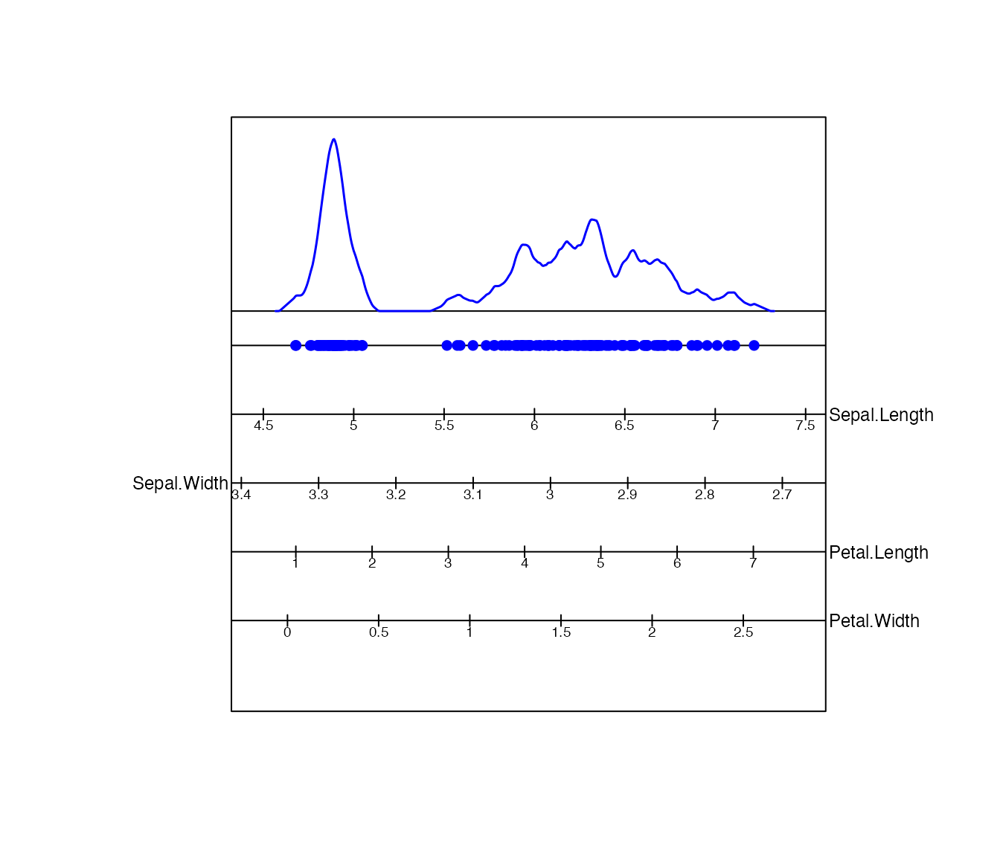

The high concentration of observations in the right of the plot now
becomes evident. To further explore the distributions of the
observations, we may want to explore the density of groupings in the
data. To do this, simply specify the `group.aes=` argument in
[`PCA()`](../reference/PCA.md). Here the density of the three species of
iris is displayed.

[`biplot`](../reference/biplot.md)`(``iris``)`` ``|>`` `[`PCA`](../reference/PCA.md)`(``group.aes ``=`` ``iris``[``,``5``]``,dim.biplot ``=`` ``1``)`` ``|>`` `` `` `[`axes`](../reference/axes.md)`(``col``=``"black"``)`` ``|>`` `` `[`density1D`](../reference/density1D.md)`(``)`` ``|>`` `[`plot`](https://rdrr.io/r/graphics/plot.default.html)`(``)`` ``#> Warning: The ggplot2 engine does not yet support 1D biplots; falling back to`` ``#> base graphics.`

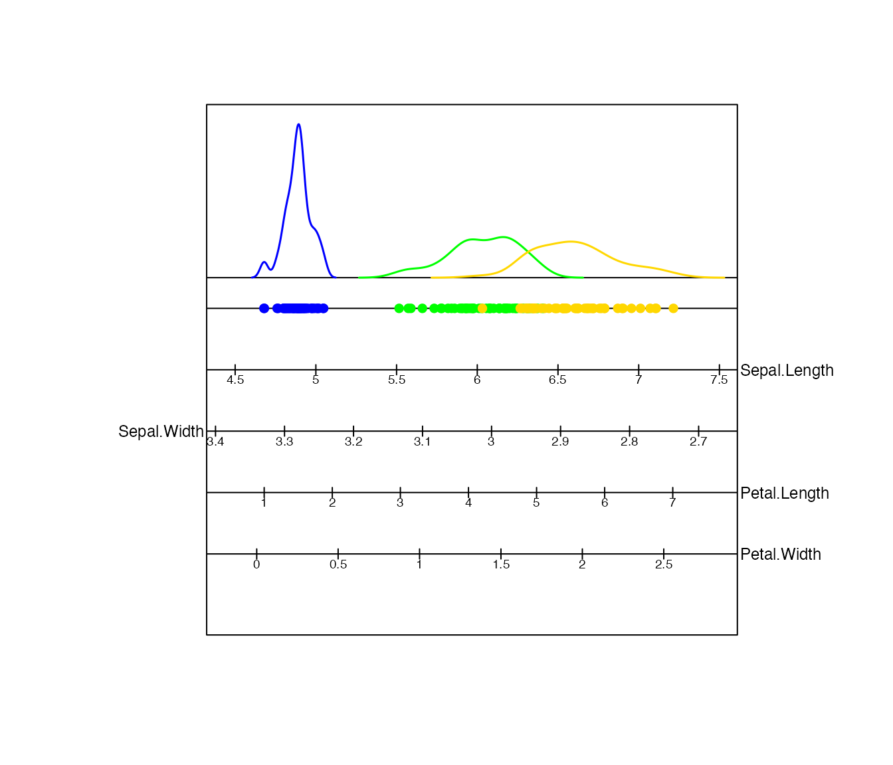

To only display the density of certain groups, use the `which=` argument
in [`density1D()`](../reference/density1D.md).

[`biplot`](../reference/biplot.md)`(``iris``)`` ``|>`` `[`PCA`](../reference/PCA.md)`(``group.aes ``=`` ``iris``[``,``5``]``,dim.biplot ``=`` ``1``)`` ``|>`` `` `` `[`axes`](../reference/axes.md)`(``col``=``"black"``)`` ``|>`` `` `[`density1D`](../reference/density1D.md)`(``which ``=`` `[`c`](https://rdrr.io/r/base/c.html)`(``2``,``3``)``)`` ``|>`` `[`plot`](https://rdrr.io/r/graphics/plot.default.html)`(``)`` ``#> Warning: The ggplot2 engine does not yet support 1D biplots; falling back to`` ``#> base graphics.`

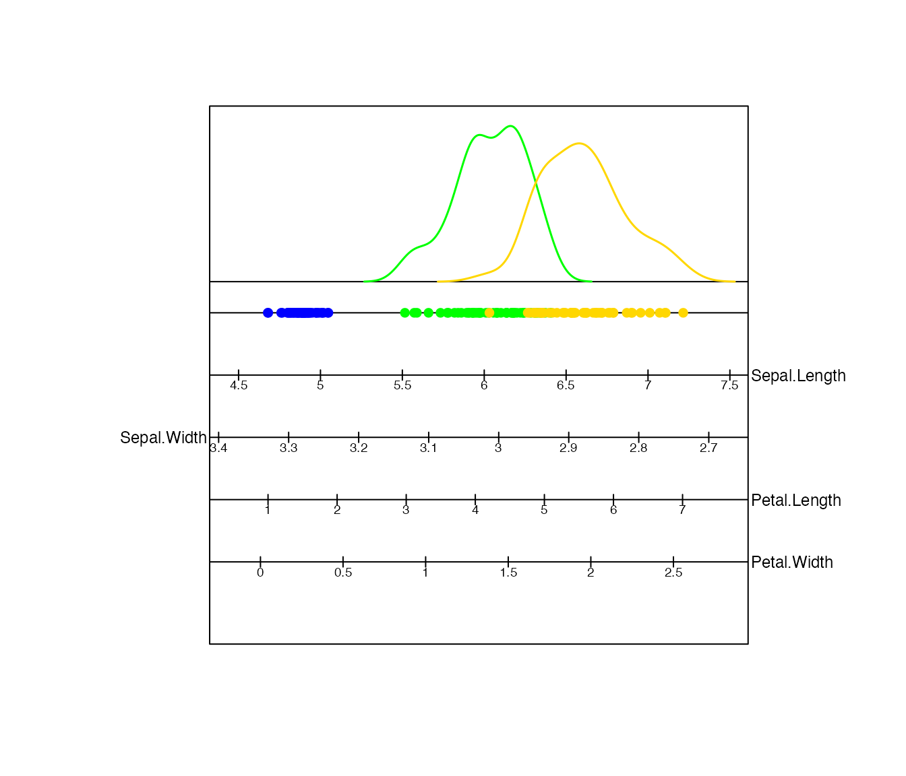

## The function `legend.type()`

`legend.type` adds a legend to the plot. A separate legend is created
for each of the elements by setting each of `samples`, `means`, `bags`
and `ellipses` equal to `TRUE`. Here, we add a legend for the samples.

[`biplot`](../reference/biplot.md)`(``iris``)`` ``|>`` `[`PCA`](../reference/PCA.md)`(``group.aes ``=`` ``iris``[``,``5``]``,dim.biplot ``=`` ``1``, show.class.means ``=`` ``TRUE``)`` ``|>`` `` `[`axes`](../reference/axes.md)`(``col``=``"black"``)`` ``|>`` `[`density1D`](../reference/density1D.md)`(``)`` ``|>`` `[`samples`](../reference/samples.md)`(``opacity``=``0.5``)``|>`` `[`alpha.bags`](../reference/alpha.bags.md)`(``)``|>`` `` `[`legend.type`](../reference/legend.type.md)`(``samples ``=`` ``TRUE``)`` ``|>`` `[`plot`](https://rdrr.io/r/graphics/plot.default.html)`(``)`` ``#> Computing 0.95 -bag for setosa `` ``#> Computing 0.95 -bag for versicolor `` ``#> Computing 0.95 -bag for virginica`` ``#> Warning: The ggplot2 engine does not yet support 1D biplots; falling back to`` ``#> base graphics.`

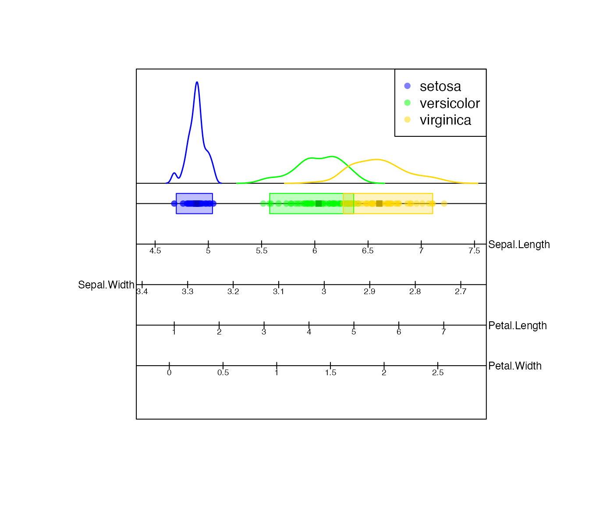

If other legends are added, they will overlap with the elements of the
plot as displayed below.

[`biplot`](../reference/biplot.md)`(``iris``)`` ``|>`` `[`PCA`](../reference/PCA.md)`(``group.aes ``=`` ``iris``[``,``5``]``,dim.biplot ``=`` ``1``, show.class.means ``=`` ``TRUE``)`` ``|>`` `` `[`axes`](../reference/axes.md)`(``col``=``"black"``)`` ``|>`` `[`density1D`](../reference/density1D.md)`(``)`` ``|>`` `[`samples`](../reference/samples.md)`(``opacity``=``0.5``)``|>`` `[`alpha.bags`](../reference/alpha.bags.md)`(``)``|>`` `` `[`legend.type`](../reference/legend.type.md)`(``samples ``=`` ``TRUE``,means ``=`` ``TRUE``, bags ``=`` ``TRUE``)`` ``|>`` `[`plot`](https://rdrr.io/r/graphics/plot.default.html)`(``)`` ``#> Computing 0.95 -bag for setosa `` ``#> Computing 0.95 -bag for versicolor `` ``#> Computing 0.95 -bag for virginica`` ``#> Warning: The ggplot2 engine does not yet support 1D biplots; falling back to`` ``#> base graphics.`

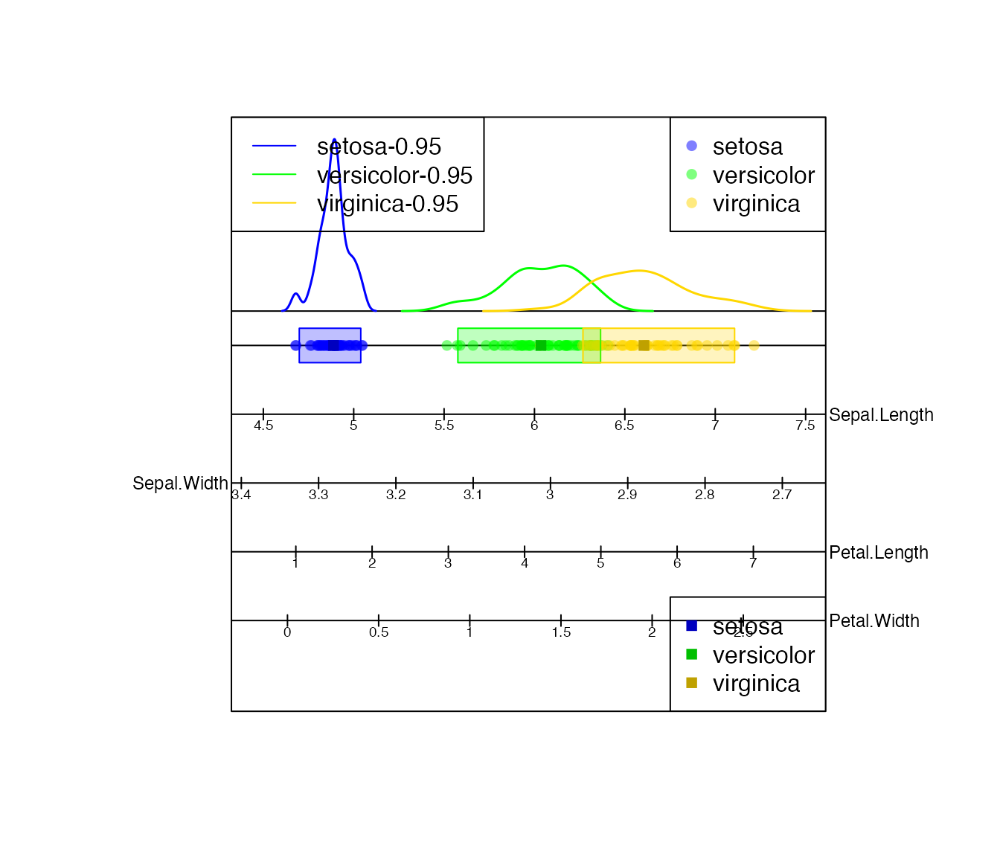

By specifying `new=TRUE`, the legends will be displayed on a new plot.

[`biplot`](../reference/biplot.md)`(``iris``)`` ``|>`` `[`PCA`](../reference/PCA.md)`(``group.aes ``=`` ``iris``[``,``5``]``,dim.biplot ``=`` ``1``, show.class.means ``=`` ``TRUE``)`` ``|>`` `` `[`axes`](../reference/axes.md)`(``col``=``"black"``)`` ``|>`` `[`density1D`](../reference/density1D.md)`(``)`` ``|>`` `[`samples`](../reference/samples.md)`(``opacity``=``0.5``)``|>`` `[`alpha.bags`](../reference/alpha.bags.md)`(``)``|>`` `` `[`legend.type`](../reference/legend.type.md)`(``samples ``=`` ``TRUE``,means ``=`` ``TRUE``, bags ``=`` ``TRUE``, new``=``TRUE``)`` ``|>`` `[`plot`](https://rdrr.io/r/graphics/plot.default.html)`(``)`` ``#> Computing 0.95 -bag for setosa `` ``#> Computing 0.95 -bag for versicolor `` ``#> Computing 0.95 -bag for virginica`` ``#> Warning: The ggplot2 engine does not yet support legend.type(new = TRUE);`` ``#> falling back to base graphics.`

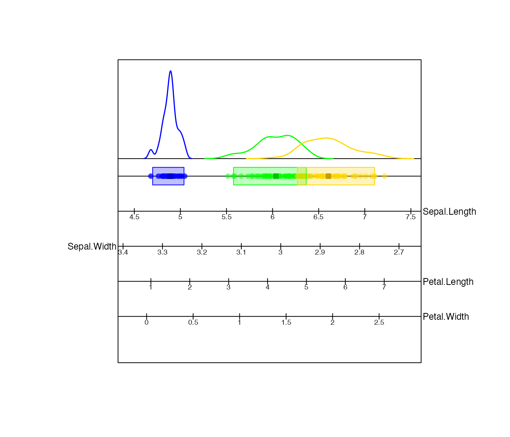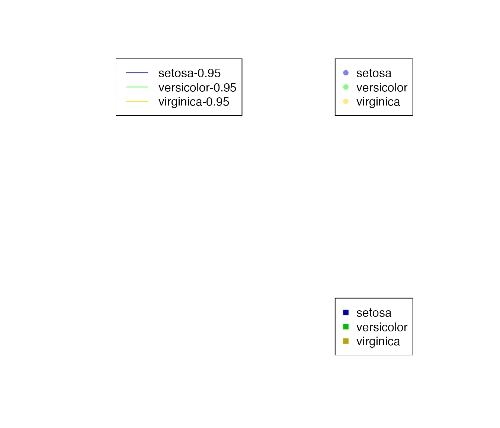

For the CVA biplot `legend.type` also displays a legend for
classification regions if \`

`bp`` ``<-`` `[`biplot`](../reference/biplot.md)`(``iris``)`` ``|>`` `[`CVA`](../reference/CVA.md)`(``classes ``=`` ``iris``[``,``5``]``,dim.biplot ``=`` ``1``, show.class.means ``=`` ``TRUE``)`` ``|>`` `` `[`axes`](../reference/axes.md)`(``col``=``"black"``)`` ``|>`` `[`classify`](../reference/classify.md)`(``)`` ``|>`` `[`density1D`](../reference/density1D.md)`(``)`` ``|>`` `[`samples`](../reference/samples.md)`(``opacity``=``0.5``)``|>`` `[`alpha.bags`](../reference/alpha.bags.md)`(``)``|>`` `` `[`legend.type`](../reference/legend.type.md)`(``samples ``=`` ``TRUE``,means ``=`` ``TRUE``, bags ``=`` ``TRUE``, regions ``=`` ``TRUE``, new``=``TRUE``)`` ``|>`` `[`plot`](https://rdrr.io/r/graphics/plot.default.html)`(``)`` ``#`` ``#> Computing 0.95 -bag for setosa `` ``#> Computing 0.95 -bag for versicolor `` ``#> Computing 0.95 -bag for virginica`` ``#> Warning: The ggplot2 engine does not yet support legend.type(new = TRUE);`` ``#> falling back to base graphics.`

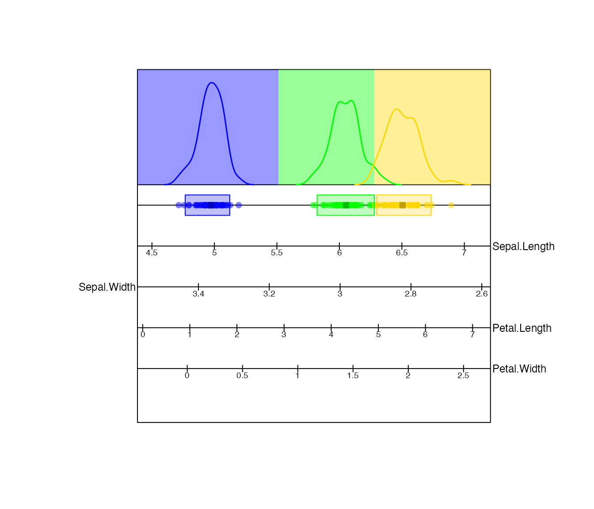

## The function `fit.measures()`

[`fit.measures()`](../reference/fit.measures.md) calculates measures of
fit for the biplot. Passing a biplot object which has been piped to
[`fit.measures()`](../reference/fit.measures.md) to
[`summary()`](https://rdrr.io/r/base/summary.html) will output:

- For the plot: Quality of fit.
- For each variable: an Adequacy measure and a measure of Axis
  Predictivity.
- For each sample: Sample Predictivity

`a`` ``<-`` `[`biplot`](../reference/biplot.md)`(``iris``)`` ``|>`` `[`PCA`](../reference/PCA.md)`(``group.aes ``=`` ``iris``[``,``5``]``,dim.biplot ``=`` ``1``)`` ``|>`` `[`fit.measures`](../reference/fit.measures.md)`(``)`` `[`summary`](https://rdrr.io/r/base/summary.html)`(``a``)`` ``#> Object of class biplot, based on 150 samples and 5 variables.`` ``#> 4 numeric variables.`` ``#> 1 categorical variable.`` ``#> `` ``#> Quality of fit in 1 dimension(s) = 92.5% `` ``#> Adequacy of variables in 1 dimension(s):`` ``#> Sepal.Length Sepal.Width Petal.Length Petal.Width `` ``#> 0.130600269 0.007144055 0.733884527 0.128371149 `` ``#> Axis predictivity in 1 dimension(s):`` ``#> Sepal.Length Sepal.Width Petal.Length Petal.Width `` ``#> 0.8053299 0.1590003 0.9957524 0.9342141 `` ``#> Sample predictivity in 1 dimension(s):`` ``#> 1 2 3 4 5 6 `` ``#> 0.9859320755 0.9885358364 0.9974032622 0.9858701194 0.9843168833 0.8999107868 `` ``#> 7 8 9 10 11 12 `` ``#> 0.9904348916 0.9957802734 0.9612785710 0.9923358788 0.9370769165 0.9948836825 `` ``#> 13 14 15 16 17 18 `` ``#> 0.9875168089 0.9750670327 0.8294906959 0.7529871550 0.9071569468 0.9853898465 `` ``#> 19 20 21 22 23 24 `` ``#> 0.8616422955 0.9552462766 0.9620201204 0.9652955093 0.9901078239 0.9937624785 `` ``#> 25 26 27 28 29 30 `` ``#> 0.9810460091 0.9863832711 0.9951903602 0.9788910031 0.9826539385 0.9920053991 `` ``#> 31 32 33 34 35 36 `` ``#> 0.9923858356 0.9597307230 0.8986110971 0.8460407992 0.9949139602 0.9929589514 `` ``#> 37 38 39 40 41 42 `` ``#> 0.9371265524 0.9862655235 0.9733166664 0.9912721172 0.9891383317 0.8797484869 `` ``#> 43 44 45 46 47 48 `` ``#> 0.9825513928 0.9769811411 0.9396840258 0.9875952309 0.9530258191 0.9923056267 `` ``#> 49 50 51 52 53 54 `` ``#> 0.9503079288 0.9971653130 0.7221680790 0.8953237687 0.8532596845 0.0442100903 `` ``#> 55 56 57 58 59 60 `` ``#> 0.9129953358 0.6359273436 0.9116787898 0.3571098355 0.8281788080 0.0001270475 `` ``#> 61 62 63 64 65 66 `` ``#> 0.1332510142 0.8958907297 0.0818459091 0.9526971985 0.2540681791 0.7246059875 `` ``#> 67 68 69 70 71 72 `` ``#> 0.6197552004 0.1947357248 0.5937494624 0.0051154548 0.8476044276 0.6378818290 `` ``#> 73 74 75 76 77 78 `` ``#> 0.8806268185 0.8333647070 0.8003003948 0.7880417411 0.8419077254 0.9590386463 `` ``#> 79 80 81 82 83 84 `` ``#> 0.9582463503 0.2779242770 0.0082643376 0.0606288071 0.1243095987 0.9010013410 `` ``#> 85 86 87 88 89 90 `` ``#> 0.4112193414 0.7631565205 0.8696344890 0.5516294004 0.3190741381 0.0556990781 `` ``#> 91 92 93 94 95 96 `` ``#> 0.2922625503 0.9696427131 0.1971557114 0.3235202228 0.3247632177 0.5026574343 `` ``#> 97 98 99 100 101 102 `` ``#> 0.5643559551 0.9057638532 0.5676221930 0.4180323047 0.9171464166 0.8271416340 `` ``#> 103 104 105 106 107 108 `` ``#> 0.9806829065 0.9748867821 0.9851812054 0.9634762352 0.1357241699 0.9588447969 `` ``#> 109 110 111 112 113 114 `` ``#> 0.9664650500 0.9136258044 0.9543465424 0.9836661306 0.9843680241 0.7205977672 `` ``#> 115 116 117 118 119 120 `` ``#> 0.7597174900 0.9253702336 0.9925388347 0.8904535431 0.9774035332 0.7072260541 `` ``#> 121 122 123 124 125 126 `` ``#> 0.9631634829 0.6942722608 0.9562507107 0.9637593562 0.9632124205 0.9427733678 `` ``#> 127 128 129 130 131 132 `` ``#> 0.9657601543 0.9613019987 0.9845972460 0.9236214690 0.9539031336 0.8415331923 `` ``#> 133 134 135 136 137 138 `` ``#> 0.9775228161 0.9628241776 0.8556597753 0.9327799099 0.8909511203 0.9790497984 `` ``#> 139 140 141 142 143 144 `` ``#> 0.9273791355 0.9602863486 0.9614110358 0.8945281971 0.8271416340 0.9753298287 `` ``#> 145 146 147 148 149 150 `` ``#> 0.9351760753 0.9383233979 0.9136490692 0.9866832123 0.8702674447 0.8913242393`

## References
