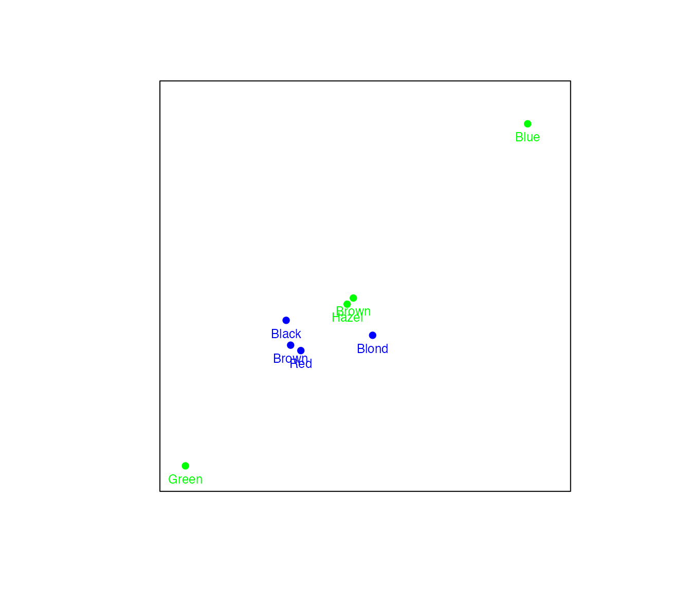
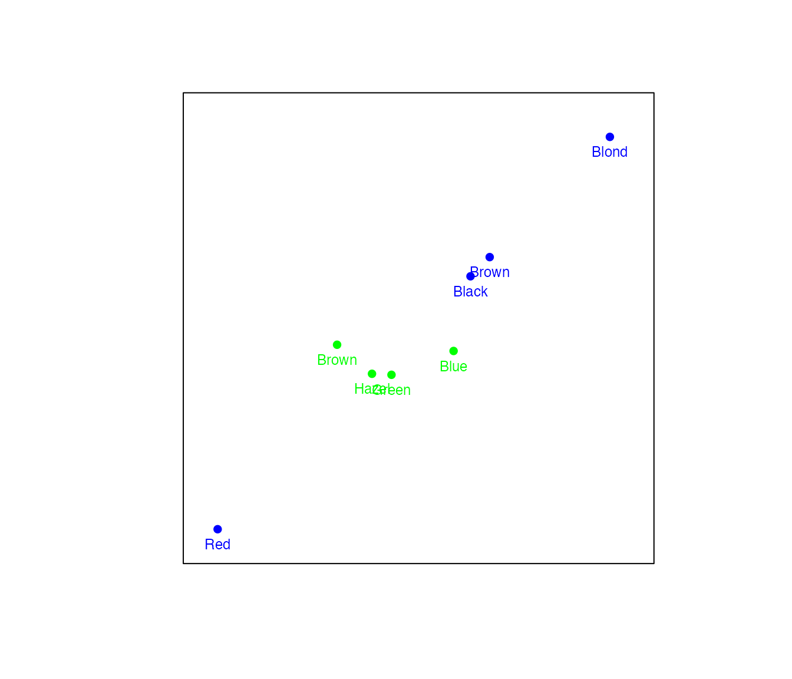
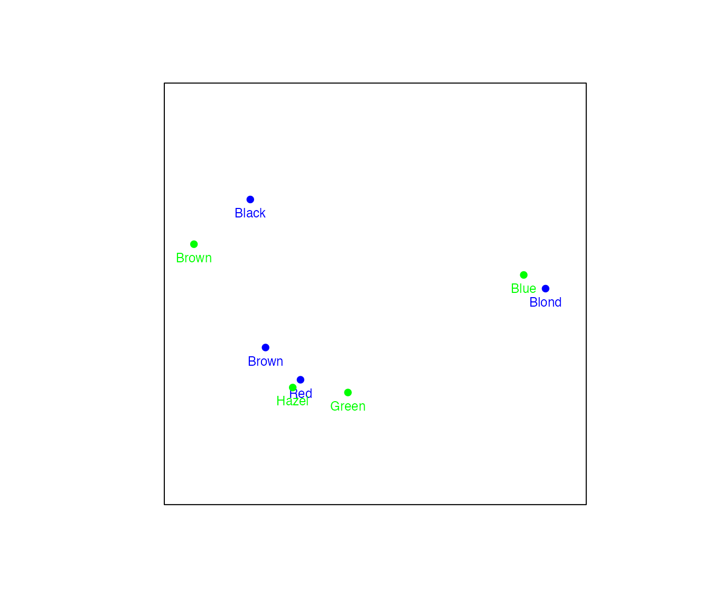
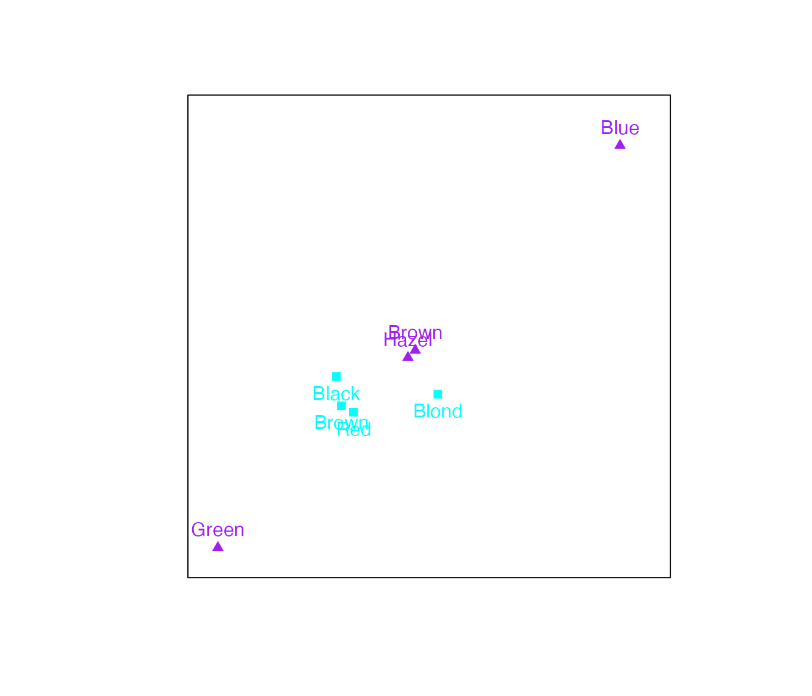
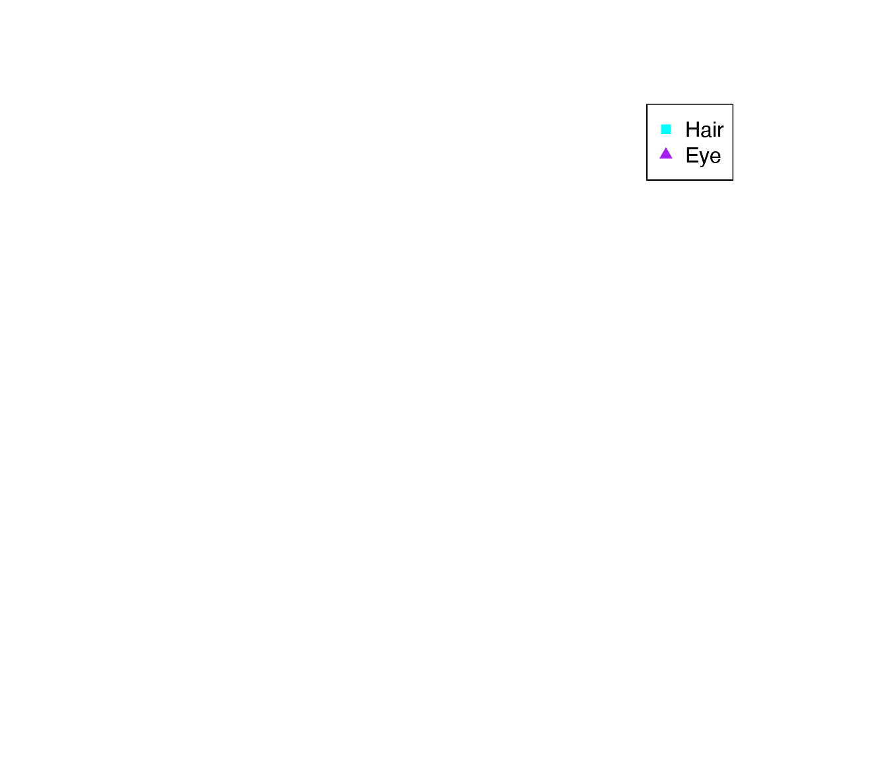
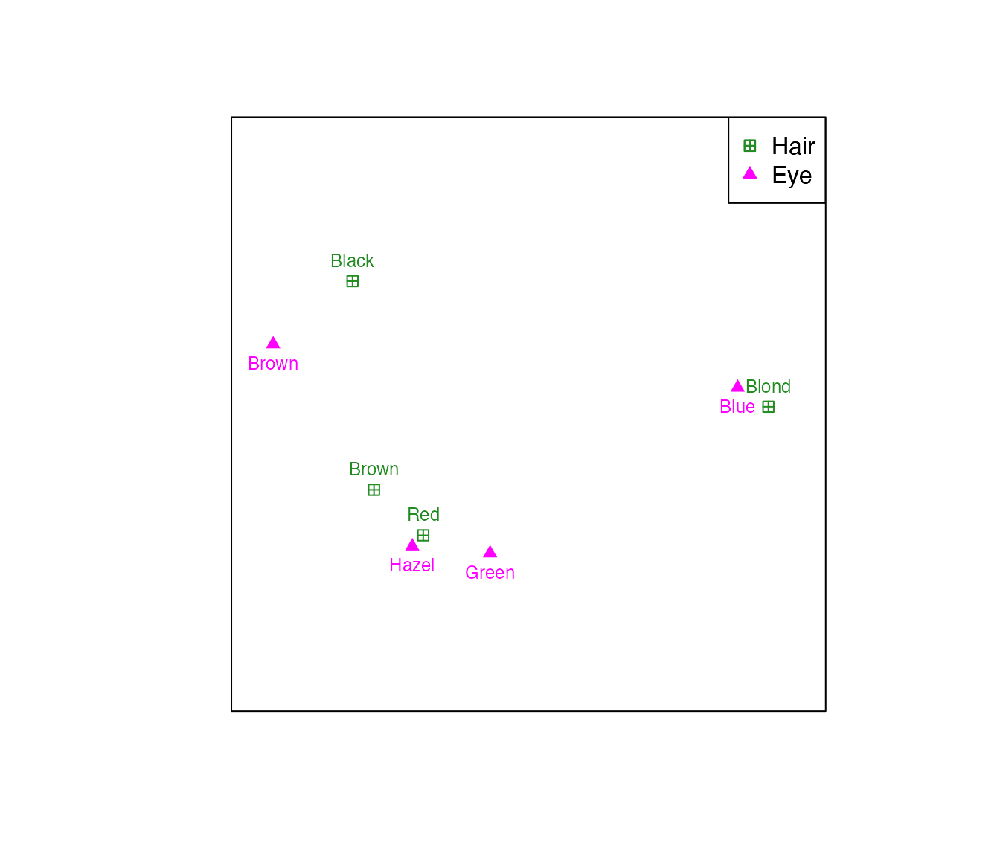
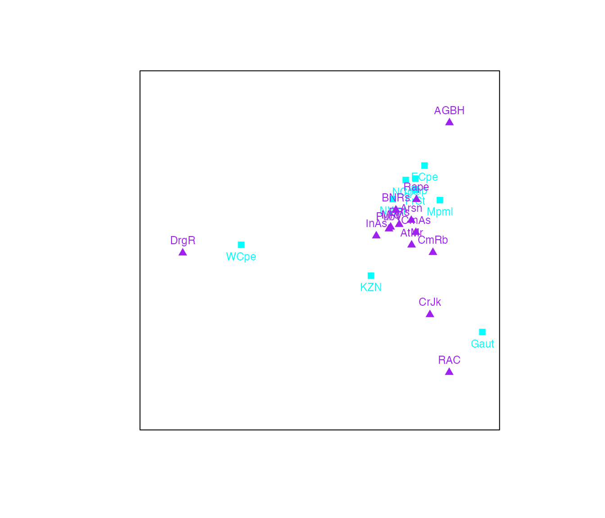
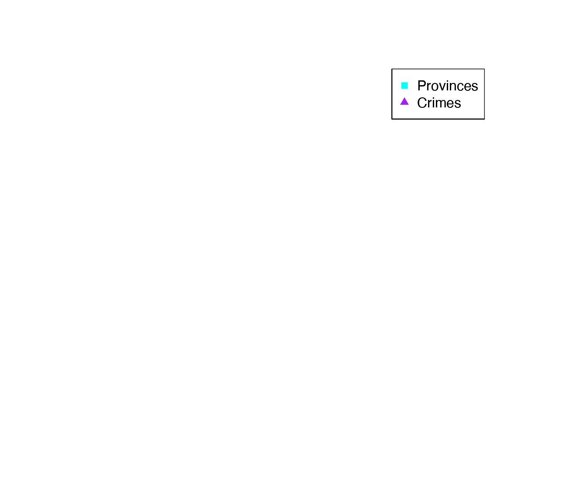

# CA in biplotEZ

## What is a Correspondence Analysis?

In its simplest form Correspondence Analysis (CA) aims to expose the
association between two categorical variables by utilising a two-way
frequency table. Numerous variants of CA are available for the
application to diverse problems, the interested reader is referred to:
Gower et al. (2011), Beh and Lombardo (2014).

In this vignette, focus will be placed on three *EZ*-to-use versions
based on the Pearson residuals (Gower et al. (2011) :300).

Now, the two-way frequency table is also referred to as the data matrix:
$`\mathbf{X}:r\times c`$. This data matrix is different from the
continuous case used for the [`PCA()`](../reference/PCA.md) and
[`CVA()`](../reference/CVA.md) examples, as it represents the
cross-tabulations of two categorical variables (i.e. factors), each with
a finite number of levels (i.e response values). The elements of the
data matrix represent the frequency of the co-occurrence of two
particular levels of the two variables. Consider the `HairEyeColor` data
set in `R`, which summarises the hair and eye color of male and female
statistics students. For the purpose of this example only the male
students will be considered:

`X`` ``<-`` ``HairEyeColor``[``,,``2``]`` ``X`` ``#> Eye`` ``#> Hair Brown Blue Hazel Green`` ``#> Black 36 9 5 2`` ``#> Brown 66 34 29 14`` ``#> Red 16 7 7 7`` ``#> Blond 4 64 5 8`

The grand total of the table $`N`$ is obtained from the total of all
frequencies:

``` math
\sum_{r=1}^{R}\sum_{c=1}^{C}x_{rc}=N
```

`N`` ``<-`` `[`sum`](https://rdrr.io/r/base/sum.html)`(``X``)`` ``N`` ``#> [1] 313`

It is common to work with the proportions rather than the frequencies in
terms of the correspondence matrix, $`\mathbf{P}`$:

``` math
\mathbf{P}=\frac{\mathbf{X}}{N}
```

`P`` ``<-`` ``X``/``N`` ``P`` ``#> Eye`` ``#> Hair Brown Blue Hazel Green`` ``#> Black 0.115015974 0.028753994 0.015974441 0.006389776`` ``#> Brown 0.210862620 0.108626198 0.092651757 0.044728435`` ``#> Red 0.051118211 0.022364217 0.022364217 0.022364217`` ``#> Blond 0.012779553 0.204472843 0.015974441 0.025559105`

Other useful summaries of $`\mathbf{P}`$ include the row and column
masses (for arbitrary row and column $`r`$ and $`c`$, respectively),
also expressed as diagonal matrices:

\$\$ \mathbf{r}\_r = \sum\_{c=1}^{C}p\_{rc}; \hspace{0.5 cm}
\mathbf{c}\_c = \sum\_{r=1}^{R}p\_{rc}\\ \mathbf{r}=\mathbf{P1};
\hspace{0.5 cm} \mathbf{c}=\mathbf{P}^\prime\mathbf{1} \$\$

`rMass`` ``<-`` `[`rowSums`](https://rdrr.io/r/base/colSums.html)`(``P``)`` ``rMass`` ``#> Black Brown Red Blond `` ``#> 0.1661342 0.4568690 0.1182109 0.2587859`` ``cMass`` ``<-`` `[`colSums`](https://rdrr.io/r/base/colSums.html)`(``P``)`` ``cMass`` ``#> Brown Blue Hazel Green `` ``#> 0.38977636 0.36421725 0.14696486 0.09904153`

Diagonal matrices:

\$\$ \mathbf{D_r}=\text{diag}(\mathbf{r}); \hspace{0.5 cm}
\mathbf{D_c}=\text{diag}(\mathbf{c}) \$\$

`Dr`` ``<-`` `[`diag`](https://rdrr.io/r/base/diag.html)`(`[`apply`](https://rdrr.io/r/base/apply.html)`(``P``, ``1``, ``sum``)``)`` ``Dr`` ``#> [,1] [,2] [,3] [,4]`` ``#> [1,] 0.1661342 0.000000 0.0000000 0.0000000`` ``#> [2,] 0.0000000 0.456869 0.0000000 0.0000000`` ``#> [3,] 0.0000000 0.000000 0.1182109 0.0000000`` ``#> [4,] 0.0000000 0.000000 0.0000000 0.2587859`` ``Dc`` ``<-`` `[`diag`](https://rdrr.io/r/base/diag.html)`(`[`apply`](https://rdrr.io/r/base/apply.html)`(``P``, ``2``, ``sum``)``)`` ``Dc`` ``#> [,1] [,2] [,3] [,4]`` ``#> [1,] 0.3897764 0.0000000 0.0000000 0.00000000`` ``#> [2,] 0.0000000 0.3642173 0.0000000 0.00000000`` ``#> [3,] 0.0000000 0.0000000 0.1469649 0.00000000`` ``#> [4,] 0.0000000 0.0000000 0.0000000 0.09904153`

In order to obtain the first form of the row and column coordinates, the
singular value decomposition (SVD) of the matrix of standardised Pearson
residuals ($`\mathbf{S}`$) is computed:

``` math
\begin{aligned}
\text{SVD}(\mathbf{S}) &= \text{SVD}\left(\mathbf{D_r^{-\frac{1}{2}}}(\mathbf{P}-\mathbf{rc^\prime})\mathbf{D_c^{-\frac{1}{2}}}\right)\\&= \mathbf{U\Lambda V^\prime}
\end{aligned}
```
The return value for the Standardised pearson residuals is `Smat` and
the singular value decomposition, `SVD`.

`Smat`` ``<-`` `[`sqrt`](https://rdrr.io/r/base/MathFun.html)`(`[`solve`](https://rdrr.io/r/base/solve.html)`(``Dr``)``)`[`%*%`](https://rdrr.io/r/base/matmult.html)`(``P``-``(``Dr`` `[`%*%`](https://rdrr.io/r/base/matmult.html)[`matrix`](https://rdrr.io/r/base/matrix.html)`(``1``, nrow ``=`` `[`nrow`](https://rdrr.io/r/base/nrow.html)`(``X``)``, `` `` ncol ``=`` `[`ncol`](https://rdrr.io/r/base/nrow.html)`(``X``)``)`` `[`%*%`](https://rdrr.io/r/base/matmult.html)` ``Dc``)``)`[`%*%`](https://rdrr.io/r/base/matmult.html)[`sqrt`](https://rdrr.io/r/base/MathFun.html)`(`[`solve`](https://rdrr.io/r/base/solve.html)`(``Dc``)``)`` ``svd.out`` ``<-`` `[`svd`](https://rdrr.io/r/base/svd.html)`(``Smat``)`` ``svd.out`` ``#> $d`` ``#> [1] 5.499629e-01 1.806424e-01 7.541748e-02 1.145995e-16`` ``#> `` ``#> $u`` ``#> [,1] [,2] [,3] [,4]`` ``#> [1,] -0.3832205 0.7807477 -0.27828196 0.4075956`` ``#> [2,] -0.3195599 -0.2982325 0.59335474 0.6759209`` ``#> [3,] -0.1736837 -0.5332073 -0.75320188 0.3438181`` ``#> [4,] 0.8490333 0.1310737 -0.05635808 0.5087101`` ``#> `` ``#> $v`` ``#> [,1] [,2] [,3] [,4]`` ``#> [1,] -0.61837991 0.4547976 -0.14487614 0.6243207`` ``#> [2,] 0.75797511 0.2307003 0.08963172 0.6035041`` ``#> [3,] -0.20612962 -0.5898626 0.68015284 0.3833600`` ``#> [4,] 0.02430218 -0.6260980 -0.71300012 0.3147086`

This is linked to the $`\chi^2`$-statistic to determine whether the two
categorical variables (i.e. the rows and columns of the contingency
table) are independent. The expected frequencies represented by the
product of the row and column masses ($`\mathbf{rc^\prime}`$).

Furthermore, since the weights of certain objects might be substantially
different from others which could result in a distorted approximation in
lower dimension, the $`\chi^2`$-distance, also referred to as the
weighted Euclidean distance, is rather used to measure distances in CA.
This is an intuitive decision as it follows from the
$`\chi^2`$-statistic to test the independence between two categorical
variables, in this case the independence between the rows and columns of
the contingency table. (Beh and Lombardo (2014), Greenacre (2017)).

## CA biplot

### Coordinates

In order to construct a biplot in which the distances between the row
and column coordinates are meaningful an asymmetric display should be
constructed. This means that the contribution of the singular values
should be different for the row and column coordinates. (Gabriel (1971))
The standard coordinates are expressed by:

\$\$ \begin{aligned} \text{Row standard coordinates:} \hspace{0.5
cm}&\mathbf{U}\\ \text{Column standard coordinates:} \hspace{0.5
cm}&\mathbf{V} \end{aligned} \$\$

The principal coordinates are expressed by:

\$\$ \begin{aligned} \text{Row principal coordinates:} \hspace{0.5
cm}&\mathbf{U\Lambda}\\ \text{Column principal coordinates:} \hspace{0.5
cm}&\mathbf{V\Lambda} \end{aligned} \$\$

By including the singular values the magnitude of the association
between the variables are incorporated in the scaling of the
coordinates.

In the `ca()` function the argument `variant` allows the user to choose
between three types of CA biplots: `Princ`, `Stand` and `Symmetric`.

\$\$ \begin{aligned} \text{Row coordinates:} \hspace{0.5
cm}&\mathbf{U\Lambda^\gamma}\\ \text{Column coordinates:} \hspace{0.5
cm}&\mathbf{V\Lambda^{1-\gamma}} \end{aligned} \$\$ The row standard
(i.e. column principal) coordinate biplot: `Stand`, results from
$`\gamma=0`$.

The row principal (i.e. column standard) coordinate biplot: `Princ`,
results from $`\gamma=1`$.

The symmetric plot in which row and column coordinates are scaled
equally: `Symmetric`, results from $`\gamma=0.5`$.

The return value is `rowcoor` and `colcoor`, respectively.

`gamma`` ``<-`` ``0`` ``rowcoor`` ``<-`` ``svd.out``[[``2``]``]`[`%*%`](https://rdrr.io/r/base/matmult.html)`(`[`diag`](https://rdrr.io/r/base/diag.html)`(``svd.out``[[``1``]``]``)``^``gamma``)`` ``colcoor`` ``<-`` ``svd.out``[[``3``]``]`[`%*%`](https://rdrr.io/r/base/matmult.html)`(`[`diag`](https://rdrr.io/r/base/diag.html)`(``svd.out``[[``1``]``]``)``^``(``1``-``gamma``)``)`

### Lambda scaling

As presented in Gower et al. (2011) :24, when constructing a biplot
representing the rows of a coordinate matrix $`\mathbf{A}`$ and
$`\mathbf{B}^\prime`$. Take note that the inner product is invariant
when $`\mathbf{A}`$ and $`\mathbf{B}`$ are scaled inversely by
$`\lambda`$.

``` math
\mathbf{AB} = (\lambda\mathbf{A})(\mathbf{B}/\lambda)
```
An arbitrary value of $`\lambda`$ can be selected or an *optimal* value
could be to ensure that the average squared distance of the points in
$`\lambda\mathbf{A}`$ and $`\mathbf{B}/\lambda`$ is equal.

``` math
\lambda^4 =\frac{r}{c}\frac{||\mathbf{B}||^2}{||\mathbf{A}||^2}
```

The default setting is to not apply lambda-scaling (i.e. $`\lambda=1`$).

The return value is `lambda.val`.

### Measures of fit

`quality`, `adequacy`, `row.predictivities` and `column.predictivities`
are available for CA biplots.

As explained in the biplotEZ vignette, the quality of the biplot is
measured by the ratio of the variance explained (sum of the squared
singular values of the utilised ($`M`$) components) and the total
variance (sum of all squared singular values ($`p`$)).

``` math
\frac{\sum_{m=1}^{M}\lambda_m^2}{\sum_{m=1}^{p}\lambda_m^2}
```
The `adequacy` refers to the representation of the variables. In
[`CA()`](../reference/CA.md) the factor variable represented in the
columns is treated as the variables and is calculated as explained in
the biplotEZ vignette:

``` math
 \frac{diag(\mathbf{V}_r\mathbf{V}_r')}{diag(\mathbf{VV}')}= diag(\mathbf{V}_r\mathbf{V}_r')
```

The predictivities provide a measure of how well the original values are
recovered from the biplot. An element that is well represented will have
a predictivity close to one, indicating that the row or column variable
values from prediction is close to the observed values. If an element is
poorly represented, the predicted values will be very different from the
original values and the predictivity value will be close to zero.

The `row.predictivities` are calculated as follows (Gower et al. (2011)
:299):

\$\$
diag(\mathbf{U}\mathbf{\Sigma}\mathbf{J}\mathbf{\Sigma}\mathbf{U}')\[diag(\mathbf{U}\mathbf{\Sigma}\mathbf{\Sigma}\mathbf{U}')\]^{-1}\\
=diag(\mathbf{U}\mathbf{\Sigma}^2\mathbf{J}\mathbf{U}')\[diag(\mathbf{U}\mathbf{\Sigma^2}\mathbf{U}')\]^{-1}
\$\$

The `col.predictivities` are calculated as follows (Gower et al. (2011)
:299):

``` math
diag(\mathbf{V}\mathbf{\Sigma}^2\mathbf{J}\mathbf{V}')[diag(\mathbf{V}\mathbf{\Sigma^2}\mathbf{V}')]^{-1}
```

## The function CA()

The function [`CA()`](../reference/CA.md) requires a two-way contingency
table as input and will return an object of class `CA` and `biplot`. As
this is not a standard data matrix as for `PCA` and `CVA`, scaling and
centering is not allowed on the two-way contingency table and a warning
will be given if either `scale` or `center` is specified as `TRUE` in
biplot()\`.

### `Variant="Princ"`

The default CA biplot is a row principal coordinate biplot:

[`biplot`](../reference/biplot.md)`(``HairEyeColor``[``,,``2``]``, center ``=`` ``FALSE``)`` ``|>`` `[`CA`](../reference/CA.md)`(``)`` ``|>`` `[`plot`](https://rdrr.io/r/graphics/plot.default.html)`(``)`` ``#> Warning: The ggplot2 engine does not yet support CA maps; falling back to base`` ``#> graphics.`



### `Variant="Stand"`

To construct the CA biplot for row standard coordinates:

`ca.out`` ``<-`` `[`biplot`](../reference/biplot.md)`(``HairEyeColor``[``,,``2``]``, center ``=`` ``FALSE``)`` ``|>`` `[`CA`](../reference/CA.md)`(``variant ``=`` ``"Stand"``)`` ``|>`` `` `` `[`plot`](https://rdrr.io/r/graphics/plot.default.html)`(``)`` ``#> Warning: The ggplot2 engine does not yet support CA maps; falling back to base`` ``#> graphics.`



### `Variant="Symmetric"`

To construct the symmetric CA map:

`ca.out`` ``<-`` `[`biplot`](../reference/biplot.md)`(``HairEyeColor``[``,,``2``]``, center ``=`` ``FALSE``)`` ``|>`` `` `` `[`CA`](../reference/CA.md)`(``variant ``=`` ``"Symmetric"``)`` ``|>`` `[`plot`](https://rdrr.io/r/graphics/plot.default.html)`(``)`` ``#> Warning: The ggplot2 engine does not yet support CA maps; falling back to base`` ``#> graphics.`



`ca.out``$``lambda.val`` ``#> [1] 1`

### Measures of fit

The `fit.mesaures()` function should be utilised to obtain the specific
fit measures explained above.

`ca.out`` ``<-`` `[`biplot`](../reference/biplot.md)`(``HairEyeColor``[``,,``2``]``, center ``=`` ``FALSE``)`` ``|>`` `` `` `[`CA`](../reference/CA.md)`(``variant ``=`` ``"Symmetric"``)`` ``|>`` `[`fit.measures`](../reference/fit.measures.md)`(``)`` `[`print`](https://rdrr.io/r/base/print.html)`(``"Quality"``)`` ``#> [1] "Quality"`` ``ca.out``$``quality`` ``#> [1] 0.9833094`` `[`print`](https://rdrr.io/r/base/print.html)`(``"Adequacy"``)`` ``#> [1] "Adequacy"`` ``ca.out``$``adequacy`` ``#> Brown Blue Hazel Green`` ``#> Dim 1 0.3824 0.5745 0.0425 0.0006`` ``#> Dim 2 0.5892 0.6277 0.3904 0.3926`` ``#> Dim 3 0.6102 0.6358 0.8530 0.9010`` ``#> Dim 4 1.0000 1.0000 1.0000 1.0000`` `[`print`](https://rdrr.io/r/base/print.html)`(``"Row predictivities"``)`` ``#> [1] "Row predictivities"`` ``ca.out``$``row.predictivities`` ``#> Black Brown Red Blond`` ``#> Dim 1 0.6860 0.8630 0.4219 0.9974`` ``#> Dim 2 0.9932 0.9441 0.8508 0.9999`` ``#> Dim 3 1.0000 1.0000 1.0000 1.0000`` ``#> Dim 4 1.0000 1.0000 1.0000 1.0000`` `[`print`](https://rdrr.io/r/base/print.html)`(``"Column predictivities"``)`` ``#> [1] "Column predictivities"`` ``ca.out``$``col.predictivities`` ``#> Brown Blue Hazel Green`` ``#> Dim 1 0.9439 0.9898 0.4789 0.0113`` ``#> Dim 2 0.9990 0.9997 0.9020 0.8177`` ``#> Dim 3 1.0000 1.0000 1.0000 1.0000`` ``#> Dim 4 1.0000 1.0000 1.0000 1.0000`

### Interpolating new samples

Adding cross-tabulations of the two categorical variables to the plot is
facilitated by the function
[`interpolate()`](../reference/interpolate.md). Note that the additional
variables to be interpolated did not contribute to the construction of
the biplot. This is the reason why Greenacre (2017) term these
supplementary points.

The function [`interpolate()`](../reference/interpolate.md) accepts a
matrix or data frame containing the samples and variables to be
interpolated. The argument `newdata` containing the samples to be
interpolated needs to have a similar structure to the data set sent to
[`biplot()`](../reference/biplot.md). If
[`biplot()`](../reference/biplot.md) received a data frame, `newdata`
can be either another data frame or a matrix containing the subset of
numerical variables.

The function [`newsamples()`](../reference/newsamples.md) operates
similar to [`samples()`](../reference/samples.md) and enables aesthetic
changes to the new samples.

`#biplot(HairEyeColor[,,2], center = FALSE) |> CA(variant = "Symmetric") |> `` ``# samples(pch = c(0,2)) |> interpolate(newdata = HairEyeColor[,,1]) |> `` ``# newsamples(col = c("orange","purple"), pch = c(15,17)) |> plot() `

### Aesthetics and legend

The [`sample()`](https://rdrr.io/r/base/sample.html) function should be
utilised to specify the colours, plotting characters and expansion of
the samples.

[`biplot`](../reference/biplot.md)`(``HairEyeColor``[``,,``2``]``, center ``=`` ``FALSE``)`` ``|>`` `[`CA`](../reference/CA.md)`(``variant ``=`` ``"Princ"``)`` ``|>`` `` `` `[`samples`](../reference/samples.md)`(``col ``=`` `[`c`](https://rdrr.io/r/base/c.html)`(``"cyan"``,``"purple"``)``, pch ``=`` `[`c`](https://rdrr.io/r/base/c.html)`(``15``,``17``)``, label.side ``=`` `[`c`](https://rdrr.io/r/base/c.html)`(``"bottom"``,``"top"``)``, `` `` label.cex ``=`` ``1``)`` ``|>`` `[`legend.type`](../reference/legend.type.md)`(``samples ``=`` ``TRUE``, new ``=`` ``TRUE``)`` ``|>`` `[`plot`](https://rdrr.io/r/graphics/plot.default.html)`(``)`` ``#> Warning: The ggplot2 engine does not yet support legend.type(new = TRUE);`` ``#> falling back to base graphics.`



[`biplot`](../reference/biplot.md)`(``HairEyeColor``[``,,``2``]``, center ``=`` ``FALSE``)`` ``|>`` `[`CA`](../reference/CA.md)`(``variant ``=`` ``"Symmetric"``)`` ``|>`` `` `` `[`samples`](../reference/samples.md)`(``col ``=`` `[`c`](https://rdrr.io/r/base/c.html)`(``"forestgreen"``,``"magenta"``)``, pch ``=`` `[`c`](https://rdrr.io/r/base/c.html)`(``12``,``17``)``, `` `` label.side ``=`` `[`c`](https://rdrr.io/r/base/c.html)`(``"top"``,``"bottom"``)``)`` ``|>`` `` `` `[`legend.type`](../reference/legend.type.md)`(``samples ``=`` ``TRUE``)`` ``|>`` `[`plot`](https://rdrr.io/r/graphics/plot.default.html)`(``)`` ``#> Warning: The ggplot2 engine does not yet support CA maps; falling back to base`` ``#> graphics.`



### Additional example

Consider the South African Crime data set 2008, extracted from the South
African police website (<http://www.saps.gov.za/>). Gower et al. (2011)
:312.

`SACrime`` ``<-`` `[`matrix`](https://rdrr.io/r/base/matrix.html)`(`[`c`](https://rdrr.io/r/base/c.html)`(``1235``,``432``,``1824``,``1322``,``573``,``588``,``624``,``169``,``629``,``34479``,``16833``,``46993``,``30606``,``13670``,`` `` ``16849``,``15861``,``9898``,``24915``,``2160``,``939``,``5257``,``4946``,``722``,``1271``,``881``,``775``,``1844``,``5946``,`` `` ``4418``,``15117``,``10258``,``5401``,``4273``,``4987``,``1956``,``10639``,``29508``,``15705``,``62703``,``37203``,`` `` ``11857``,``18855``,``14722``,``4924``,``42376``,``604``,``156``,``7466``,``3889``,``203``,``664``,``291``,``5``,``923``,``19875``,`` `` ``19885``,``57153``,``29410``,``11024``,``12202``,``10406``,``5431``,``32663``,``7086``,``4193``,``22152``,``9264``,``3760``,`` `` ``4752``,``3863``,``1337``,``8578``,``7929``,``4525``,``12348``,``24174``,``3198``,``1770``,``7004``,``2201``,``45985``,``764``,`` `` ``427``,``1501``,``1197``,``215``,``251``,``345``,``213``,``1850``,``3515``,``879``,``3674``,``4713``,``696``,``835``,``917``,``422``,``2836``,`` `` ``88``,``59``,``174``,``76``,``31``,``61``,``117``,``32``,``257``,``5499``,``2628``,``8073``,``6502``,``2816``,``2635``,``3017``,``1020``,``4000``,`` `` ``8939``,``4501``,``50970``,``24290``,``2447``,``5907``,``5528``,``1175``,``14555``)``,nrow``=``9``, ncol``=``14``)`` `[`dimnames`](https://rdrr.io/r/base/dimnames.html)`(``SACrime``)`` ``<-`` `[`list`](https://rdrr.io/r/base/list.html)`(`[`paste`](https://rdrr.io/r/base/paste.html)`(`[`c`](https://rdrr.io/r/base/c.html)`(``"ECpe"``, ``"FrSt"``, ``"Gaut"``, ``"KZN"``, ``"Limp"``, ``"Mpml"``, ``"NWst"``, ``"NCpe"``,`` `` ``"WCpe"``)``)``, `[`paste`](https://rdrr.io/r/base/paste.html)`(`[`c`](https://rdrr.io/r/base/c.html)`(``"Arsn"``, ``"AGBH"``, ``"AtMr"``, ``"BNRs"``, ``"BRs"``, ``"CrJk"``,`` `` ``"CmAs"``, ``"CmRb"``, ``"DrgR"``, ``"InAs"``, ``"Mrd"``, ``"PubV"``, `` `` ``"Rape"``, ``"RAC"`` ``)``)``)`` `[`names`](https://rdrr.io/r/base/names.html)`(`[`dimnames`](https://rdrr.io/r/base/dimnames.html)`(``SACrime``)``)``[[``1``]``]`` ``<-`` ``"Provinces"`` `[`names`](https://rdrr.io/r/base/names.html)`(`[`dimnames`](https://rdrr.io/r/base/dimnames.html)`(``SACrime``)``)``[[``2``]``]`` ``<-`` ``"Crimes"`` ``SACrime`` ``#> Crimes`` ``#> Provinces Arsn AGBH AtMr BNRs BRs CrJk CmAs CmRb DrgR InAs Mrd PubV`` ``#> ECpe 1235 34479 2160 5946 29508 604 19875 7086 7929 764 3515 88`` ``#> FrSt 432 16833 939 4418 15705 156 19885 4193 4525 427 879 59`` ``#> Gaut 1824 46993 5257 15117 62703 7466 57153 22152 12348 1501 3674 174`` ``#> KZN 1322 30606 4946 10258 37203 3889 29410 9264 24174 1197 4713 76`` ``#> Limp 573 13670 722 5401 11857 203 11024 3760 3198 215 696 31`` ``#> Mpml 588 16849 1271 4273 18855 664 12202 4752 1770 251 835 61`` ``#> NWst 624 15861 881 4987 14722 291 10406 3863 7004 345 917 117`` ``#> NCpe 169 9898 775 1956 4924 5 5431 1337 2201 213 422 32`` ``#> WCpe 629 24915 1844 10639 42376 923 32663 8578 45985 1850 2836 257`` ``#> Crimes`` ``#> Provinces Rape RAC`` ``#> ECpe 5499 8939`` ``#> FrSt 2628 4501`` ``#> Gaut 8073 50970`` ``#> KZN 6502 24290`` ``#> Limp 2816 2447`` ``#> Mpml 2635 5907`` ``#> NWst 3017 5528`` ``#> NCpe 1020 1175`` ``#> WCpe 4000 14555`

[`biplot`](../reference/biplot.md)`(``SACrime``, center ``=`` ``FALSE``)`` ``|>`` `` `` `[`CA`](../reference/CA.md)`(``variant ``=`` ``"Symmetric"``, lambda.scal ``=`` ``TRUE``)`` ``|>`` `` `` `[`samples`](../reference/samples.md)`(``col ``=`` `[`c`](https://rdrr.io/r/base/c.html)`(``"cyan"``,``"purple"``)``, pch ``=`` `[`c`](https://rdrr.io/r/base/c.html)`(``15``,``17``)``, label.side ``=`` `[`c`](https://rdrr.io/r/base/c.html)`(``"bottom"``,``"top"``)``)`` ``|>`` `` `[`legend.type`](../reference/legend.type.md)`(``samples ``=`` ``TRUE``, new ``=`` ``TRUE``)`` ``|>`` `[`plot`](https://rdrr.io/r/graphics/plot.default.html)`(``)`` ``#> Warning: The ggplot2 engine does not yet support legend.type(new = TRUE);`` ``#> falling back to base graphics.`



## References

Beh, E, and Rosaria Lombardo. 2014. “Correspondence Analysis.” *Theory,
Paractice and New Strategies*.

Gabriel, K. R. 1971. “The Biplot Graphic Display of Matrices with
Application to Principal Component Analysis.” *Biometrika*, 453–67.

Gower, J. C., S. Lubbe, and N. J. le Roux. 2011. *Understanding
Biplots.* Wiley.

Greenacre, M. J. 2017. *Correspondence Analysis in Practice.* CRC press.
