# Class separation

[`library`](https://rdrr.io/r/base/library.html)`(``biplotEZ``)`` ``#> Welcome to biplotEZ! `` ``#> This package is used to construct biplots `` ``#> Run ?biplot or vignette() for more information`` ``#> `` ``#> Attaching package: 'biplotEZ'`` ``#> The following object is masked from 'package:stats':`` ``#> `` ``#> biplot`

This vignette deals with biplots for separating classes. Topics
discussed are

- CVA (Canonical variate analysis) biplots
- AoD (Analysis of Distance) biplots
- Classification biplots

## What is a CVA biplot

Consider a data matrix $`\mathbf{X}:n \times p`$ containing data on
$`n`$ objects and $`p`$ variables. In addition, a vector
$`\mathbf{g}:n \times 1`$ contains information on class membership of
each observation. Let $`G`$ indicate the total number of classes. CVA is
closely related to linear discriminant anlaysis, in that the $`p`$
variables are transformed to $`p`$ new variables, called canonical
variates, such that the classes are optimally separated in the canonical
space. By optimally separated, we mean maximising the between class
variance, relative to the within class variance. This can be formulated
as follows:

Let $`\mathbf{G}:n \times G`$ be an indicator matrix with $`g_{ij} = 0`$
unless observation $`i`$ belongs to class $`j`$ and then $`g_{ij} = 1`$.
The matrix $`\mathbf{G'G}`$ is a diagonal matrix containing the number
of observations per class on the diagonal. We can form the matrix of
class means
$`\bar{\mathbf{X}}:G \times p = (\mathbf{G'G})^{-1} \mathbf{G'X}`$. With
the usual analysis of variance the total variance can be decomposed into
a between class variance and within class variance:

``` math
\mathbf{T} = \mathbf{B} + \mathbf{W}
```

``` math
\mathbf{X'X} = \mathbf{\bar{\mathbf{X}}'C \bar{\mathbf{X}}} + \mathbf{X' [I - G(G'G)^{-1}C(G'G)^{-1}G'] X}
```

The default choice for the centring matrix $`\mathbf{C = G'G}`$ leads to
the simplification

``` math
\mathbf{X'X} = \mathbf{\bar{\mathbf{X}}'G'G \bar{\mathbf{X}}} + \mathbf{X' [I - G(G'G)^{-1}G'] X}.
```

Other options are $`\mathbf{C = I}`$ and
$`\mathbf{C} = (\mathbf{I}_G - \frac{1}{G}\mathbf{11'})`$. To find the
canonical variates we want to maximise the ratio

``` math
\frac{\mathbf{m'Bm}}{\mathbf{m'Wm}}
```

subject to $`\mathbf{m'Wm} = 1`$. It can be shown that this leads to the
following equivalent eigen equations:

``` math
\mathbf{W}^{-1}\mathbf{BM} = \mathbf{M \Lambda} \tag{1}
```

``` math
\mathbf{BM} = \mathbf{WM \Lambda}
```

``` math
(\mathbf{W}^{-\frac{1}{2}} \mathbf{B} \mathbf{W}^{-\frac{1}{2}}) \mathbf{M} = (\mathbf{W}^{-\frac{1}{2}} \mathbf{M}) \mathbf{\Lambda}
```

with $`\mathbf{M'BM}= \mathbf{\Lambda}`$ and
$`\mathbf{M'WM}= \mathbf{I}`$.

Since the matrix
$`\mathbf{W}^{-\frac{1}{2}} \mathbf{B} \mathbf{W}^{-\frac{1}{2}}`$ is
symmetric and positive semi-definite the eigenvalues in the matrix
$`\mathbf{\Lambda}`$ are positive and ordered. The rank of
$`\mathbf{B} = min(p, G-1)`$ so that only the first $`rank(\mathbf{B})`$
eigenvalues are non-zero. We form the canonical variates with the
transformation

``` math
\bar{\mathbf{Y}} = \bar{\mathbf{X}}\mathbf{M}.
```

To construct a 2D biplot, we plot the first two canonical variates
$`\bar{\mathbf{Z}} = \bar{\mathbf{X}}\mathbf{MJ}_2`$ where
$`\mathbf{J}_2' = \begin{bmatrix} \mathbf{I}_2 & \mathbf{0} \end{bmatrix}`$.
We add the individual sample points with the same transformation

``` math
\mathbf{Z} = \mathbf{X}\mathbf{MJ}_2
```
where
``` math
\mathbf{J}_2 = \begin{bmatrix}
                \mathbf{I}_2\\
                \mathbf{0}
               \end{bmatrix}.
```
Interpolation of a new sample $`\mathbf{x}^*:p \times 1`$ follows as
$`{\mathbf{z}^*}':2 \times 1 ={\mathbf{x}^*}' \mathbf{MJ}_2`$. Using the
inverse transformation $`\mathbf{x}' = \mathbf{y}'\mathbf{M}^{-1}`$, all
the points that will predict $`\mu`$ for variable $`j`$ will have the
form

``` math
\mu = \mathbf{y}'\mathbf{M}^{-1} \mathbf{e}_j
```

where $`\mathbf{e}_j`$ is a vector of zeros with a one in position
$`j`$. All the points in the 2D biplot that predict the value $`\mu`$
will have

``` math
\mu = \begin{bmatrix} z_1 & z_2 & 0 & \dots & 0\end{bmatrix}\mathbf{M}^{-1} \mathbf{e}_j
```

defining the prediction line as

``` math
\mu = \mathbf{z}_{\mu}' \mathbf{J}_2 \mathbf{M}^{-1} \mathbf{e}_j.
```

Writing $`\mathbf{h}_{(j)} = \mathbf{J}_2 \mathbf{M}^{-1} \mathbf{e}_j`$
the construction of biplot axes is similar to the discussion in the
biplotEZ vignette for PCA biplots. The direction of the axis is given by
$`\mathbf{h}_{(j)}`$. To find the intersection of the prediction line
with $`\mathbf{h}_{(j)}`$ we note that
``` math
\mathbf{z}'_{(\mu)}\mathbf{h}_{(j)} = \| \mathbf{z}_{(\mu)} \|^2 \| \mathbf{h}_{(j)} \|^2 cos(\mathbf{z}_{(\mu)},\mathbf{h}_{(j)}) = 
\| \mathbf{p} \|^2 \| \mathbf{h}_{(j)} \|^2 
```
where $`\mathbf{p}`$ is the length of the orthogonal projection of
$`\mathbf{z}_{(\mu)}`$ on $`\mathbf{h}_{(j)}`$.

Since $`\mathbf{p}`$ is along $`\mathbf{h}_{(j)}`$ we can write
$`\mathbf{p} = c\mathbf{h}_{(j)}`$ and all points on the prediction line
$`\mu = \mathbf{z}'_{\mu}\mathbf{h}_{(j)}`$ project on the same point
$`c_{\mu}\mathbf{h}_{(j)}`$. We solve for $`c_{\mu}`$ from
``` math
\mu = \mathbf{z}'_{\mu}\mathbf{h}_{(j)}=\| \mathbf{p} \|^2 \| \mathbf{h}_{(j)} \|^2 = 
\| c_{\mu}\mathbf{h}_{(j)} \|^2 \| \mathbf{h}_{(j)} \|^2 
```

``` math
c_{\mu} = \frac{\mu}{\mathbf{h}_{(j)}'\mathbf{h}_{(j)}}.
```
If we select ‘nice’ scale markers
$`\tau_{1}, \tau_{2}, \cdots \tau_{k}`$ for variable $`j`$, then
$`\tau_{h}-\bar{x}_j = \mu_{h}`$ and positions of these scale markers on
$`\mathbf{h}_{(j)}`$ are given by
$`p_{\mu_{1}}, p_{\mu_{2}}, \cdots p_{\mu_{k}}`$ with
``` math
p_{\mu_h} = c_{\mu_h}\mathbf{h}_{(j)} =  \frac{\mu_h}{\mathbf{h}_{(j)}'\mathbf{h}_{(j)}}\mathbf{h}_{(j)}
```

``` math
= \frac{\mu_h}{\mathbf{e}_{(j)}' \mathbf{M'}^{-1} \mathbf{J} \mathbf{M}^{-1} \mathbf{e}_{(j)}}\ \mathbf{J}_2 \mathbf{M}^{-1} \mathbf{e}_{(j)}
```

with
``` math
\mathbf{J} = \begin{bmatrix}
              \mathbf{I}_2 & \mathbf{0}\\
              \mathbf{0} & \mathbf{0}
             \end{bmatrix}.
```

## The function `CVA()`

To obtain a CVA biplot of the `state.x77` data set, optimally separating
the classes according to `state.region` we call

[`biplot`](../reference/biplot.md)`(``state.x77``)`` ``|>`` `` `` `[`CVA`](../reference/CVA.md)`(``classes ``=`` ``state.region``)`` ``|>`` `` `` `[`plot`](https://rdrr.io/r/graphics/plot.default.html)`(``)`

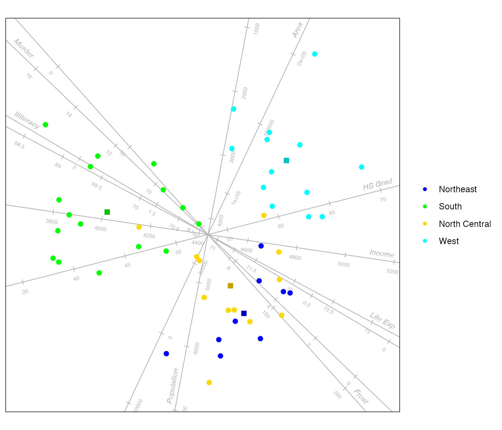

Fitting $`\alpha`$-bags to the classes makes it easier to compare class
overlap and separation. For a detailed discussion on $`\alpha`$-bags,
see the *biplotEZ* vignette.

[`biplot`](../reference/biplot.md)`(``state.x77``)`` ``|>`` `[`CVA`](../reference/CVA.md)`(``classes ``=`` ``state.region``)`` ``|>`` `[`alpha.bags`](../reference/alpha.bags.md)`(``)`` ``|>`` `` `` `[`legend.type`](../reference/legend.type.md)` ``(``bags ``=`` ``TRUE``)`` ``|>`` `` `` `[`plot`](https://rdrr.io/r/graphics/plot.default.html)`(``)`` ``#> Computing 0.95 -bag for Northeast `` ``#> Computing 0.95 -bag for South `` ``#> Computing 0.95 -bag for North Central `` ``#> Computing 0.95 -bag for West`

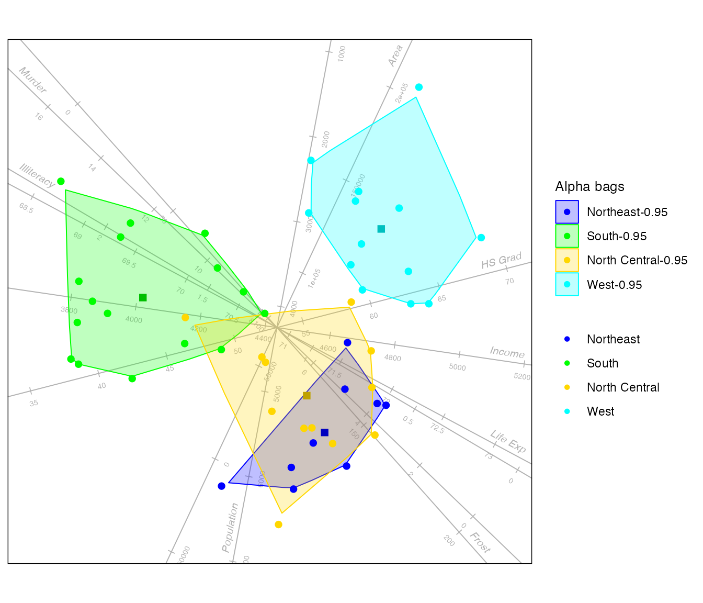

## The function `means()`

This function controls the aesthetics of the class means in the biplot.
The function accepts as first argument an object of class `biplot` where
the aesthetics should be applied. Let us first construct a CVA biplot of
the `state.x77` data with samples optimally separated according to
`state.division`.

[`biplot`](../reference/biplot.md)`(``state.x77``, scaled ``=`` ``TRUE``)`` ``|>`` `` `` `[`CVA`](../reference/CVA.md)`(``classes ``=`` ``state.division``)`` ``|>`` `` `` `[`legend.type`](../reference/legend.type.md)`(``means ``=`` ``TRUE``)`` ``|>`` `` `` `[`plot`](https://rdrr.io/r/graphics/plot.default.html)`(``)`

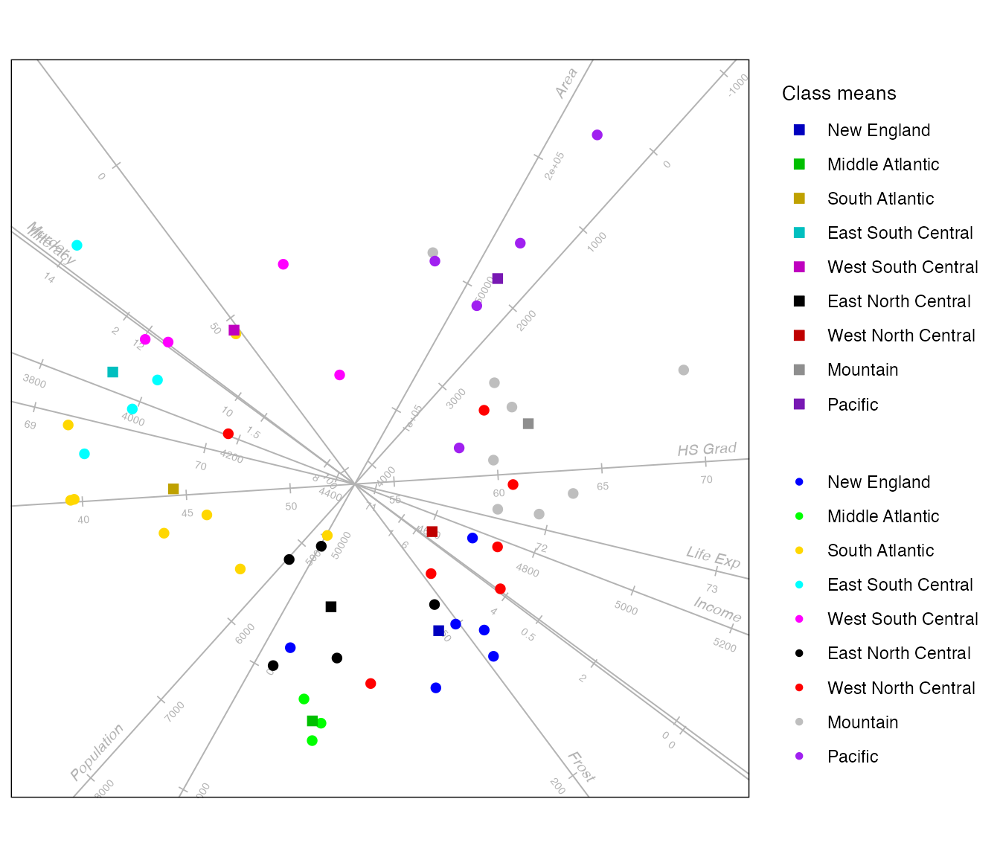

Instead of adding a legend, we can choose to label the class means.
Furthermore, the colour of each class mean defaults to the colour of the
samples. We wish to select a different colour and plotting character for
the class means.

[`biplot`](../reference/biplot.md)`(``state.x77``, scaled ``=`` ``TRUE``)`` ``|>`` `` `` `[`CVA`](../reference/CVA.md)`(``classes ``=`` ``state.division``)`` ``|>`` `` `` `[`means`](../reference/means.md)`(``label ``=`` ``TRUE``, col ``=`` ``"olivedrab"``, pch ``=`` ``15``)`` ``|>`` `` `` `[`plot`](https://rdrr.io/r/graphics/plot.default.html)`(``)`

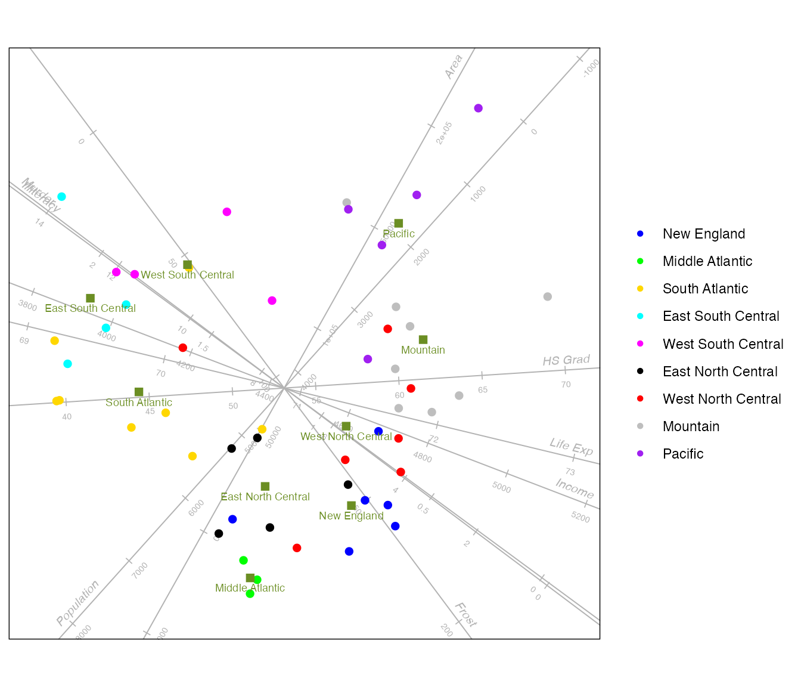

If we choose to only show the class means for the central states, the
argument `which` is used either indicating the number(s) in the sequence
of levels (`which = 4:7`), or as shown below, the levels themselves:

[`biplot`](../reference/biplot.md)`(``state.x77``, scaled ``=`` ``TRUE``)`` ``|>`` `` `` `[`CVA`](../reference/CVA.md)`(``classes ``=`` ``state.division``)`` ``|>`` `` `` `[`means`](../reference/means.md)` ``(``which ``=`` `[`c`](https://rdrr.io/r/base/c.html)`(``"West North Central"``, ``"West South Central"``, ``"East South Central"``, `` `` ``"East North Central"``)``, label ``=`` ``TRUE``)`` ``|>`` `` `[`plot`](https://rdrr.io/r/graphics/plot.default.html)`(``)`

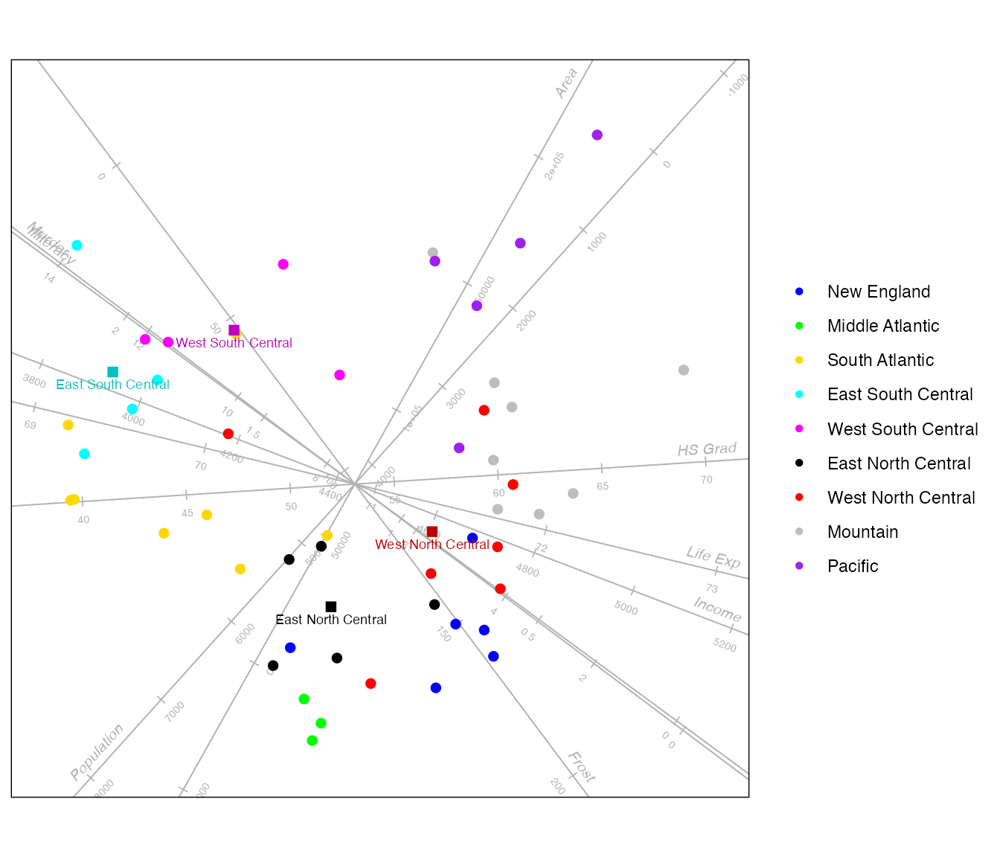

The size of the labels is controlled with `label.cex` which can be
specified either as a single value (for all class means) or a vector
indicating size values for each individual sample. The colour of the
labels defaults to the colour(s) of the class means. However, individual
label colours can be spesified with `label.col`, similar to `label.cex`
as either a single value of a vector of length equal to the number of
classes.

[`biplot`](../reference/biplot.md)`(``state.x77``, scaled ``=`` ``TRUE``)`` ``|>`` `` `` `[`CVA`](../reference/CVA.md)`(``classes ``=`` ``state.division``)`` ``|>`` `` `` `[`means`](../reference/means.md)` ``(``col ``=`` ``"olivedrab"``, pch ``=`` ``15``, cex ``=`` ``1.5``,`` `` label ``=`` ``TRUE``, label.col ``=`` `[`c`](https://rdrr.io/r/base/c.html)`(``"blue"``,``"green"``,``"gold"``,``"cyan"``,``"magenta"``,`` `` ``"black"``,``"red"``,``"grey"``,``"purple"``)``)`` ``|>`` `` `[`plot`](https://rdrr.io/r/graphics/plot.default.html)`(``)`

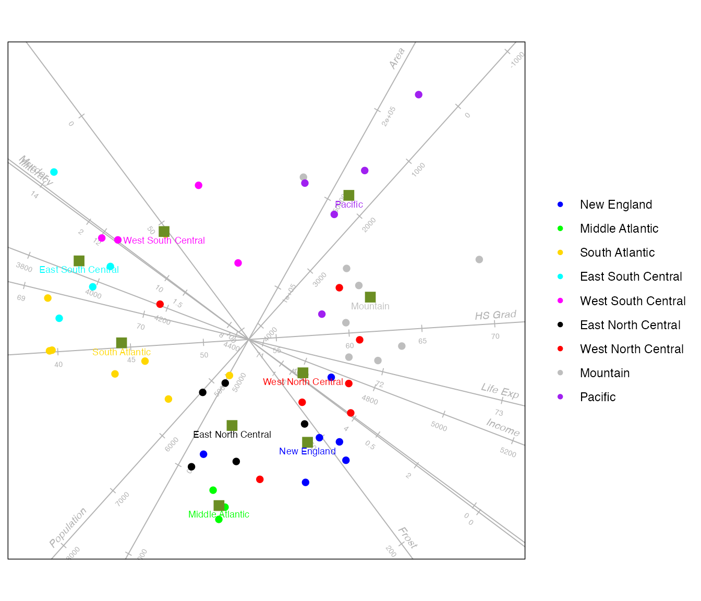

We can also make use of the functionality of the `ggrepel` package to
place the labels.

[`biplot`](../reference/biplot.md)`(``state.x77``, scaled ``=`` ``TRUE``)`` ``|>`` `` `` `[`CVA`](../reference/CVA.md)`(``classes ``=`` ``state.division``)`` ``|>`` `` `` `[`samples`](../reference/samples.md)` ``(``label ``=`` ``"ggrepel"``, label.cex``=``0.65``)`` ``|>`` `` `` `[`means`](../reference/means.md)` ``(``label ``=`` ``"ggrepel"``, label.cex``=``0.8``)`` ``|>`` `[`plot`](https://rdrr.io/r/graphics/plot.default.html)`(``)`

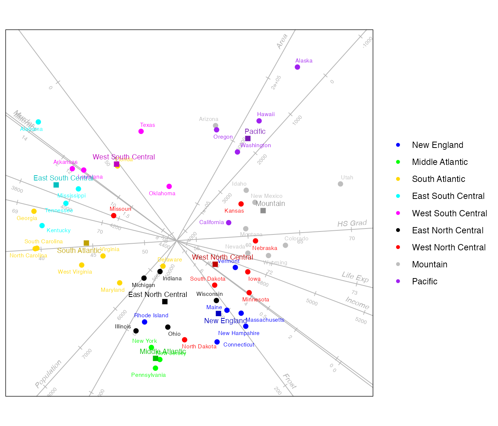

## The function `classify()`

Classification regions can be added to the CVA biplot with the function
[`classify()`](../reference/classify.md). The argument
`classify.regions` must be set equal to `TRUE` to render the regions in
the plot. Other arguments such as `col`, `opacity` and `borders` allows
to change the aesthetics of the regions.

[`biplot`](../reference/biplot.md)`(``state.x77``, scaled ``=`` ``TRUE``)`` ``|>`` `` `` `[`CVA`](../reference/CVA.md)`(``classes ``=`` ``state.division``)`` ``|>`` `` `[`classify`](../reference/classify.md)`(``classify.regions ``=`` ``TRUE``,opacity ``=`` ``0.2``)`` ``|>`` `` `` `[`plot`](https://rdrr.io/r/graphics/plot.default.html)`(``)`

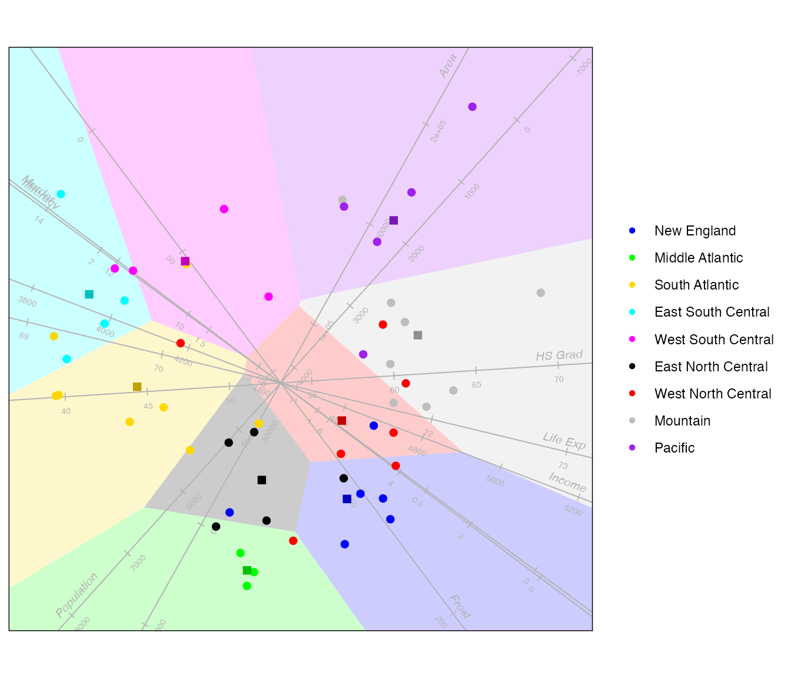

## The functions `fit.measures()` and `summary()`

There is a number of fit measures that are specific to CVA biplots. The
measures are computed with the function
[`fit.measures()`](../reference/fit.measures.md) and the results are
displayed by the function
[`summary()`](https://rdrr.io/r/base/summary.html).

Canonical variate analysis can be considered as a transformation of the
original variables to the canonical space followed by constructing a PCA
biplot of canonical variables. The matrix of class means
$`\bar{\mathbf{X}} = (\mathbf{G'G})^{-1} \mathbf{G'X}`$ is transformed
to $`\mathbf{\bar{X}L}`$ where $`\mathbf{L}`$ is a non-singular matrix
such that $`\mathbf{LL'=W}^{-1}`$. Pricipal component analysis finds the
orthogonal matrix $`\mathbf{V}`$ such that

``` math
\mathbf{(L'\bar{X}'C\bar{X}L)V=V \Lambda}
```

where $`\mathbf{M = LV}`$ as defined in section 1. The predicted values
for the class means is given by

``` math
\mathbf{\hat{\bar{X}}} = \mathbf{\bar{X}MJ}\mathbf{M}^{-1}.
```

### Overall quality of fit

Based on the two-step process described above, there are two measures of
quality of fit. The quality of the approximation of the canonical
variables $`\mathbf{\bar{X}L}`$ in the $`2`$-dimensional display is
given by

``` math
Quality (canonical \: variables) = \frac{tr(\mathbf{\Lambda J})}{tr(\mathbf{\Lambda)}}
```
and the quality of the approximation of the original variables
$`\mathbf{\bar{X}}`$ in the 2D CVA biplot is given by

``` math
Quality (original \: variables) = \frac{tr(\mathbf{\Lambda J})}{tr(\mathbf{\Lambda)}}
```

### Adequacy of representation of variables

The adequacy with which each of the variables is represented in the
biplot is given by the elementwise ratios

``` math
Adequacy = \frac{diag(\mathbf{MJM'})}{diag(\mathbf{MM'})}.
```

### Predictivity

#### Between class predictivity

The axis and class mean predictivities are defined in terms of the
weighted class means.

##### Axis predictivity

The elementwise ratios for the predictivity of each of the axes are
given by

``` math
axis \: predictivity = \frac{diag(\mathbf{\hat{\bar{X}}}'\mathbf{C\hat{\bar{X}}})}{diag(\mathbf{\bar{X}}'\mathbf{C\bar{X}})}.
```

##### Class predictivity

Similarly for each of the class means the elementwise ratio is computed
from

``` math
class \: predictivity = \frac{diag(\mathbf{C}^{\frac{1}{2}}\mathbf{\hat{\bar{X}}}'\mathbf{W^{-1}}\mathbf{\hat{\bar{X}}}\mathbf{C}^{\frac{1}{2}})}{diag(\mathbf{C}^{\frac{1}{2}}\mathbf{\bar{X}}'\mathbf{W^{-1}}\mathbf{\bar{X}}\mathbf{C}^{\frac{1}{2}})}.
```

#### Within class predictivity

We define the matrix of samples as deviations from their class means as

``` math
(\mathbf{I-H})\mathbf{X}=(\mathbf{I}_n-\mathbf{G}(\mathbf{G'G})^{-1}\mathbf{G}')\mathbf{X}
```

where $`\mathbf{H} = \mathbf{G}(\mathbf{G'G})^{-1}\mathbf{G}'`$.

##### Within class axis predictivity

The within class axis predictivity is computed as the elementwise ratios

``` math
within \: class \: axis \: predictivity = \frac{diag(\mathbf{\hat{X}}'(\mathbf{I-H)\hat{X}})}{diag(\mathbf{X}'(\mathbf{I-H)X})}.
```

##### Within class sample predictivity

Unlike PCA biplots, sample predictivity for CVA biplots are computed for
the observations expressed as deviations from their class means. The
elementwise ratios is obtained from

``` math
within \: class \: axis \: predictivity = \frac{diag(\mathbf{(I-H)\hat{X}}\mathbf{W}^{-1}\mathbf{\hat{X}'(I-H)})}{diag(\mathbf{(I-H)X}\mathbf{W}^{-1}\mathbf{X'(I-H)})}.
```
To display the fit measures, we create a `biplot` object with the
measures added by the function
[`fit.measures()`](../reference/fit.measures.md) and call
[`summary()`](https://rdrr.io/r/base/summary.html).

`obj`` ``<-`` `[`biplot`](../reference/biplot.md)`(``state.x77``, scaled ``=`` ``TRUE``)`` ``|>`` `` `` `[`CVA`](../reference/CVA.md)`(``classes ``=`` ``state.division``)`` ``|>`` `` `` `[`fit.measures`](../reference/fit.measures.md)`(``)`` ``|>`` `` `[`plot`](https://rdrr.io/r/graphics/plot.default.html)`(``)`

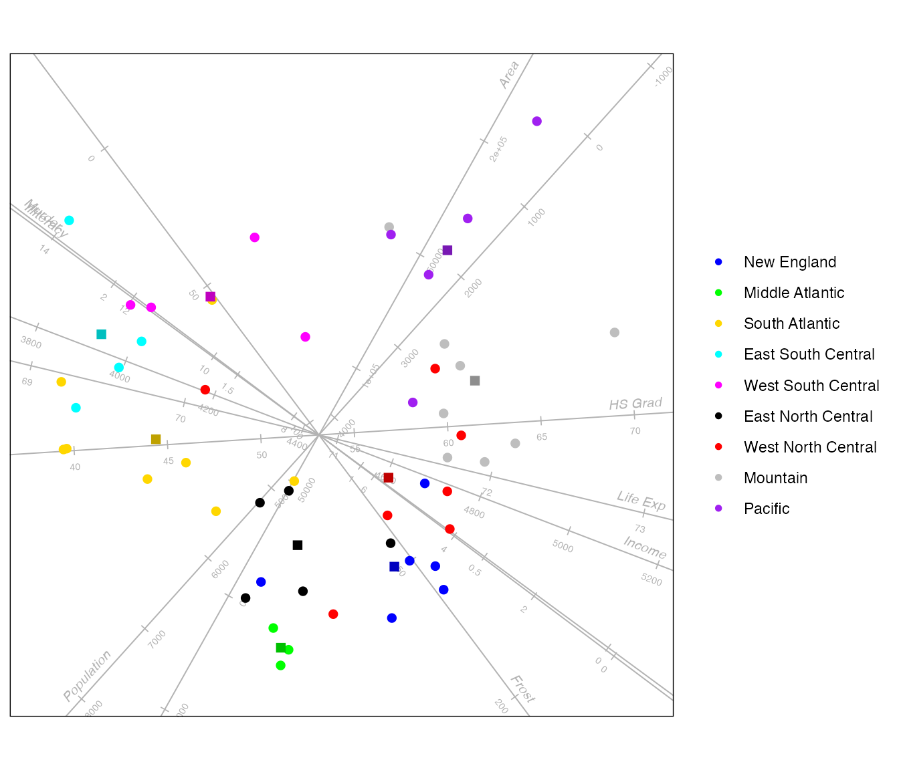

[`summary`](https://rdrr.io/r/base/summary.html)` ``(``obj``)`` ``#> Object of class biplot, based on 50 samples and 8 variables.`` ``#> 8 numeric variables.`` ``#> 9 classes: New England Middle Atlantic South Atlantic East South Central West South Central East North Central West North Central Mountain Pacific `` ``#> `` ``#> Quality of fit of canonical variables in 2 dimension(s) = 70.7% `` ``#> Quality of fit of original variables in 2 dimension(s) = 70.5% `` ``#> Adequacy of variables in 2 dimension(s):`` ``#> Population Income Illiteracy Life Exp Murder HS Grad Frost `` ``#> 0.41716176 0.15621549 0.16136381 0.09759664 0.19426796 0.55332679 0.50497634 `` ``#> Area `` ``#> 0.40661470 `` ``#> Axis predictivity in 2 dimension(s):`` ``#> Population Income Illiteracy Life Exp Murder HS Grad Frost `` ``#> 0.1859124 0.4019427 0.8195756 0.6925389 0.7685373 0.9506355 0.7819324 `` ``#> Area `` ``#> 0.8458143 `` ``#> Class predictivity in 2 dimension(s):`` ``#> New England Middle Atlantic South Atlantic East South Central `` ``#> 0.7922047 0.6570417 0.8191791 0.8777759 `` ``#> West South Central East North Central West North Central Mountain `` ``#> 0.7416085 0.6370315 0.3265978 0.6825966 `` ``#> Pacific `` ``#> 0.6700194 `` ``#> Within class axis predictivity in 2 dimension(s):`` ``#> Population Income Illiteracy Life Exp Murder HS Grad Frost `` ``#> 0.04212318 0.09357501 0.25675620 0.19900223 0.29474972 0.75215233 0.31027358 `` ``#> Area `` ``#> 0.12741853 `` ``#> Within class sample predictivity in 2 dimension(s):`` ``#> Alabama Alaska Arizona Arkansas California `` ``#> 0.722548912 0.163442379 0.333341120 0.268976273 0.229139828 `` ``#> Colorado Connecticut Delaware Florida Georgia `` ``#> 0.264963758 0.082284385 0.593415987 0.461070888 0.636531435 `` ``#> Hawaii Idaho Illinois Indiana Iowa `` ``#> 0.015640188 0.113711473 0.338612599 0.389208196 0.507060148 `` ``#> Kansas Kentucky Louisiana Maine Maryland `` ``#> 0.784831952 0.314119027 0.078465054 0.008388471 0.306141816 `` ``#> Massachusetts Michigan Minnesota Mississippi Missouri `` ``#> 0.076563044 0.218470793 0.645446212 0.046129058 0.710971640 `` ``#> Montana Nebraska Nevada New Hampshire New Jersey `` ``#> 0.086279776 0.810374638 0.090490164 0.298187909 0.003496353 `` ``#> New Mexico New York North Carolina North Dakota Ohio `` ``#> 0.007134343 0.024268121 0.422776032 0.446240464 0.277262145 `` ``#> Oklahoma Oregon Pennsylvania Rhode Island South Carolina `` ``#> 0.450104680 0.108636860 0.033945796 0.415029328 0.261568299 `` ``#> South Dakota Tennessee Texas Utah Vermont `` ``#> 0.134881180 0.247921823 0.110537439 0.500454605 0.159941068 `` ``#> Virginia Washington West Virginia Wisconsin Wyoming `` ``#> 0.310439564 0.030877305 0.066303623 0.295499472 0.474458397`

The call to [`biplot()`](../reference/biplot.md),
[`CVA()`](../reference/CVA.md) and
[`fit.measures()`](../reference/fit.measures.md) is required to (a)
create an object of class `biplot`, (b) extend the object to class `CVA`
and (c) compute the fit measures. The call to the function
[`plot()`](https://rdrr.io/r/graphics/plot.default.html) is optional. It
is further possible to select which fit measures to display in the
[`summary()`](https://rdrr.io/r/base/summary.html) function where all
measures default to `TRUE`.

`obj`` ``<-`` `[`biplot`](../reference/biplot.md)`(``state.x77``, scaled ``=`` ``TRUE``)`` ``|>`` `` `` `[`CVA`](../reference/CVA.md)`(``classes ``=`` ``state.region``)`` ``|>`` `` `` `[`fit.measures`](../reference/fit.measures.md)`(``)`` `[`summary`](https://rdrr.io/r/base/summary.html)` ``(``obj``, adequacy ``=`` ``FALSE``, within.class.axis.predictivity ``=`` ``FALSE``,`` `` within.class.sample.predictivity ``=`` ``FALSE``)`` ``#> Object of class biplot, based on 50 samples and 8 variables.`` ``#> 8 numeric variables.`` ``#> 4 classes: Northeast South North Central West `` ``#> `` ``#> Quality of fit of canonical variables in 2 dimension(s) = 91.9% `` ``#> Quality of fit of original variables in 2 dimension(s) = 95.3% `` ``#> Axis predictivity in 2 dimension(s):`` ``#> Population Income Illiteracy Life Exp Murder HS Grad Frost `` ``#> 0.9873763 0.9848608 0.8757913 0.9050208 0.9955088 0.9970346 0.9558192 `` ``#> Area `` ``#> 0.9344651 `` ``#> Class predictivity in 2 dimension(s):`` ``#> Northeast South North Central West `` ``#> 0.8031465 0.9985089 0.6449906 0.9988469`

## Additional CVA dimensions

It was mentioned that the eigen equation (1) has $`min(p, G-1)`$
non-zero eigenvalues. This implies that the CVA biplot for $`G=2`$
groups, reduces to a single dimension. If we write

``` math
\mathbf{M} = \begin{bmatrix}
             \mathbf{m}_1 & \mathbf{M}^*
             \end{bmatrix}
```
the columns of $`\mathbf{M}^*`$ forms a basis for the orthogonal
complement of the canonical space defined by $`\mathbf{m}`$\_1. The
argument `low.dim` determines how to uniquely define the second and
third dimensions. By default `low.dim = "sample.opt"` which selects the
dimensions by minimising total squared reconstruction error for samples.

The representation of the canonical variates
$`\bar{\mathbf{Z}} = \bar{\mathbf{X}}\mathbf{m}_1`$ are exact in the
first dimension, but not the representation of the individual samples
$`{\mathbf{Z}} = {\mathbf{X}}\mathbf{m}_1`$. If we define
$`\mathbf{\hat{X}} = \mathbf{XMJ}\mathbf{M}^{-1}`$ with $`\mathbf{J}`$ a
square matrix of zeros except for a $`1`$ in the first diagonal
position, then the total square reconstruction error for samples is
given by

``` math
TSRES = tr{(\mathbf{X}-\mathbf{\hat{X}})'(\mathbf{X}-\mathbf{\hat{X}})}.
```
Define
``` math
\mathbf{M}^{-1} = \begin{bmatrix}
\mathbf{M}^{(1)}:(G-1) \times p \\
\mathbf{M}^{(2)}: (p-G+1) \times p
\end{bmatrix}
```

then $`TSRES`$ is minimised when

``` math
  \mathbf{M}^{opt} = \begin{bmatrix}
  \mathbf{M}_1 & \mathbf{M}^*\mathbf{V}
  \end{bmatrix}
```

where where $`\mathbf{V}`$ is the matrix of right singular vectors of
$`\mathbf{M}^{(2)}\mathbf{M}^{(2)'}`$.

`state.2group`` ``<-`` `[`ifelse`](https://rdrr.io/r/base/ifelse.html)`(``state.division`` ``==`` ``"New England"`` ``|`` `` `` ``state.division`` ``==`` ``"Middle Atlantic"`` ``|`` `` ``state.division`` ``==`` ``"South Atlantic"`` ``|`` `` ``state.division`` ``==`` ``"Pacific"``,`` `` ``"Coastal"``, ``"Central"``)`` `[`biplot`](../reference/biplot.md)` ``(``state.x77``)`` ``|>`` `[`CVA`](../reference/CVA.md)` ``(``state.2group``)`` ``|>`` `[`legend.type`](../reference/legend.type.md)`(``means``=``TRUE``)`` ``|>`` `[`plot`](https://rdrr.io/r/graphics/plot.default.html)`(``)`` ``#> Warning in CVA.biplot(biplot(state.x77), state.2group): The dimension of the`` ``#> canonical space < dim.biplot sample.opt method used for additional`` ``#> dimension(s).`

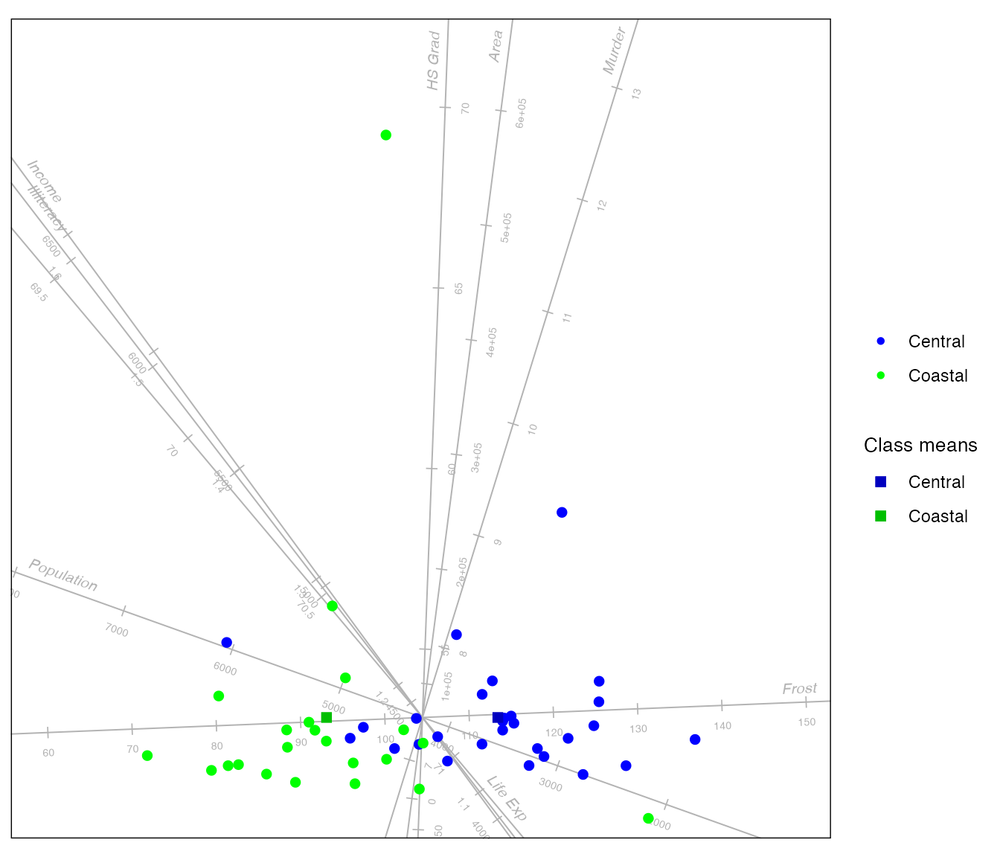

le Roux and Gardner-Lubbe (2024) discuss an alternative method for
obtaining additional dimensions. When assuming underlying normal
distributions, the Bhattacharyya distance can be optimised. This method
is specific to the two class case and cannot be utilised to find a third
dimension in a 3D CVA biplot with three classes.

[`biplot`](../reference/biplot.md)` ``(``state.x77``)`` ``|>`` `[`CVA`](../reference/CVA.md)` ``(``state.2group``, low.dim``=``"Bha"``)`` ``|>`` `[`legend.type`](../reference/legend.type.md)`(``means``=``TRUE``)`` ``|>`` `[`plot`](https://rdrr.io/r/graphics/plot.default.html)`(``)`` ``#> Warning in CVA.biplot(biplot(state.x77), state.2group, low.dim = "Bha"): The`` ``#> dimension of the canonical space < dim.biplot Bhattacharyya.dist method used`` ``#> for additional dimension(s).`

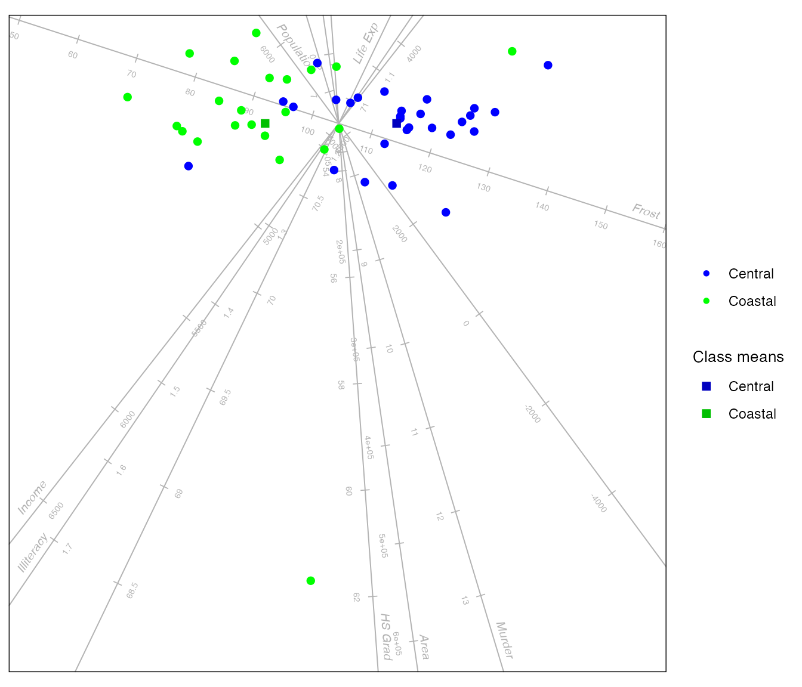

## Analysis of Distance (AoD)

Similar to the variance decomposition in CVA, analysis of distance
decomposes the total sum of squared distances into a sum of squared
distances between class means component and a sum of squared distances
within classes component.

Consider any Euclidean embeddable distance metric
$`\psi_{ij}=\psi(\mathbf{x}_i,\mathbf{x}_j)`$. For a Euclidean
embeddable metric it is possible to find high dimensional coordinates
$`\mathbf{y}_i`$ and $`\mathbf{y}_j`$ such that the Euclidean distance
between $`\mathbf{y}_i`$ and $`\mathbf{y}_j`$ is equal to $`\psi_{ij}`$.
Let the matrix $`\mathbf{\tilde\Psi}`$ contain the values
$`-\frac{1}2{}\psi_{ij}^2`$ and similarly $`\mathbf{\tilde\Delta}`$ the
values $`-\frac{1}2{}\delta_{hk}^2`$ where $`\delta_{hk}`$ represent the
distance between class means $`h`$ and $`k`$.

``` math
\mathbf{T} = \mathbf{B} + \mathbf{W}
```

``` math
\mathbf{1'\tilde\Psi1} = \mathbf{n'\tilde\Delta n} + \sum_{k=1}^{G} \frac{n}{n_k} \mathbf{g}_k'\mathbf{\tilde\Psi}\mathbf{g}_k
```
where $`\mathbf{n}=\mathbf{(G'G)1}`$. Thus, AoD differs from CVA in
allowing any Euclidean embeddable measure of inter-class distance. As
with CVA, these distances may be represented in maps with point
representing the class means, supplemented by additional points
representing the within-group variation. Principal coordinate analysis
is performed, only on the $`G \times G`$ matrix
$`\mathbf{\tilde\Delta}`$.

[`biplot`](../reference/biplot.md)`(``state.x77``, scaled ``=`` ``TRUE``)`` ``|>`` `[`AoD`](../reference/AoD.md)`(``classes ``=`` ``state.region``)`` ``|>`` `[`plot`](https://rdrr.io/r/graphics/plot.default.html)`(``)`

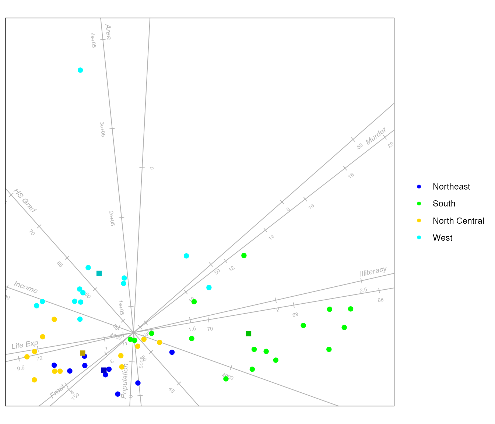

By default linear regression biplot axes are fitted to the plot.
Alternatively, spline axes can be constructed.

[`biplot`](../reference/biplot.md)`(``state.x77``, scaled ``=`` ``TRUE``)`` ``|>`` `[`AoD`](../reference/AoD.md)`(``classes ``=`` ``state.region``, axes ``=`` ``"splines"``)`` ``|>`` `[`plot`](https://rdrr.io/r/graphics/plot.default.html)`(``)`` ``#> Warning: The ggplot2 engine does not yet support spline axes; falling back to`` ``#> base graphics.`

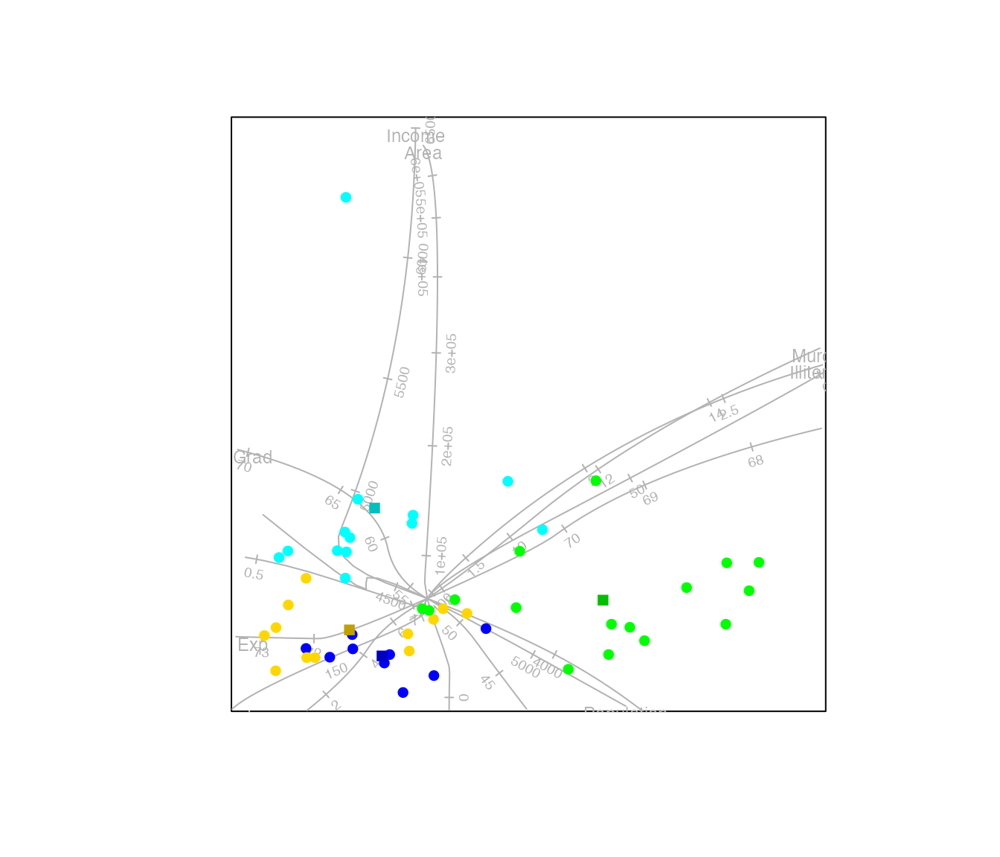

    #> Calculating spline axis for variable 1 
    #> Calculating spline axis for variable 2 
    #> Calculating spline axis for variable 3 
    #> Calculating spline axis for variable 4 
    #> Calculating spline axis for variable 5 
    #> Calculating spline axis for variable 6 
    #> Calculating spline axis for variable 7 
    #> Calculating spline axis for variable 8

As an illustration of a Euclidean embeddable distance metric, other than
Euclidean distance itself, we can construct an AoD biplot with the
square root of the Manhattan distance.

[`biplot`](../reference/biplot.md)`(``state.x77``, scaled ``=`` ``TRUE``)`` ``|>`` `` `` `[`AoD`](../reference/AoD.md)`(``classes ``=`` ``state.region``, axes ``=`` ``"splines"``, dist.func``=``sqrtManhattan``)`` ``|>`` `[`plot`](https://rdrr.io/r/graphics/plot.default.html)`(``)`` ``#> Warning: The ggplot2 engine does not yet support spline axes; falling back to`` ``#> base graphics.`

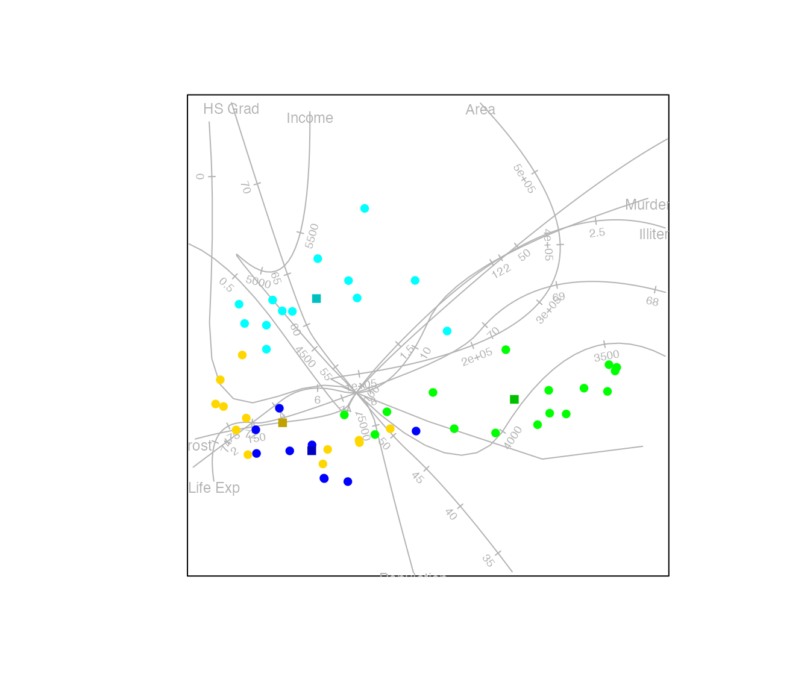

    #> Calculating spline axis for variable 1 
    #> Calculating spline axis for variable 2 
    #> Calculating spline axis for variable 3 
    #> Calculating spline axis for variable 4 
    #> Calculating spline axis for variable 5 
    #> Calculating spline axis for variable 6 
    #> Calculating spline axis for variable 7 
    #> Calculating spline axis for variable 8

## References

le Roux, N. J, and S. Gardner-Lubbe. 2024. “A Two-Group Canonical
Variate Analysis Biplot for an Optimal Display of Bothmeans and Cases.”
*Advances in Data Analysis and Classification*.
