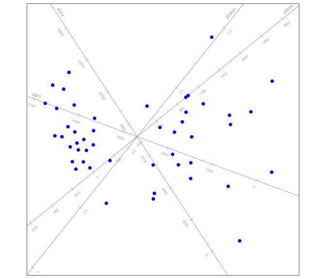
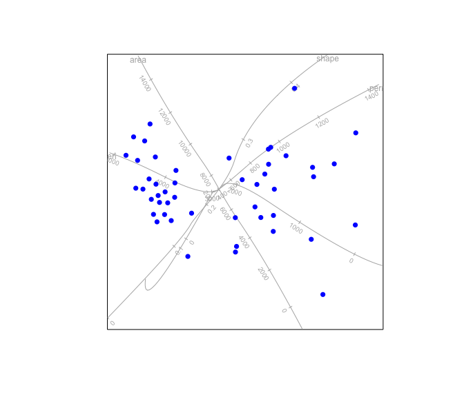
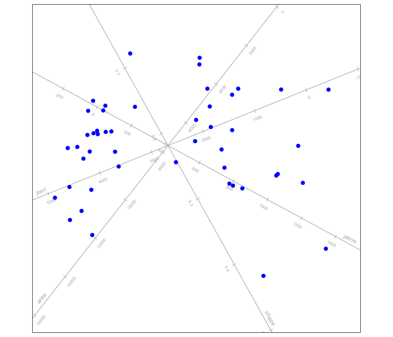
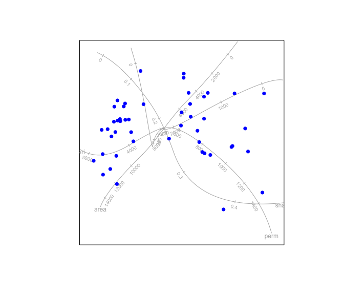
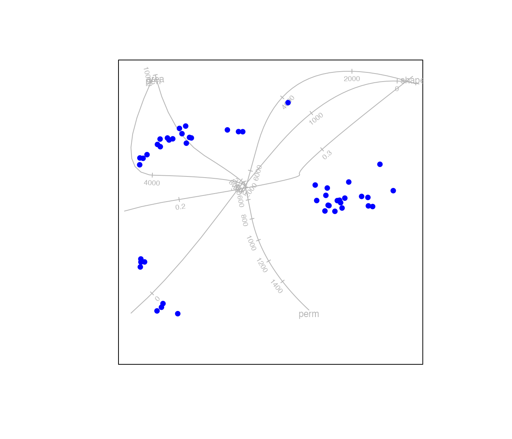
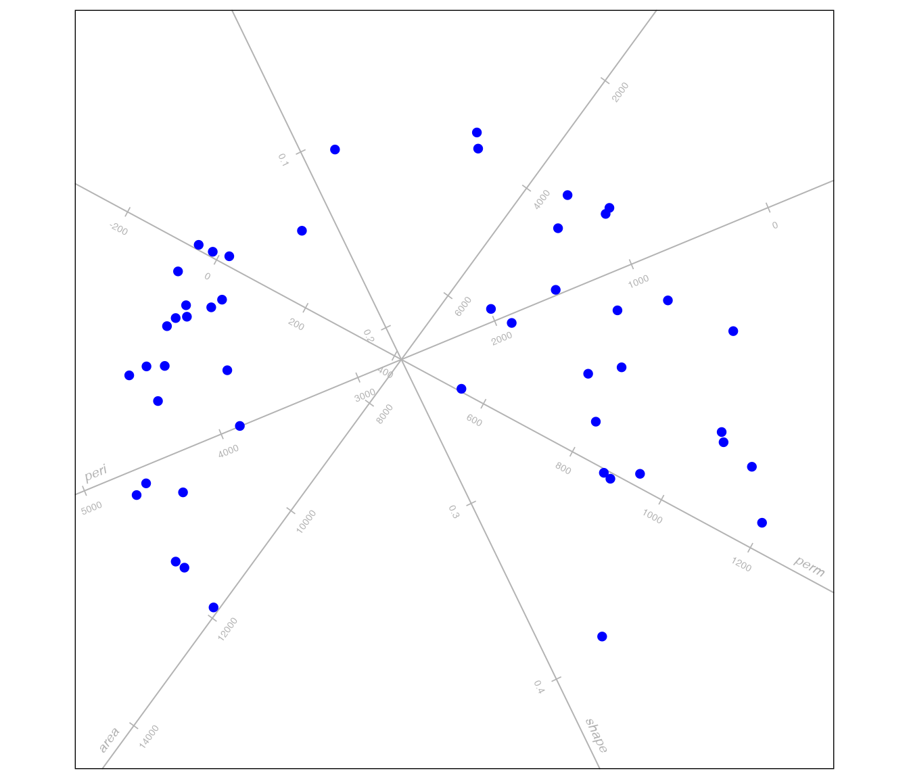

# MDS

[`library`](https://rdrr.io/r/base/library.html)`(``biplotEZ``)`` ``#> Welcome to biplotEZ! `` ``#> This package is used to construct biplots `` ``#> Run ?biplot or vignette() for more information`` ``#> `` ``#> Attaching package: 'biplotEZ'`` ``#> The following object is masked from 'package:stats':`` ``#> `` ``#> biplot`

This vignette deals with biplots based on Multidimensional scaling
(MDS).

## What is MDS

In general, multidimensional scaling deals with constructing a low
dimensional map of $`n`$ samples such that the Euclidean distances
between the samples match a given set of dissimilarities
$`\mathbf{\Delta}:n \times n`$ as closely as possible. Here the focus is
on Principal Coordinate Analysis (PCO), an approach based on the
singular value decomposition of a matrix. However, the regression biplot
provides a general structure for fitting any 2D map of samples with
biplot axes.

## Regression biplot

The function `regress` accepts as arguments an object of class `biplot`.
The call to the function `biplot` should contain the data set that will
be used to construct the biplot axes. The second argument `Z` contains
the coordinates of the samples in the MDS map. By default linear
regression axes will be fitted to the plot. If $`\mathbf{X}`$ denote the
data matrix, the directions of the biplot axes are found by solving the
regression equation

``` math
\mathbf{X} = \mathbf{ZH}' + \mathbf{E}.
```
The matrix $`\mathbf{H}'=(\mathbf{Z'Z})^{-1}\mathbf{Z'X}`$ and
calibration of the axes proceed analogous to equation (2) in the
biplotEZ vignette. The coordinates of the marker $`/mu`$ on biplot axis
$`j`$ is given as follows

``` math
p_{\mu} =  \frac{\mu}{\mathbf{h}_{(j)}'\mathbf{h}_{(j)}}\mathbf{h}_{(j)}.
```

[`biplot`](../reference/biplot.md)`(``rock``)`` ``|>`` `` `` `[`regress`](../reference/regress.md)`(``Z ``=`` ``MASS``::`[`sammon`](https://rdrr.io/pkg/MASS/man/sammon.html)`(`[`dist`](https://rdrr.io/r/stats/dist.html)`(`[`scale`](https://rdrr.io/r/base/scale.html)`(``rock``)``, method``=``"manhattan"``)``)``$``points``)`` ``|>`` `` `` `[`plot`](https://rdrr.io/r/graphics/plot.default.html)`(``)`` ``#> Initial stress : 0.02554`` ``#> stress after 10 iters: 0.01094, magic = 0.500`` ``#> stress after 20 iters: 0.01080, magic = 0.500`` ``#> stress after 30 iters: 0.01078, magic = 0.500`



More flexibility is provided by approximating the biplot axes using
B-splines. A calibrated trajectory represented in a matrix
$`\mathbf{H}:m \times 2`$ snakes through the samples points
$`\mathbf{Z}`$ such that the marker on the trajectory which is closest
to a particular sample gives the predicted value of that sample for the
particular variable. To retain smoothness of the trajectory
$`\mathbf{H}`$, B-splines are used.

[`biplot`](../reference/biplot.md)`(``rock``)`` ``|>`` `` `` `[`regress`](../reference/regress.md)`(``Z ``=`` ``MASS``::`[`sammon`](https://rdrr.io/pkg/MASS/man/sammon.html)`(`[`dist`](https://rdrr.io/r/stats/dist.html)`(`[`scale`](https://rdrr.io/r/base/scale.html)`(``rock``)``, method``=``"manhattan"``)``)``$``points``,`` `` axes ``=`` ``"splines"``)`` ``|>`` `` `` `[`plot`](https://rdrr.io/r/graphics/plot.default.html)`(``)`` ``#> Initial stress : 0.02554`` ``#> stress after 10 iters: 0.01094, magic = 0.500`` ``#> stress after 20 iters: 0.01080, magic = 0.500`` ``#> stress after 30 iters: 0.01078, magic = 0.500`` ``#> Warning: The ggplot2 engine does not yet support spline axes; falling back to`` ``#> base graphics.`



    #> Calculating spline axis for variable 1 
    #> Calculating spline axis for variable 2 
    #> Calculating spline axis for variable 3 
    #> Calculating spline axis for variable 4

## Principal Coordinate Analysis (PCO) biplots

Let $`\mathbf{\tilde\Delta}`$ be the $`n \times n`$ matrix containing
the values $`-\frac{1}{2}\delta_{ij}^2`$ where $`\delta_{ij}`$ represent
the dissimilarity between objects $`i`$ and $`j`$. If it is possible to
find a set of coordinates $`\mathbf{Y}:n\times m`$ where typically
$`m = n-1`$ such that the Euclidean distances between the rows of
$`\mathbf{Y}`$ exactly match the dissimilarities $`\delta_{ij}`$, the
dissimilarity is known as a Euclidean embeddable distance metric. Gower
(1982) shows that if the distances $`\delta_{ij}`$ are Euclidean
embeddable, then

``` math
(\mathbf{I}-\mathbf{1s}')\mathbf{\tilde\Delta} (\mathbf{I}-\mathbf{s1}')
```

is positive semi-definite.

The Euclidean representation of the samples is obtained as
$`\mathbf{Y=V\Lambda}^{\frac{1}{2}}`$ where
$`(\mathbf{I}-\mathbf{1s}')\mathbf{\tilde\Delta} (\mathbf{I}-\mathbf{s1}') = \mathbf{V \Lambda V'}`$.
Since the coordinates in $`\mathbf{Y}`$ is already referred to their
principal axes with $`\mathbf{Y'Y=\Lambda}`$, the representation of the
samples in a 2D biplot is obtained from the first two columns of
$`\mathbf{Y}`$.

In addition to the exact biplot axis representations discussed in Gower
et al. (2011) approximate axes can be obtained. Linear axes are fitted
with the regression method. The variables in the data matrix
$`\mathbf{X}:n \times p`$ can be represented as biplot axes in the PCO
biplot with the sample points
$`\mathbf{Z=V\Lambda}^{\frac{1}{2}}\mathbf{J}_2`$ according to the
regression method discussed in section 2 above.

[`biplot`](../reference/biplot.md)`(``rock``, scale ``=`` ``TRUE``)`` ``|>`` `[`PCO`](../reference/PCO.md)`(``)`` ``|>`` `[`plot`](https://rdrr.io/r/graphics/plot.default.html)`(``)`



Using B-splines instead of linear regression provides the user with more
flexibility. This is achieved by setting the argument
`axes = "splines"`.

[`biplot`](../reference/biplot.md)`(``rock``, scale ``=`` ``TRUE``)`` ``|>`` `[`PCO`](../reference/PCO.md)`(``axes ``=`` ``"splines"``)`` ``|>`` `[`plot`](https://rdrr.io/r/graphics/plot.default.html)`(``)`` ``#> Warning: The ggplot2 engine does not yet support spline axes; falling back to`` ``#> base graphics.`



    #> Calculating spline axis for variable 1 
    #> Calculating spline axis for variable 2 
    #> Calculating spline axis for variable 3 
    #> Calculating spline axis for variable 4

By default the distance metric used for the analysis is Euclidean
distance. The user can also specify the distance matrix `Dmat` as an
$`n \times n`$ matrix of a `dist` object. As illustration of a metric
that is Euclidean embeddable, the Clark’s distance

``` math
\delta_{ij}^2 = \sum_{k=1}^{p}\left(\frac{x_{ik}-x_{jk}}{x_{ik}+x_{jk}}\right)^2
```

as defined by Gower and Ngouenet (2005) is calculated below and used for
constructing a PCO biplot. Note that the metric is only defined for
strictly positive values, so that the data is scaled to values between
$`1`$ and $`2`$.

`Clark.dist`` ``<-`` ``function``(``X``)`` ``{`` `` ``n`` ``<-`` `[`nrow`](https://rdrr.io/r/base/nrow.html)`(``X``)`` `` ``p`` ``<-`` `[`ncol`](https://rdrr.io/r/base/nrow.html)`(``X``)`` `` ``Dmat`` ``<-`` `[`matrix`](https://rdrr.io/r/base/matrix.html)` ``(``0``, nrow``=``n``, ncol``=``n``)`` `` ``for`` ``(``i`` ``in`` ``1``:``(``n``-``1``)``)`` `` ``for`` ``(``j`` ``in`` ``(``i``+``1``)``:``n``)`` `` ``Dmat``[``i``,``j``]`` ``<-`` `[`sum`](https://rdrr.io/r/base/sum.html)`(``(``(``X``[``i``,``]`` ``-`` ``X``[``j``,``]``)``/``(``X``[``i``,``]`` ``+`` ``X``[``j``,``]``)``)``^``2``)`` `` `[`sqrt`](https://rdrr.io/r/base/MathFun.html)`(``Dmat`` ``+`` `[`t`](https://rdrr.io/r/base/t.html)`(``Dmat``)``)`` ``}`` ``my.data`` ``<-`` `[`scale`](https://rdrr.io/r/base/scale.html)`(``rock``, center``=`[`apply`](https://rdrr.io/r/base/apply.html)`(``rock``,``2``,``min``)``, scale``=`[`diff`](https://rdrr.io/r/base/diff.html)`(`[`apply`](https://rdrr.io/r/base/apply.html)`(``rock``,``2``,``range``)``)``)``+``1`` `[`biplot`](../reference/biplot.md)`(``rock``)`` ``|>`` `[`PCO`](../reference/PCO.md)`(``Dmat ``=`` ``Clark.dist`` ``(``rock``)``, axes ``=`` ``"splines"``)`` ``|>`` `[`plot`](https://rdrr.io/r/graphics/plot.default.html)`(``)`` ``#> Warning: The ggplot2 engine does not yet support spline axes; falling back to`` ``#> base graphics.`



    #> Calculating spline axis for variable 1 
    #> Calculating spline axis for variable 2 
    #> Calculating spline axis for variable 3 
    #> Calculating spline axis for variable 4

Alternatively, the user can specify a function which computes a distance
matrix or `dist` object. The Manhattan distance is not Euclidean
embeddable, but the square root of the distance is. The function
`sqrtManhattan` is included as an example of a function computing a
Euclidean embeddable `dist` object.

`sqrtManhattan`` ``#> function (X) `` ``#> {`` ``#> sqrt(stats::dist(X, method = "manhattan"))`` ``#> }`` ``#> <bytecode: 0x7b9a7d230>`` ``#> <environment: namespace:biplotEZ>`` `[`biplot`](../reference/biplot.md)`(``rock``, scaled ``=`` ``TRUE``)`` ``|>`` `[`PCO`](../reference/PCO.md)`(``dist.func ``=`` ``sqrtManhattan``)`` ``|>`` `[`plot`](https://rdrr.io/r/graphics/plot.default.html)`(``)`



## References

Gower, J. C. 1982. “Euclidean Distance Geometry.” *Mathematical
Scientist*, 1–14.

Gower, J. C., S. Lubbe, and N. J. le Roux. 2011. *Understanding
Biplots.* Wiley.

Gower, John C, and Roger F Ngouenet. 2005. “Nonlinearity Effects in
Multidimensional Scaling.” *Journal of Multivariate Analysis* 94 (2):
344–65.
