# biplotEZ

The package provides users with an *EZ*-to-use way of constructing
multi-dimensional scatter plots of their data. The simplest form of a
biplot is the principal component analysis (PCA) biplot which will be
used for illustration in this vignette.

Read more …

- [`vignette("Biplots_in_1D")`](../articles/Biplots_in_1D.md) for
  1-dimensional biplots
- [`vignette("Biplots_in_3D")`](../articles/Biplots_in_3D.md) for
  3-dimensional biplots
- [`vignette("biplotEZ_enhancements")`](../articles/biplotEZ_enhancements.md)
  for alpha-bags, ellipses, densities, interpolation, prediction,
  reflection, rotation, zoom and axes translation
- `vignette("Class_sepeartion")` for grouped data
- [`vignette("CA_in_biplotEZ")`](../articles/CA_in_biplotEZ.md) for
  correspondence analysis
- [`vignette("MDS")`](../articles/MDS.md) for multidimensional scaling
  biplots

## What is a PCA biplot

Consider a data matrix $`\mathbf{X}^{*}:n \times p`$ containing data on
$`n`$ objects and $`p`$ variables. To produce a 2D biplot, we need to
optimally approximate
$`\mathbf{X} = (\mathbf{I}_n-\frac{1}{n}\mathbf{11}')\mathbf{X}^{*}`$
(typically of rank $`p`$ with $`p<n`$) with a rank $`2`$ matrix. In
terms of the least squares error, we want to

``` math
min \| \hat{\mathbf{X}}-\mathbf{X} \|^2
```
where $`rank(\hat{\mathbf{X}})=2`$. It was shown by Eckart and Young
(1936) that if the singular value decomposition of
$`\mathbf{X} = \mathbf{UDV'}`$ then
``` math
\hat{\mathbf{X}} = \mathbf{UJDJV'}
```
with
``` math
\mathbf{J} = \begin{bmatrix}
              \mathbf{I}_2 & \mathbf{0}\\
              \mathbf{0} & \mathbf{0}
             \end{bmatrix}
```
essentially selecting only the first two columns of $`\mathbf{U}`$, the
diagonal matrix of the first (largest) two singular values and the first
two rows of $`\mathbf{V}'`$. Define
``` math
\mathbf{J}_2 = \begin{bmatrix}
                \mathbf{I}_2\\
                \mathbf{0}
               \end{bmatrix}
```
then $`\mathbf{J}_2\mathbf{J}_2' = \mathbf{J}`$ and we can write
$`\hat{\mathbf{X}} = (\mathbf{UDJ}_2)(\mathbf{VJ}_2)'`$.

Gabriel (1971) shows that any rank $`2`$ matrix can be written as
``` math
\begin{equation}
  \hat{\mathbf{X}} = \mathbf{G} \mathbf{H}' \tag{1}
\end{equation}
```
where $`\mathbf{G}:n \times 2`$ and $`\mathbf{H}:p \times 2`$.The $`n`$
rows of $`\mathbf{G}`$ provide the $`n`$ pairs of 2D coordinates
representing the rows of $`\hat{\mathbf{X}}`$ and the $`p`$ rows of
$`\mathbf{H}`$ provide the $`p`$ pairs of 2D coordinates representing
the columns of $`\hat{\mathbf{X}}`$. Since
$`\hat{\mathbf{X}} = (\mathbf{UDJ}_2)(\mathbf{VJ}_2)'`$, by setting
$`\mathbf{G}=\mathbf{UDJ}_2`$ and $`\mathbf{H}=\mathbf{VJ}_2`$ we
obtains the best least squares approximation of $`\mathbf{X}`$. Gabriel
(1971) further shows that the approximation of distances between the
rows are optimal, while the approximation of correlations by the cosines
between the angles of the rows of $`\mathbf{H}`$ is sub-optimal.

The rows of $`\mathbf{G}`$ is plotted as points, representing the
samples. The rows of $`\mathbf{H}`$ provide the directions of the axes
for the variables. Since we have
``` math
x^{*}_{ij}-\bar{x}_j = x_{ij} \approx \hat{x}_{ij} = \mathbf{g}_{(i)}'\mathbf{h}_{(j)}
```
all the values that will predict $`\mu`$ for variable $`j`$ is of the
form
``` math
\mu = \mathbf{g}'_{\mu}\mathbf{h}_{(j)}
```
which defines a straight line orthogonal to $`\mathbf{h}_{(j)}`$ in the
biplot space (see the dotted red line in Figure 1(a)). To find the
intersection of this prediction line with $`\mathbf{h}_{(j)}`$ we note
that
``` math
\mathbf{g}'_{(i)}\mathbf{h}_{(j)} = \| \mathbf{g}_{(i)} \| \| \mathbf{h}_{(j)} \| cos(\mathbf{g}_{(i)},\mathbf{h}_{(j)}) = 
\| \mathbf{p} \| \| \mathbf{h}_{(j)} \| 
```
where $`\mathbf{p}`$ is the length of the orthogonal projection of
$`\mathbf{g}_{(i)}`$ on $`\mathbf{h}_{(j)}`$. This is illustrated in
Figure 1(b) with triangle ABC: $`cos(\theta) = \frac{AC}{AB}`$ or
$`AC = AB cos(\theta)`$ The length of $`AC`$, written as
$`\| \mathbf{p} \|`$ is equal to the cosine times the length of $`AB`$,
i.e. $`cos(\mathbf{g}_{(i)},\mathbf{h}_{(j)}) \| \mathbf{g}_{(i)} \|`$.

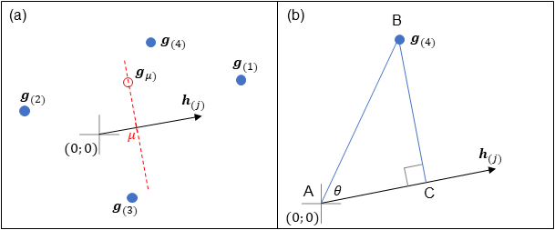

Figure 1: Calibration of biplot axes.

Since $`\mathbf{p}`$ is along $`\mathbf{h}_{(j)}`$ we can write
$`\mathbf{p} = c\mathbf{h}_{(j)}`$ and all points on the prediction line
$`\mu = \mathbf{g}'_{\mu}\mathbf{h}_{(j)}`$ project on the same point
$`c_{\mu}\mathbf{h}_{(j)}`$. We solve for $`c_{\mu}`$ from
``` math
\mu = \mathbf{g}'_{\mu}\mathbf{h}_{(j)}=\| \mathbf{p} \| \| \mathbf{h}_{(j)} \| = 
\| c_{\mu}\mathbf{h}_{(j)} \| \| \mathbf{h}_{(j)} \|
```

``` math
c_{\mu} = \frac{\mu}{\mathbf{h}_{(j)}'\mathbf{h}_{(j)}}.
```
If we select ‘nice’ scale markers
$`\tau_{1}, \tau_{2}, \cdots \tau_{k}`$ for variable $`j`$, then
$`\tau_{h}-\bar{x}_j = \mu_{h}`$ and positions of these scale markers on
$`\mathbf{h}_{(j)}`$ are given by
$`p_{\mu_{1}}, p_{\mu_{2}}, \cdots p_{\mu_{k}}`$ with
``` math
p_{\mu_h} = c_{\mu_h}\mathbf{h}_{(j)} =  \frac{\mu_h}{\mathbf{h}_{(j)}'\mathbf{h}_{(j)}}\mathbf{h}_{(j)} \tag{2}
```
To obtain a PCA biplot of the $`48\times 4`$ rock data in `R` we call

[`biplot`](../reference/biplot.md)`(``rock``, scale ``=`` ``TRUE``)`` ``|>`` `[`PCA`](../reference/PCA.md)`(``)`` ``|>`` `[`plot`](https://rdrr.io/r/graphics/plot.default.html)`(``)`

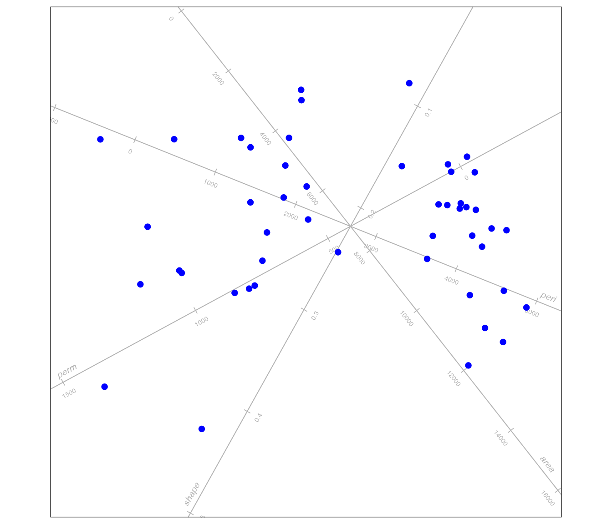

## The function `biplot()`

The function [`biplot()`](../reference/biplot.md) takes a data set
(usually) and outputs an object of class `biplot`.

`state.data`` ``<-`` `[`data.frame`](https://rdrr.io/r/base/data.frame.html)` ``(``state.region``, ``state.x77``)`` `[`biplot`](../reference/biplot.md)`(``state.data``)`` ``#> Object of class biplot, based on 50 samples and 9 variables.`` ``#> 8 numeric variables.`` ``#> 1 categorical variable.`

Apart from specifying a data set, we can specify a single variable for
classification purposes.

[`biplot`](../reference/biplot.md)`(``state.x77``, classes``=``state.region``)`` ``#> Object of class biplot, based on 50 samples and 8 variables.`` ``#> 8 numeric variables.`` ``#> 4 classes: Northeast South North Central West`

If we want to use the variable `state.region` for formatting, say colour
coding the samples according to region, we instead specify
`grouping.aes` to indicate it pertains to the aesthetics, rather than
data structure. We can include or exclude the aestethics variable from
the data set.

[`biplot`](../reference/biplot.md)`(``state.x77``, group.aes``=``state.region``)`` ``#> Object of class biplot, based on 50 samples and 8 variables.`` ``#> 8 numeric variables.`

Next, we look at centring and scaling of the numeric data matrix. As we
saw in section 1 above, PCA is computed from the centred data matrix.
For most methods, centring is either required or has no effect on the
methodology, therefore the default is `center = TRUE`. Since centring is
usually assumed, you will get a warning message, should you explicitly
choose to set `center = FALSE`. The default for `scaled` is `FALSE`, but
often when variables are in different units of measurement, it is
advisable to divide each variable by its standard deviation which is
accomplished by setting \`scale = TRUE’.

[`biplot`](../reference/biplot.md)`(``state.data``)`` ``# centred, but no scaling`` ``#> Object of class biplot, based on 50 samples and 9 variables.`` ``#> 8 numeric variables.`` ``#> 1 categorical variable.`` `[`biplot`](../reference/biplot.md)`(``state.data``, scale ``=`` ``TRUE``)`` ``# centered and scaled`` ``#> Object of class biplot, based on 50 samples and 9 variables.`` ``#> 8 numeric variables.`` ``#> 1 categorical variable.`` `[`biplot`](../reference/biplot.md)`(``state.data``, center ``=`` ``FALSE``)`` ``# no centring (usually not recommended) or scaling`` ``#> Object of class biplot, based on 50 samples and 9 variables.`` ``#> 8 numeric variables.`` ``#> 1 categorical variable.`

The final optional argument to the function is specifying a title for
your plot. We notice in the output above, that centring and / or scaling
has no effect on the `print method`. It does however have an effect on
the components of the object of class `biplot` in the output.

`out`` ``<-`` `[`biplot`](../reference/biplot.md)`(``state.data``)`` ``# centred, but no scaling`` ``out``$``center`` ``#> [1] TRUE`` ``out``$``scaled`` ``#> [1] FALSE`` ``out``$``means`` ``#> Population Income Illiteracy Life.Exp Murder HS.Grad Frost `` ``#> 4246.4200 4435.8000 1.1700 70.8786 7.3780 53.1080 104.4600 `` ``#> Area `` ``#> 70735.8800`` ``out``$``sd`` ``#> [1] 1 1 1 1 1 1 1 1`` ``out`` ``<-`` `[`biplot`](../reference/biplot.md)`(``state.data``, scale ``=`` ``TRUE``)`` ``# centered and scaled`` ``out``$``center`` ``#> [1] TRUE`` ``out``$``scaled`` ``#> [1] TRUE`` ``out``$``means`` ``#> Population Income Illiteracy Life.Exp Murder HS.Grad Frost `` ``#> 4246.4200 4435.8000 1.1700 70.8786 7.3780 53.1080 104.4600 `` ``#> Area `` ``#> 70735.8800`` ``out``$``sd`` ``#> Population Income Illiteracy Life.Exp Murder HS.Grad `` ``#> 4.464491e+03 6.144699e+02 6.095331e-01 1.342394e+00 3.691540e+00 8.076998e+00 `` ``#> Frost Area `` ``#> 5.198085e+01 8.532730e+04`` ``out`` ``<-`` `[`biplot`](../reference/biplot.md)`(``state.data``, center ``=`` ``FALSE``)`` ``# no centring (usually not recommended) or scaling`` ``out``$``center`` ``#> [1] FALSE`` ``out``$``scaled`` ``#> [1] FALSE`` ``out``$``means`` ``#> [1] 0 0 0 0 0 0 0 0`` ``out``$``sd`` ``#> [1] 1 1 1 1 1 1 1 1`

Note that the components `means` and `sd` only contain the sample means
and sample sds when either/or `center` and `scaled` is `TRUE`. For
values of `FALSE`, these components contain zeros for the `means` and/or
ones for the `sd` to ensure back transformation will not have any
affect.

### Using `biplot()` with `princomp()` or `prcomp()`

Should the user wish to construct a PCA biplot after performing
principal component analysis via the built in functions in the `stats`
package, the output from either of these functions can be piped into the
biplot function, where the piping implies that the argument `data` now
takes the value of an object of class `prcomp` or `princomp`.

[`princomp`](https://rdrr.io/r/stats/princomp.html)`(``state.x77``)`` ``|>`` `[`biplot`](../reference/biplot.md)`(``)`` ``#> Object of class biplot, based on 50 samples and 8 variables.`` ``#> 8 numeric variables.`` ``out`` ``<-`` `[`prcomp`](https://rdrr.io/r/stats/prcomp.html)`(``state.x77``, scale.``=``TRUE``)`` ``|>`` `[`biplot`](../reference/biplot.md)`(``)`` `[`rbind`](https://rdrr.io/r/base/cbind.html)` ``(`[`head`](https://rdrr.io/r/utils/head.html)`(``out``$``raw.X``,``3``)``,`[`tail`](https://rdrr.io/r/utils/head.html)`(``out``$``raw.X``,``3``)``)`` ``#> Population Income Illiteracy Life Exp Murder HS Grad Frost Area`` ``#> Alabama 3615 3624 2.1 69.05 15.1 41.3 20 50708`` ``#> Alaska 365 6315 1.5 69.31 11.3 66.7 152 566432`` ``#> Arizona 2212 4530 1.8 70.55 7.8 58.1 15 113417`` ``#> West Virginia 1799 3617 1.4 69.48 6.7 41.6 100 24070`` ``#> Wisconsin 4589 4468 0.7 72.48 3.0 54.5 149 54464`` ``#> Wyoming 376 4566 0.6 70.29 6.9 62.9 173 97203`` `[`rbind`](https://rdrr.io/r/base/cbind.html)` ``(`[`head`](https://rdrr.io/r/utils/head.html)`(``out``$``X``,``3``)``,`[`tail`](https://rdrr.io/r/utils/head.html)`(``out``$``X``,``3``)``)`` ``#> Population Income Illiteracy Life Exp Murder`` ``#> Alabama -0.14143156 -1.32113867 1.525758 -1.3621937 2.0918101`` ``#> Alaska -0.86939802 3.05824562 0.541398 -1.1685098 1.0624293`` ``#> Arizona -0.45568908 0.15330286 1.033578 -0.2447866 0.1143154`` ``#> West Virginia -0.54819682 -1.33253061 0.377338 -1.0418703 -0.1836632`` ``#> Wisconsin 0.07673438 0.05240289 -0.771082 1.1929438 -1.1859550`` ``#> Wyoming -0.86693413 0.21188994 -0.935142 -0.4384705 -0.1294853`` ``#> HS Grad Frost Area`` ``#> Alabama -1.4619293 -1.62482920 -0.2347183`` ``#> Alaska 1.6828035 0.91456761 5.8093497`` ``#> Arizona 0.6180514 -1.72101848 0.5002047`` ``#> West Virginia -1.4247868 -0.08580083 -0.5469045`` ``#> Wisconsin 0.1723413 0.85685405 -0.1906996`` ``#> Wyoming 1.2123316 1.31856256 0.3101835`` ``out``$``center`` ``#> [1] TRUE`` ``out``$``scaled`` ``#> [1] TRUE`` ``out``$``means`` ``#> Population Income Illiteracy Life Exp Murder HS Grad Frost `` ``#> 4246.4200 4435.8000 1.1700 70.8786 7.3780 53.1080 104.4600 `` ``#> Area `` ``#> 70735.8800`` ``out``$``sd`` ``#> Population Income Illiteracy Life Exp Murder HS Grad `` ``#> 4.464491e+03 6.144699e+02 6.095331e-01 1.342394e+00 3.691540e+00 8.076998e+00 `` ``#> Frost Area `` ``#> 5.198085e+01 8.532730e+04`

## The functions `PCA()` and `plot()`

The first argument to the function [`PCA()`](../reference/PCA.md) is an
object of class `biplot`, i.e. the output of the
[`biplot()`](../reference/biplot.md) function. By default we construct a
2D biplot (argument `dim.biplot = 2`) of the first two principal
components (argument `e.vects = 1:2`). The `group.aes` argument, if not
specified in the function [`biplot()`](../reference/biplot.md), allows a
grouping argument for the sample aesthetics. A PCA biplot of the
`state.x77` data with colouring according to `state.region` is obtained
as follows:

[`biplot`](../reference/biplot.md)`(``state.x77``, scaled ``=`` ``TRUE``)`` ``|>`` `` `` `[`PCA`](../reference/PCA.md)`(``group.aes ``=`` ``state.region``)`` ``|>`` `` `` `[`plot`](https://rdrr.io/r/graphics/plot.default.html)`(``)`

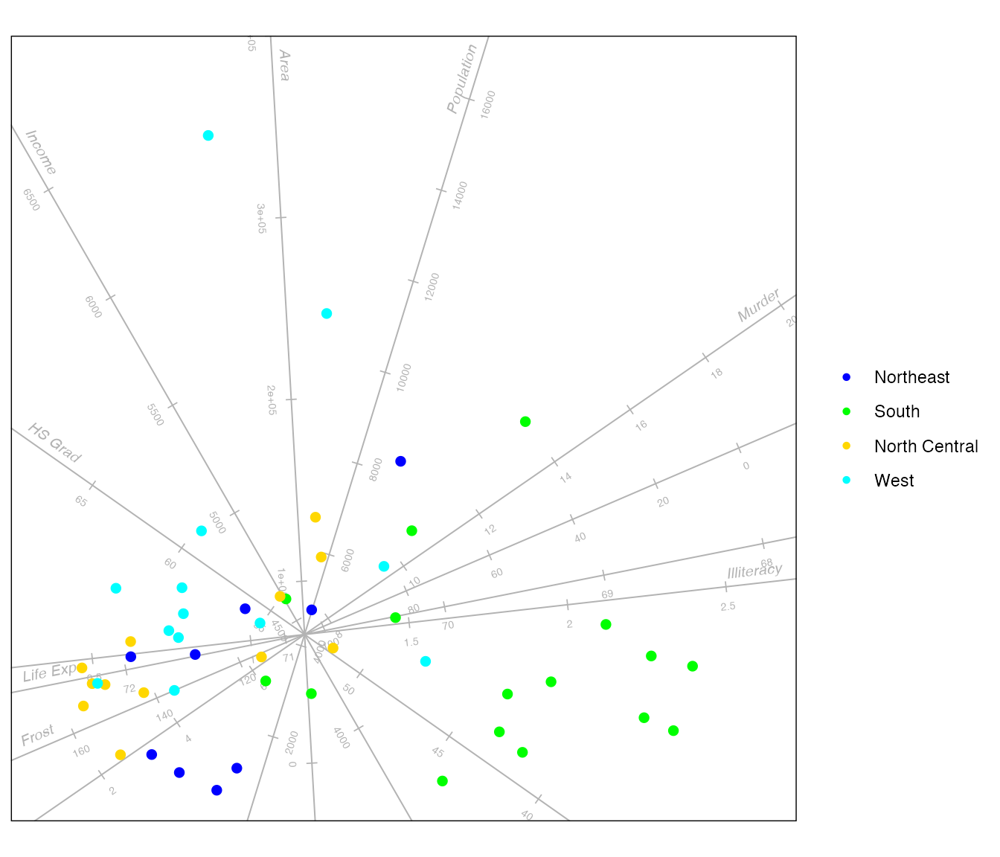

The output of [`PCA()`](../reference/PCA.md) is an object of class `PCA`
which inherits from the class `biplot`. Four additional components are
present in the `PCA` object. The matrix `Z` contains the coordinates of
the sample points, while the matrix `Vr` contains the “coordinates” for
the variables. In the notation of equation (1),
Z=$`\mathbf{G}:n \times 2`$ and Vr=$`\mathbf{H}:p \times 2`$. The
component `Xhat` is the matrix $`\mathbf{\hat{X}}`$ on the left hand
side of equation (1). The final component `ax.one.unit` contains as rows
the expression in equation (2) with $`\mu_h=1`$, in other words, one
unit in the positive direction of the biplot axis.

By piping the `PCA` class object (inheriting from class `biplot`) to the
generic [`plot()`](https://rdrr.io/r/graphics/plot.default.html)
function, the [`plot.biplot()`](../reference/plot.biplot.md) function
constructs the biplot on the graphical device.

It was mentioned in Section 1 that the default choice
$`\mathbf{G}=\mathbf{UDJ}_2`$ and $`\mathbf{H}=\mathbf{VJ}_2`$ provides
an exact representation of the distances between the rows of
$`\mathbf{\hat{X}}`$ which is an optimal approximation in the least
squares sense of the distances between the rows of $`\mathbf{X}`$
(samples). Alternatively, the correlations between the variables
(columns of $`\mathbf{X}`$) can be optimally approximated by the cosines
of the angles between the axes, leaving the approximation of the
distances between the samples to be suboptimal. In this case
$`\mathbf{G}=\mathbf{UJ}_2`$ and $`\mathbf{H}=\mathbf{VDJ}_2`$ and this
biplot is obtained by setting the argument `correlation.biplot = TRUE`.

[`biplot`](../reference/biplot.md)`(``state.x77``, scaled ``=`` ``TRUE``)`` ``|>`` `` `` `[`PCA`](../reference/PCA.md)`(``group.aes ``=`` ``state.region``, correlation.biplot ``=`` ``TRUE``)`` ``|>`` `` `` `[`plot`](https://rdrr.io/r/graphics/plot.default.html)`(``)`

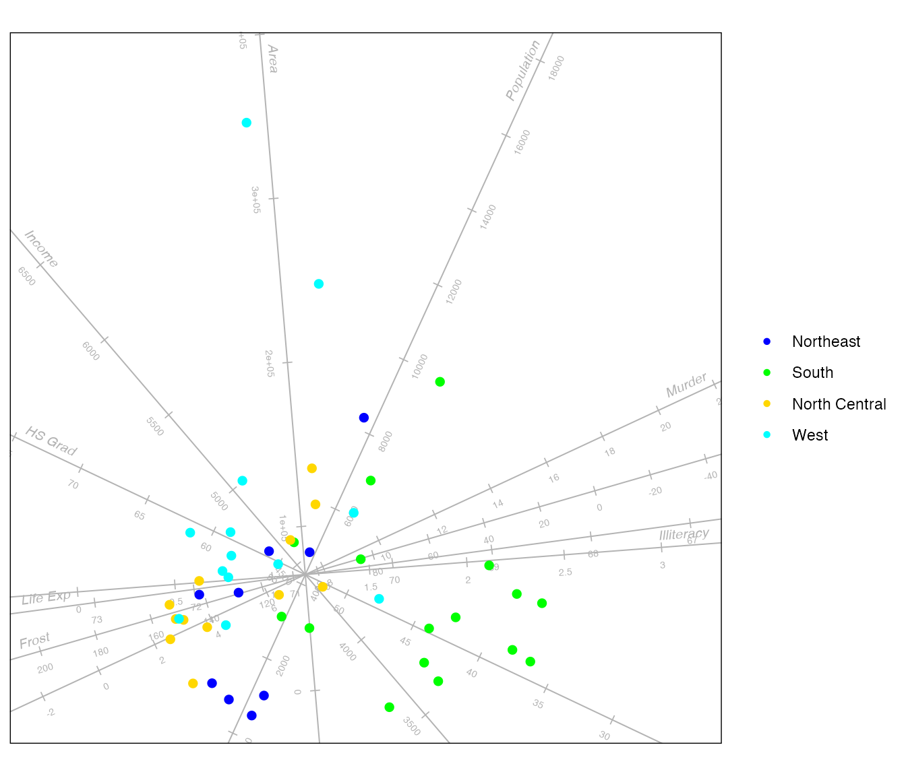

## The function `samples()`

This function controls the aesthetics of the sample points in the
biplot. The function accepts as first argument an object of class
`biplot` where the aesthetics should be applied. Let us first construct
a PCA biplot of the `state.x77` data with samples coloured according to
`state.division`.

[`biplot`](../reference/biplot.md)`(``state.x77``, scaled ``=`` ``TRUE``)`` ``|>`` `` `` `[`PCA`](../reference/PCA.md)`(``group.aes ``=`` ``state.division``)`` ``|>`` `` `` `[`plot`](https://rdrr.io/r/graphics/plot.default.html)`(``)`

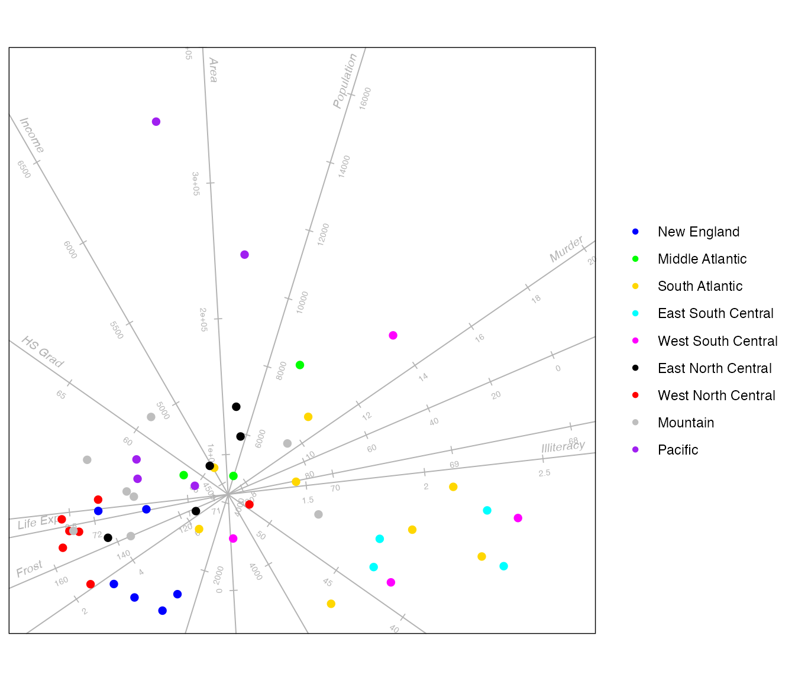

Furthermore, we wish to select colours, other than the defaults, for the
divisions. We can also change the opacity of the sample colours with the
argument `opacity` that has default 1.

[`biplot`](../reference/biplot.md)`(``state.x77``, scaled ``=`` ``TRUE``)`` ``|>`` `` `` `[`PCA`](../reference/PCA.md)`(``group.aes ``=`` ``state.division``)`` ``|>`` `` `` `[`samples`](../reference/samples.md)` ``(``col ``=`` `[`c`](https://rdrr.io/r/base/c.html)`(``"red"``, ``"darkorange"``, ``"gold"``, ``"chartreuse4"``, `` `` ``"green"``, ``"salmon"``, ``"magenta"``, ``"#000000"``, ``"blue"``)``,opacity ``=`` ``0.65``,pch``=``19``)`` ``|>`` `` `[`plot`](https://rdrr.io/r/graphics/plot.default.html)`(``)`

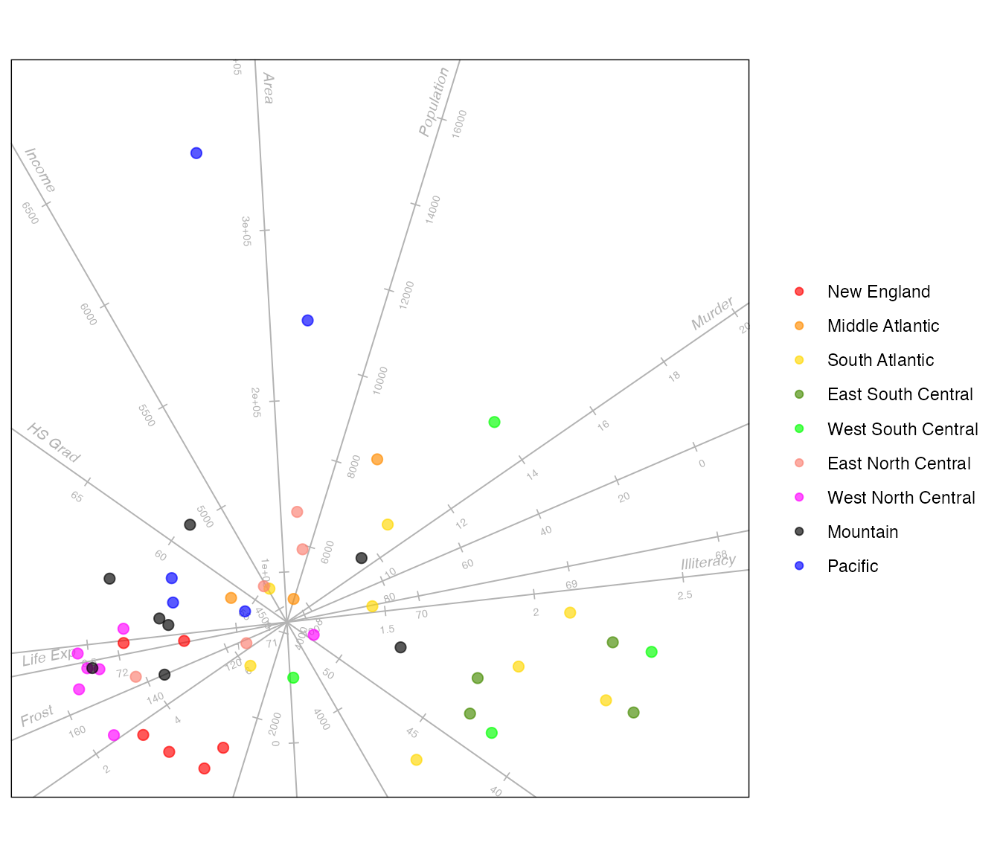

Furthermore we want to use a different plotting character for the
central regions.

[`levels`](https://rdrr.io/r/base/levels.html)` ``(``state.division``)`` ``#> [1] "New England" "Middle Atlantic" "South Atlantic" `` ``#> [4] "East South Central" "West South Central" "East North Central"`` ``#> [7] "West North Central" "Mountain" "Pacific"`

We want to use `pch = 15` for the first three and final two divisions
and `pch = 1` for the remaining four divisions.

[`biplot`](../reference/biplot.md)`(``state.x77``, scaled ``=`` ``TRUE``)`` ``|>`` `` `` `[`PCA`](../reference/PCA.md)`(``group.aes ``=`` ``state.division``)`` ``|>`` `` `` `[`samples`](../reference/samples.md)` ``(``col ``=`` `[`c`](https://rdrr.io/r/base/c.html)`(``"red"``, ``"darkorange"``, ``"gold"``, ``"chartreuse4"``, `` `` ``"green"``, ``"salmon"``, ``"magenta"``, ``"black"``, ``"blue"``)``,`` `` pch ``=`` `[`c`](https://rdrr.io/r/base/c.html)`(``15``, ``15``, ``15``, ``1``, ``1``, ``1``, ``1``, ``15``, ``15``)``)`` ``|>`` `` `[`plot`](https://rdrr.io/r/graphics/plot.default.html)`(``)`

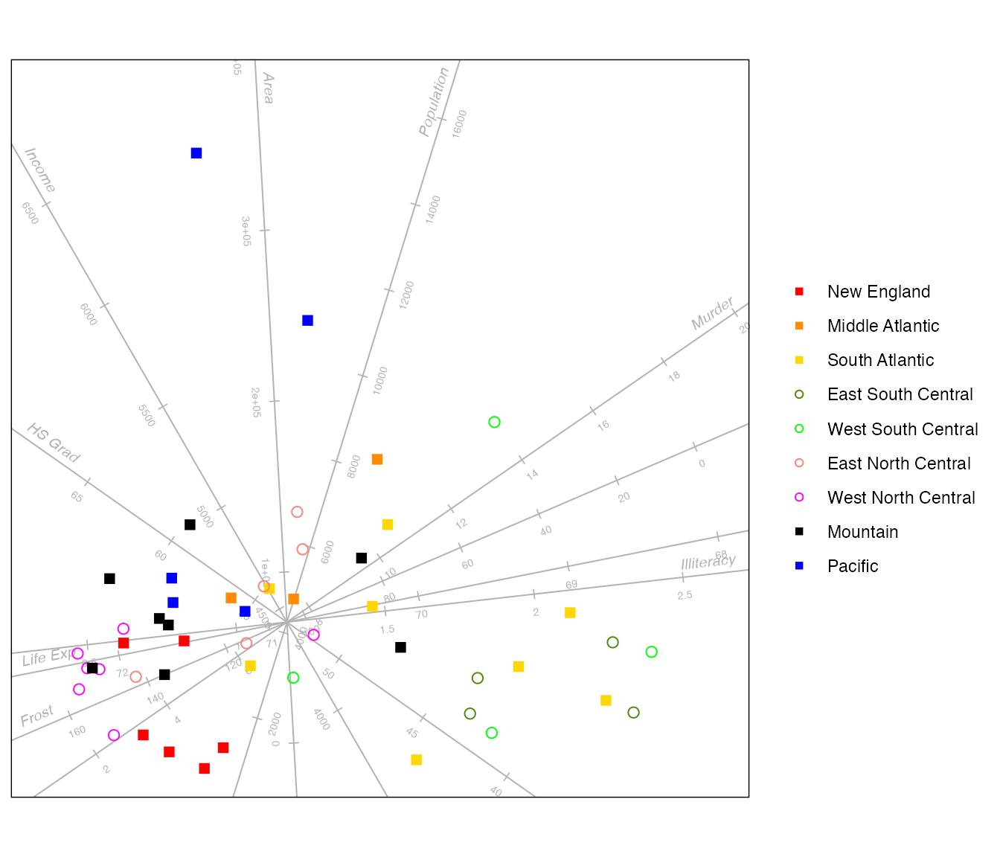

To increase the size of the plotting characters of the eastern states,
we add the following:

[`biplot`](../reference/biplot.md)`(``state.x77``, scaled ``=`` ``TRUE``)`` ``|>`` `` `` `[`PCA`](../reference/PCA.md)`(``group.aes ``=`` ``state.division``)`` ``|>`` `` `` `[`samples`](../reference/samples.md)` ``(``col ``=`` `[`c`](https://rdrr.io/r/base/c.html)`(``"red"``, ``"darkorange"``, ``"gold"``, ``"chartreuse4"``, `` `` ``"green"``, ``"salmon"``, ``"magenta"``, ``"black"``, ``"blue"``)``,`` `` pch ``=`` `[`c`](https://rdrr.io/r/base/c.html)`(``15``, ``15``, ``15``, ``1``, ``1``, ``1``, ``1``, ``15``, ``15``)``,`` `` cex ``=`` `[`c`](https://rdrr.io/r/base/c.html)`(`[`rep`](https://rdrr.io/r/base/rep.html)`(``1.5``,``4``)``, `[`c`](https://rdrr.io/r/base/c.html)`(``1``,``1.5``,``1``,``1.5``)``)``)`` ``|>`` `` `[`plot`](https://rdrr.io/r/graphics/plot.default.html)`(``)`

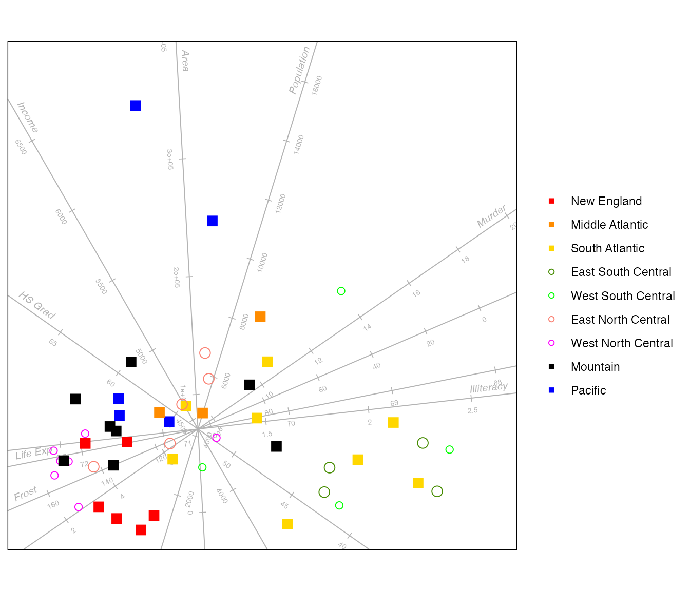

If we choose to only show the samples for the central states, the
argument `which` is used either indicating the number(s) in the sequence
of levels (`which = 4:7`), or as shown below, the levels themselves:

[`biplot`](../reference/biplot.md)`(``state.x77``, scaled ``=`` ``TRUE``)`` ``|>`` `` `` `[`PCA`](../reference/PCA.md)`(``group.aes ``=`` ``state.division``)`` ``|>`` `` `` `[`samples`](../reference/samples.md)` ``(``col ``=`` `[`c`](https://rdrr.io/r/base/c.html)`(``"red"``, ``"darkorange"``, ``"gold"``, ``"chartreuse4"``, `` `` ``"green"``, ``"salmon"``, ``"magenta"``, ``"black"``, ``"blue"``)``,`` `` which ``=`` `[`c`](https://rdrr.io/r/base/c.html)`(``"West North Central"``, ``"West South Central"``, ``"East South Central"``, `` `` ``"East North Central"``)``)`` ``|>`` `` `[`plot`](https://rdrr.io/r/graphics/plot.default.html)`(``)`

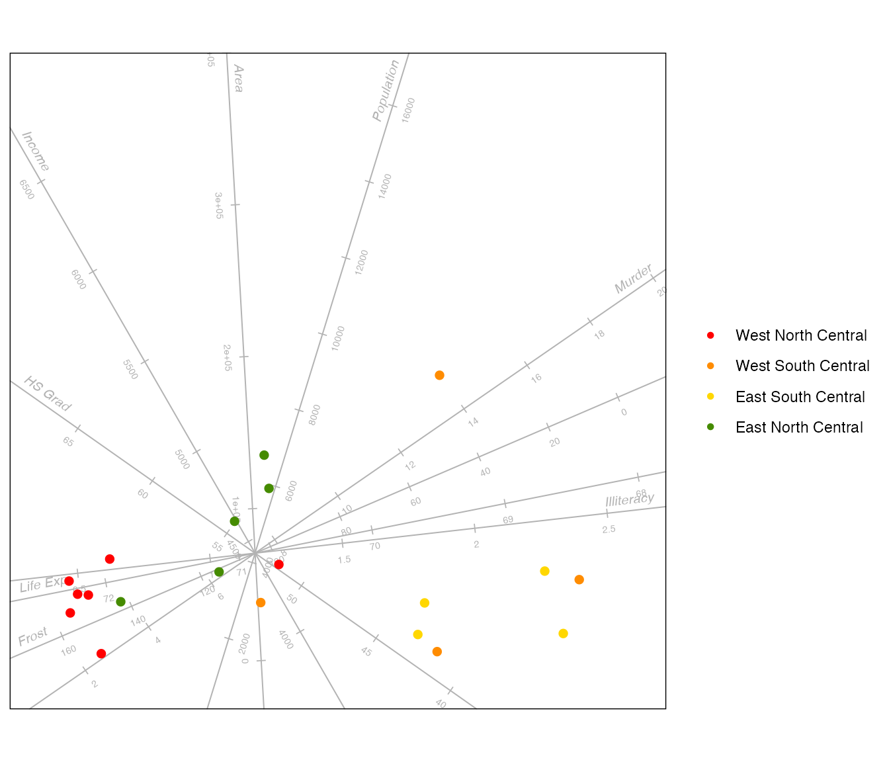

Note that since four regions are selected, the colour (and other
aesthetics) is applied to these regions in the order they are specified
in `which`. To add the sample names, the `label` argument is set to
`TRUE`. For large sample sizes, this is not recommended, as overplotting
will render the plot unusable. The size of the labels is controlled with
`label.cex` which can be specified either as a single value (for all
samples) or a vector indicating size values for each individual sample.
The colour of the labels defaults to the colour(s) of the samples.
However, individual label colours can be spesified with `label.col`,
similar to `label.cex` as either a single value of a vector of length
equal to the number of samples.

[`biplot`](../reference/biplot.md)`(``state.x77``, scaled ``=`` ``TRUE``)`` ``|>`` `[`PCA`](../reference/PCA.md)`(``)`` ``|>`` `` `` `[`samples`](../reference/samples.md)` ``(``label ``=`` ``TRUE``)`` ``|>`` `[`plot`](https://rdrr.io/r/graphics/plot.default.html)`(``)`

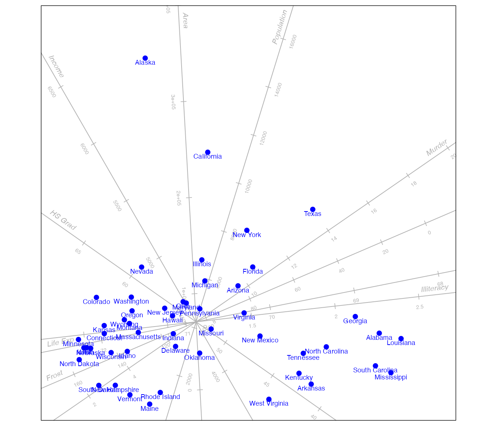

We can use the arguments `label.cex`, `label.side` and `label.offset` to
make the plot more legible with a little effort. We can also make use of
the functionality of the `ggrepel` package to place the labels.

[`biplot`](../reference/biplot.md)`(``state.x77``, scaled ``=`` ``TRUE``)`` ``|>`` `[`PCA`](../reference/PCA.md)`(``)`` ``|>`` `` `` `[`samples`](../reference/samples.md)` ``(``label ``=`` ``"ggrepel"``)`` ``|>`` `[`plot`](https://rdrr.io/r/graphics/plot.default.html)`(``)`

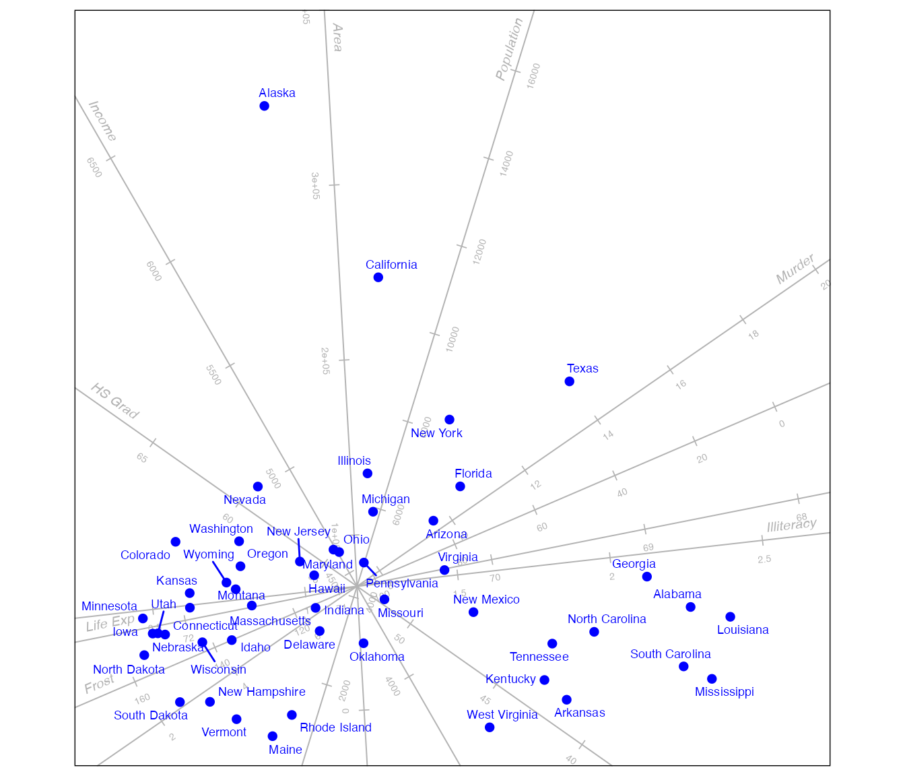

Additionally, the user can add customised label names to the samples in
the biplot. To do this, `label` must be set to `TRUE` (or `"ggrepel"`)
and `label.name` is set to be a vector of size `n` specifying the label
names of the samples. In this case, the label name is set to the first
three characters of the state name (row names of the data).

[`biplot`](../reference/biplot.md)`(``state.x77``, scaled ``=`` ``TRUE``)`` ``|>`` `[`PCA`](../reference/PCA.md)`(``)`` ``|>`` `` `` `[`samples`](../reference/samples.md)` ``(``label ``=`` ``"TRUE"``,label.name``=`[`strtrim`](https://rdrr.io/r/base/strtrim.html)`(`[`row.names`](https://rdrr.io/r/base/row.names.html)`(``state.x77``)``,``3``)``)`` ``|>`` `` `` `[`plot`](https://rdrr.io/r/graphics/plot.default.html)`(``)`

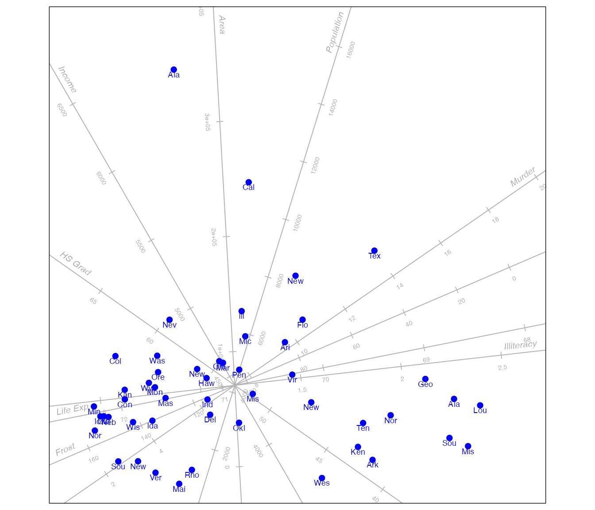

If the data plotted in the biplot is a multivariate time series, it can
make sense to connect the data points in order. Let us consider the four
quarters of the `UKgas` data set as four variables and we represent the
years as sample points in a PCA biplot.

`gas.data`` ``<-`` `[`matrix`](https://rdrr.io/r/base/matrix.html)` ``(``UKgas``, ncol``=``4``, byrow``=``T``)`` `[`colnames`](https://rdrr.io/r/base/colnames.html)`(``gas.data``)`` ``<-`` `[`paste`](https://rdrr.io/r/base/paste.html)`(``"Q"``, ``1``:``4``, sep``=``""``)`` `[`rownames`](https://rdrr.io/r/base/colnames.html)`(``gas.data``)`` ``<-`` ``60``:``86`` ``even.labels`` ``<-`` `[`rep`](https://rdrr.io/r/base/rep.html)`(`[`c`](https://rdrr.io/r/base/c.html)`(``TRUE``, ``FALSE``)``, ``14``)`` `[`biplot`](../reference/biplot.md)`(``gas.data``, scaled ``=`` ``TRUE``)`` ``|>`` `[`PCA`](../reference/PCA.md)`(``)`` ``|>`` `` `` `[`samples`](../reference/samples.md)` ``(``connected ``=`` ``TRUE``, connect.col``=``"red"``, label ``=`` ``even.labels``, label.cex``=``0.6``)`` ``|>`` `` `` `[`plot`](https://rdrr.io/r/graphics/plot.default.html)`(``)`

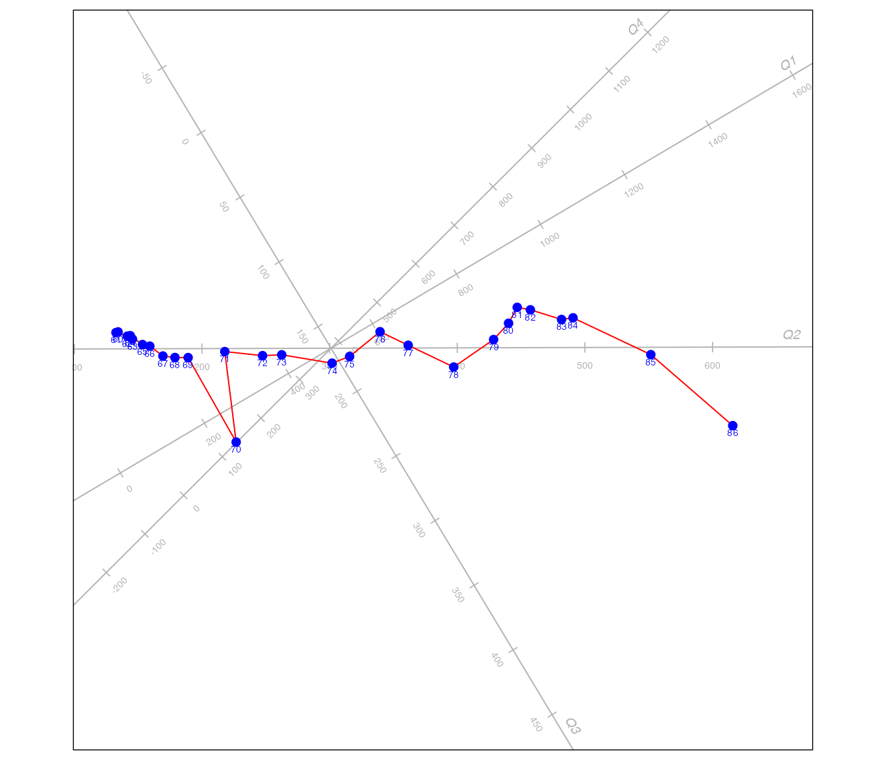

## The function `means()`

The function [`means()`](../reference/means.md) allow changing the
aesthetics for group means specified by group.aes, when the argument
`show.class.means = TRUE` in the call to the function
[`PCA()`](../reference/PCA.md). The functionality of
[`means()`](../reference/means.md) mirrors that of
[`samples()`](../reference/samples.md) and is discussed in detail in the
vignette *Class separation* where class means are more prominent than in
PCA biplots.

## The function `axes()`

Similar to the [`samples()`](../reference/samples.md) function, this
function allows for changing the aestethics of the biplot axes. The
first argument to [`axes()`](../reference/axes.md) is an object of class
`biplot`. The `X.names` argument is typically not specified by the user,
but is required for the function to allow specifying which axes to
display in the `which` argument, by either speficying the column numbers
or the column names. The arguments `col`, `lwd` and `lty` pertains to
the axes themselves and can be specified either as a scaler value (to be
recycled) or a vector with length equal to that of `which`.

To construct a PCA biplot of the rock data, displaying only the axes for
peri and shape with different colours for the two axes, different line
widths and line type 2, we need to following code:

[`biplot`](../reference/biplot.md)`(``rock``, scaled ``=`` ``TRUE``)`` ``|>`` `[`PCA`](../reference/PCA.md)`(``)`` ``|>`` `` `` `[`axes`](../reference/axes.md)`(``which ``=`` `[`c`](https://rdrr.io/r/base/c.html)`(``"shape"``,``"peri"``)``, `` `` col``=`[`c`](https://rdrr.io/r/base/c.html)`(``"lightskyblue"``,``"slategrey"``)``,`` `` lwd ``=`` `[`c`](https://rdrr.io/r/base/c.html)`(``1``,``2``)``, lty``=``2``)`` ``|>`` `` `[`plot`](https://rdrr.io/r/graphics/plot.default.html)`(``)`

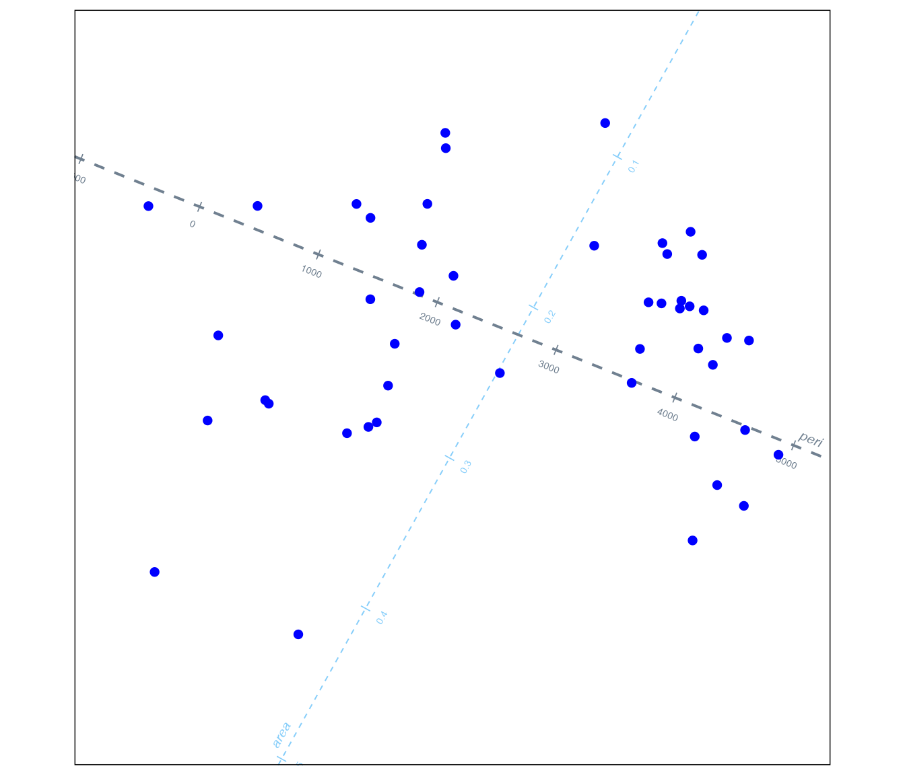

The following four arguments deal with the axis labels. The argument
`label.dir` is based on the graphics parameter `las` and allows for
labels to be either orthogonal to the axis direction (`Orthog`),
horisontal (`Hor`) or parallel to the plot `Paral`. The argument
`label.line` fulfills the role of the `line` argument in
[`mtext()`](https://rdrr.io/r/graphics/mtext.html) to determine on which
margin line (how far from the plot) the label is placed while
`label.col` and `label.cex` is self-explanatory and defaults to the axis
colour and size 0.75. Note in for the illustration the in the code below
the colour vector has only three components, so that recycling is
applied. These features are only available to base R plots where the
user has to set `engine = "base"` in
[`plot()`](https://rdrr.io/r/graphics/plot.default.html).

[`biplot`](../reference/biplot.md)`(``rock``, scaled ``=`` ``TRUE``)`` ``|>`` `[`PCA`](../reference/PCA.md)`(``)`` ``|>`` `` `` `[`axes`](../reference/axes.md)`(``col``=`[`c`](https://rdrr.io/r/base/c.html)`(``"lightskyblue"``,``"slategrey"``,``"blue"``)``,`` `` label.dir``=``"Hor"``, label.line``=`[`c`](https://rdrr.io/r/base/c.html)`(``0``,``0.5``,``1``,``1.5``)``)`` ``|>`` `` `[`plot`](https://rdrr.io/r/graphics/plot.default.html)`(``engine``=``"base"``)`

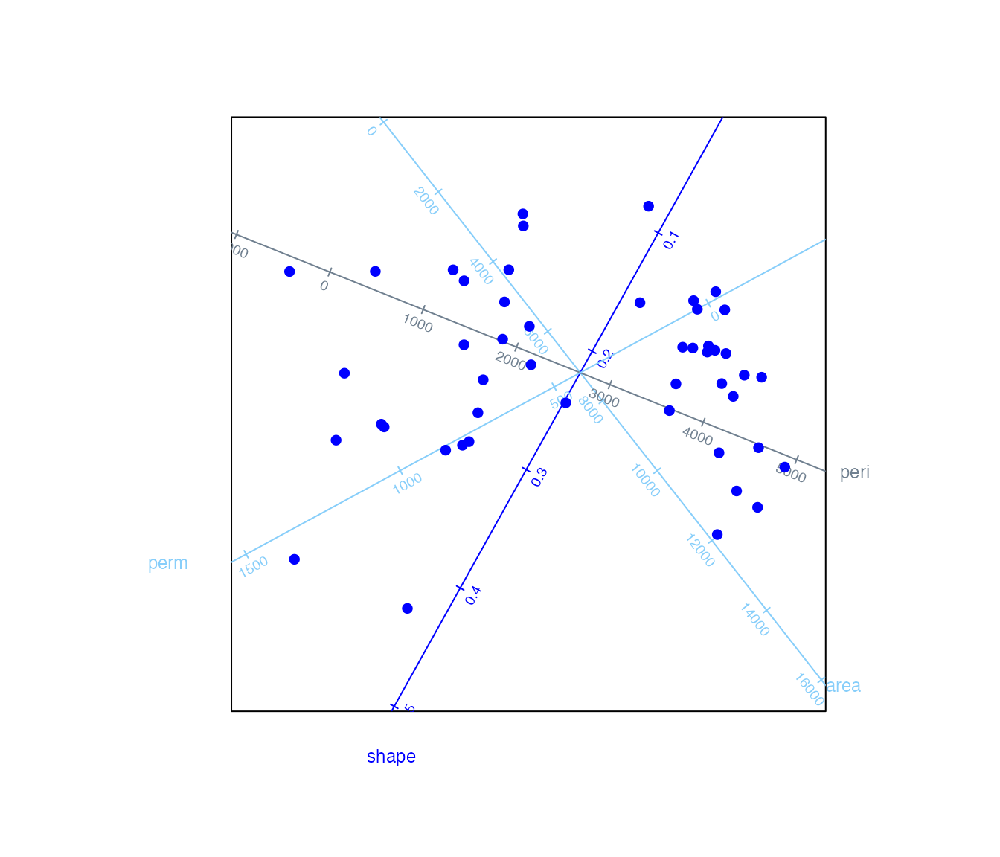

The function [`pretty()`](https://rdrr.io/r/base/pretty.html) finds
‘nice’ tick marks where the value specified in the argument `ticks`
determine the *desired* number of tick marks, although the observed
number could be different. The other `tick.*` arguments are similar to
their naming counterparts in
[`par()`](https://rdrr.io/r/graphics/par.html) or
[`text()`](https://rdrr.io/r/graphics/text.html). Since the tick labels
are important to follow the direction of increasing values of the axes,
setting `tick.label = FALSE` does not remove the tick marks completely,
but limits the labels to the smallest and largest value visible in the
plot. If the user would like to specify alternative names for the axes,
this can be done in the argument `ax.names`.

[`biplot`](../reference/biplot.md)`(``rock``, scaled ``=`` ``TRUE``)`` ``|>`` `[`PCA`](../reference/PCA.md)`(``)`` ``|>`` `` `` `[`axes`](../reference/axes.md)`(``ticks ``=`` `[`c`](https://rdrr.io/r/base/c.html)`(``3``, ``5``, ``5``, ``10``)``, tick.label``=`[`c`](https://rdrr.io/r/base/c.html)`(``F``, ``F``, ``T``, ``T``)``,`` `` ax.names ``=`` `[`c`](https://rdrr.io/r/base/c.html)`(``"area"``, ``"perimeter"``, ``"shape"``, `` `` ``"permeability in milli-Darcies"``)``)`` ``|>`` `` `[`plot`](https://rdrr.io/r/graphics/plot.default.html)`(``)`

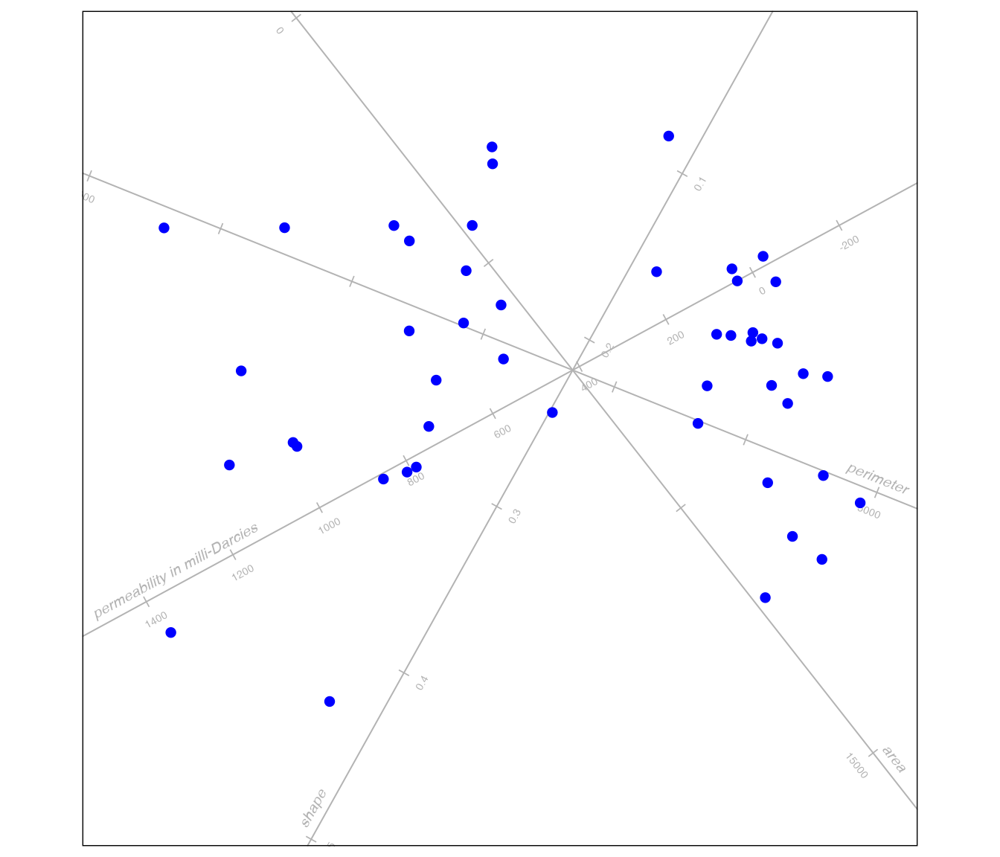

## The functions `fit.measures()` and `summary()`

The `print` method provides a short summary of the biplot object.

` ``obj`` ``<-`` `[`biplot`](../reference/biplot.md)`(``airquality``)`` ``#> Warning in biplot(airquality): 42 rows deleted due to missing values`` `` ``obj`` ``#> Object of class biplot, based on 111 samples and 6 variables.`` ``#> 6 numeric variables.`` ``#> `` ``#> The following 42 sample-rows where removed due to missing values`` ``#> 5 6 10 11 25 26 27 32 33 34 35 36 37 39 42 43 45 46 52 53 54 55 56 57 58 59 60 61 65 72 75 83 84 96 97 98 102 103 107 115 119 150`

The output from [`summary()`](https://rdrr.io/r/base/summary.html) will
be very similar.

` `[`summary`](https://rdrr.io/r/base/summary.html)`(``obj``)`` ``#> Object of class biplot, based on 111 samples and 6 variables.`` ``#> 6 numeric variables.`` ``#> `` ``#> The following 42 sample-rows were removed due to missing values`` ``#> 5 6 10 11 25 26 27 32 33 34 35 36 37 39 42 43 45 46 52 53 54 55 56 57 58 59 60 61 65 72 75 83 84 96 97 98 102 103 107 115 119 150`

Additional information about the biplot object is added by the
[`fit.measures()`](../reference/fit.measures.md) function.

### Quality of approximation

We start with the identity

``` math
\mathbf{X} = \mathbf{\hat{X}} + \mathbf{X-\hat{X}}
```
which decomposes $`\mathbf{X}`$ into a fitted part

``` math
\mathbf{\hat{X}} = \mathbf{UJDJV'} = \mathbf{UDJ}_2(\mathbf{VJ}_2)' = \mathbf{UDV'VJ}_2(\mathbf{VJ}_2)' = \mathbf{XVJV'}
```

and the residual part $`\mathbf{X-\hat{X}}`$. The lack of fit is
quantified by the quantity we are minimising

``` math
\| \hat{\mathbf{X}}-\mathbf{X} \|^2
```
where we have the orthogonal decomposition

``` math
\|\mathbf{X}\|^2 = \|\hat{\mathbf{X}}\|^2 + \|\hat{\mathbf{X}}-\mathbf{X} \|^2.
```
The overall quality of fit is therefore defined as

``` math
quality = \frac{\|\hat{\mathbf{X}}\|^2}{\|\mathbf{X}\|^2} =
\frac{tr(\mathbf{\hat{X}\hat{X}'})}{tr(\mathbf{XX}')} =
\frac{tr(\mathbf{\hat{X}'\hat{X}})}{tr(\mathbf{X'X})} =
\frac{tr(\mathbf{VD}^2\mathbf{JV'})}{tr(\mathbf{VD}^2\mathbf{V'})}.
```
In *biplotEZ* the overall quality is displayed as a percentage:

``` math
quality =\frac{d_1^2+d_2^2}{d_1^2+\dots+d_p^2}100\%.
```

### Adequacy of representation of the variables

Researchers who construct the PCA biplot representing the columns with
arrows (vectors) often fit the biplot with a unit circle. The rationale
being that perfect representation of a variable will have unit length
and the length of each arrow vs the distance to the unit circle
represent the adequacy with which the variable is represented.

By fitting the biplot with calibrated axes, it is much easier to read
off values for the variables, but the adequacy values can still be
computed from

``` math
\frac{diag(\mathbf{V}_r\mathbf{V}_r')}{diag(\mathbf{VV}')}= diag(\mathbf{V}_r\mathbf{V}_r')
```

due to the orthogonality of the matrix $`\mathbf{V}:p \times p`$.

### Predictivities

The predictivity provides a measure of how well the original values are
recovered from the biplot. An element that is well represented will have
a predictivity close to one, indicating that the sample or variable
values from prediction is close to the observed values. If an element is
poorly represented, the predicted values will be very different from the
original values and the predictivity value will be close to zero.

#### Axis predictivity

The predictivity for each of the $`p`$ variables is computed as the
elementwise ratios

``` math
axis \: predictivity = \frac{diag(\mathbf{\hat{X}'\hat{X}})}{diag(\mathbf{X'X})}
```

#### Sample predictivity

The predictivity for each of the $`n`$ samples is computed as the
elementwise ratios

``` math
sample \: predictivity = \frac{diag(\mathbf{\hat{X}\hat{X}'})}{diag(\mathbf{XX'})}
```
By calling the function [`fit.measures()`](../reference/fit.measures.md)
these quantities are computed for the specific biplot object. The values
are displayed with the
[`summary()`](https://rdrr.io/r/base/summary.html) function.

`obj`` ``<-`` `[`biplot`](../reference/biplot.md)`(``state.x77``, scale ``=`` ``TRUE``)`` ``|>`` `[`PCA`](../reference/PCA.md)`(``)`` ``|>`` `` `` `[`fit.measures`](../reference/fit.measures.md)`(``)`` ``|>`` `[`plot`](https://rdrr.io/r/graphics/plot.default.html)`(``)`

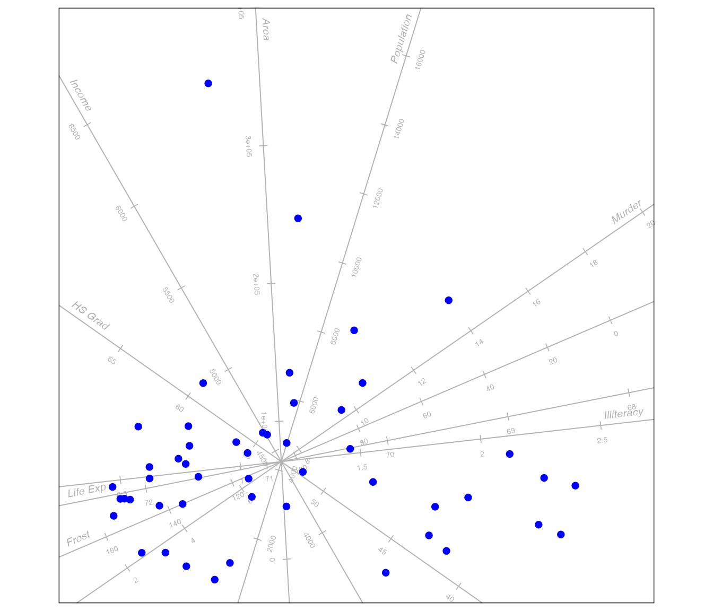

[`summary`](https://rdrr.io/r/base/summary.html)` ``(``obj``)`` ``#> Object of class biplot, based on 50 samples and 8 variables.`` ``#> 8 numeric variables.`` ``#> `` ``#> Quality of fit in 2 dimension(s) = 65.4% `` ``#> Adequacy of variables in 2 dimension(s):`` ``#> Population Income Illiteracy Life Exp Murder HS Grad Frost `` ``#> 0.1848016 0.3586383 0.2215201 0.1760908 0.2915819 0.2696184 0.1513317 `` ``#> Area `` ``#> 0.3464170 `` ``#> Axis predictivity in 2 dimension(s):`` ``#> Population Income Illiteracy Life Exp Murder HS Grad Frost `` ``#> 0.3330216 0.7609185 0.7917091 0.6206172 0.8640485 0.7947530 0.4982299 `` ``#> Area `` ``#> 0.5675169 `` ``#> Sample predictivity in 2 dimension(s):`` ``#> Alabama Alaska Arizona Arkansas California `` ``#> 0.95126856 0.61373919 0.26327256 0.86308539 0.57062754 `` ``#> Colorado Connecticut Delaware Florida Georgia `` ``#> 0.83358779 0.59003002 0.18284712 0.49725356 0.94461052 `` ``#> Hawaii Idaho Illinois Indiana Iowa `` ``#> 0.01984127 0.70337480 0.33405270 0.30082350 0.96367113 `` ``#> Kansas Kentucky Louisiana Maine Maryland `` ``#> 0.86554676 0.87758262 0.93717163 0.66553856 0.06362508 `` ``#> Massachusetts Michigan Minnesota Mississippi Missouri `` ``#> 0.47386267 0.26050188 0.89207404 0.93073099 0.11321791 `` ``#> Montana Nebraska Nevada New Hampshire New Jersey `` ``#> 0.44603781 0.93570441 0.22393876 0.87499561 0.15979033 `` ``#> New Mexico New York North Carolina North Dakota Ohio `` ``#> 0.29304145 0.40609063 0.93004841 0.69011551 0.08810179 `` ``#> Oklahoma Oregon Pennsylvania Rhode Island South Carolina `` ``#> 0.37520943 0.36273523 0.02176080 0.58625617 0.93187284 `` ``#> South Dakota Tennessee Texas Utah Vermont `` ``#> 0.83804787 0.96006357 0.73748654 0.66209083 0.80365601 `` ``#> Virginia Washington West Virginia Wisconsin Wyoming `` ``#> 0.58564755 0.33877314 0.85231725 0.82519206 0.42499724`

If is not necessary to call the
[`plot()`](https://rdrr.io/r/graphics/plot.default.html) function to
obtain the fit measures, but one of the biplot methods, such as
[`PCA()`](../reference/PCA.md) is required, since the measures differ
depending on which type of biplot is constructed. To suppress the output
of some fit measures, for instance if the interest is in the axis
predictivity and there are many samples which result in a very long
output, these can be set in the call to
[`summary()`](https://rdrr.io/r/base/summary.html). By default all
measures are set to `TRUE`.

`obj`` ``<-`` `[`biplot`](../reference/biplot.md)`(``state.x77``, scale ``=`` ``TRUE``)`` ``|>`` `[`PCA`](../reference/PCA.md)`(``)`` ``|>`` `` `` `[`fit.measures`](../reference/fit.measures.md)`(``)`` `` `[`summary`](https://rdrr.io/r/base/summary.html)` ``(``obj``, adequacy ``=`` ``FALSE``, sample.predictivity ``=`` ``FALSE``)`` ``#> Object of class biplot, based on 50 samples and 8 variables.`` ``#> 8 numeric variables.`` ``#> `` ``#> Quality of fit in 2 dimension(s) = 65.4% `` ``#> Axis predictivity in 2 dimension(s):`` ``#> Population Income Illiteracy Life Exp Murder HS Grad Frost `` ``#> 0.3330216 0.7609185 0.7917091 0.6206172 0.8640485 0.7947530 0.4982299 `` ``#> Area `` ``#> 0.5675169`

The axis predictivities and sample predictivities can be represented in
the biplot in two ways: setting either `axis.predictivity` and / or
`sample.predictivity` to `TRUE`, applies shading for axes and shrinking
for samples according to the predictivity values.

[`biplot`](../reference/biplot.md)`(``state.x77``, scale ``=`` ``TRUE``)`` ``|>`` `[`PCA`](../reference/PCA.md)`(``group.aes ``=`` ``state.region``)`` ``|>`` `` `[`samples`](../reference/samples.md)` ``(``which ``=`` ``"South"``, pch ``=`` ``15``, label ``=`` ``T``, label.cex``=``0.5``)`` ``|>`` `` `` `[`axes`](../reference/axes.md)` ``(``col ``=`` ``"black"``)`` ``|>`` `` `[`fit.measures`](../reference/fit.measures.md)`(``)`` ``|>`` `[`plot`](https://rdrr.io/r/graphics/plot.default.html)` ``(``sample.predictivity ``=`` ``TRUE``,`` `` axis.predictivity ``=`` ``TRUE``)`` `

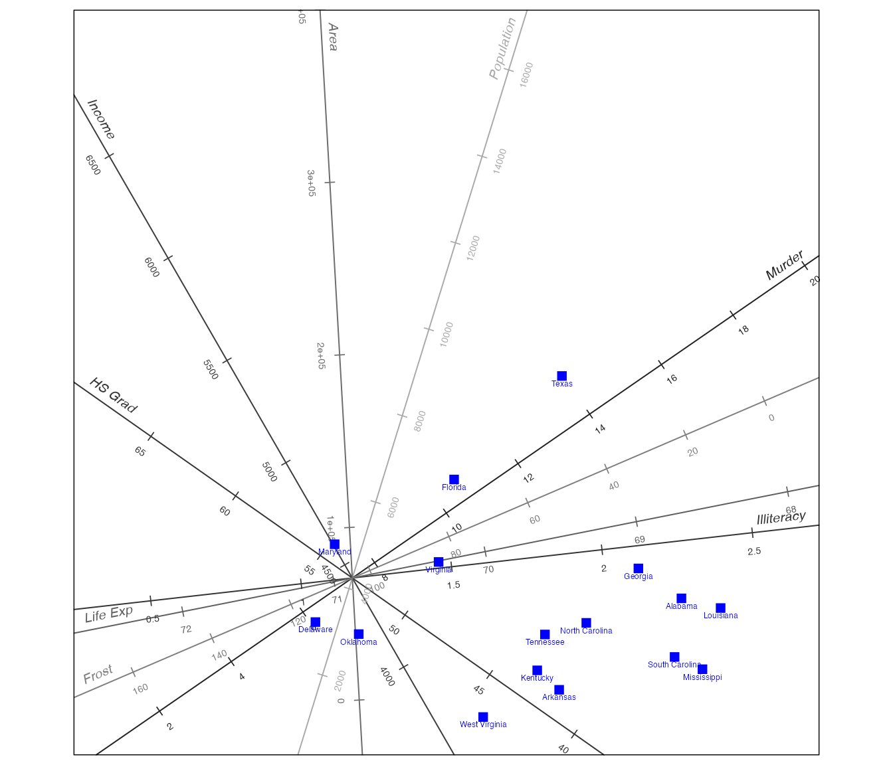

Comparing the plot with the `summary` output it is clear that the
variables Population and Frost are not very well represented and it can
be expected that predictions on these variables will be less accurate.
Furthermore, the samples located close to the origin are not as well
represented as those located towards the bottom right. This is typically
the case where samples nearly orthogonal to the PCA plane are projected
close to the origin and due to their orthogonality, very poorly
represented.

#### Axes represented as vectors

If the user wishes to view the variables as arrows on the biplot to give
information on the adequacy of the variables, this can be done with the
[`axes()`](../reference/axes.md) function, by setting `vectors = TRUE`
and `unit.circle = TRUE`. The adequacy value is given by squared length
of the arrow.

[`biplot`](../reference/biplot.md)`(``state.x77``, scale ``=`` ``TRUE``)`` ``|>`` `` `` `[`PCA`](../reference/PCA.md)`(``group.aes ``=`` ``state.region``)`` ``|>`` `` `[`axes`](../reference/axes.md)` ``(``vectors ``=`` ``TRUE``,unit.circle ``=`` ``TRUE``)`` ``|>`` `` `[`fit.measures`](../reference/fit.measures.md)`(``)`` ``|>`` `` `` `[`plot`](https://rdrr.io/r/graphics/plot.default.html)` ``(``engine``=``"base"``)`` `

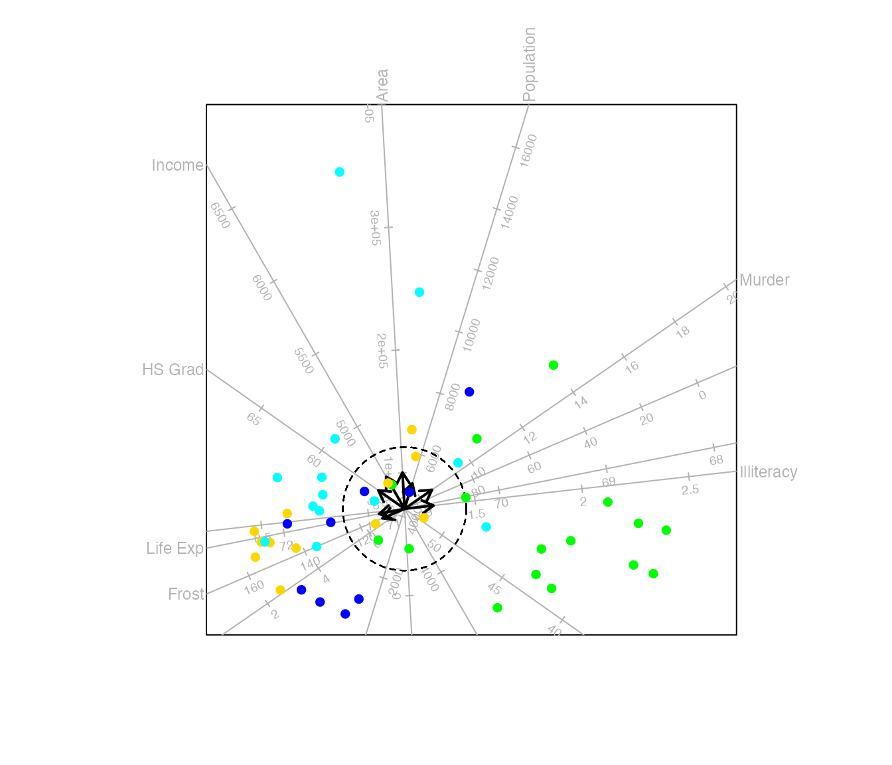

## References

Eckart, C., and G. Young. 1936. “The Approximation of One Matrix by
Another of Lower Rank.” *Psychometrika*, 211–18.

Gabriel, K. R. 1971. “The Biplot Graphic Display of Matrices with
Application to Principal Component Analysis.” *Biometrika*, 453–67.
