# biplotEZ enhancements

## Introduction

When enhancing a biplot, various additional features can significantly
improve its interpretability and utility. Introducing alpha bags helps
visualize the central region and variability within a group, providing a
robust measure of data concentration. Adding confidence ellipses can
illustrate the spread and correlation of data points, making the
underlying structure more evident. Including the capability to add new
samples and axes facilitates dynamic exploration and comparison of data
sets. The option to predict samples and means allows for the projection
of data points onto the biplot display, aiding in predictive analysis.
Moreover, tools for reflecting or rotating the biplot display can
enhance the visual representation by aligning the plot with the user’s
analytical needs, offering a clearer perspective on the relationships
and dimensions within the data.

## The function `alpha.bags()`

An $`\alpha`$-bag encloses the $`\alpha100\%`$ inner data points in a
cloud of points. It is based on the concept of halfspace location depth
as defined by Tukey (1975). Rousseeuw et al. (1999) generalised a
boxplot to a two-dimensional bagplot where the box is replaced by a bag
containing the inner $`50\%`$ of the observations. Gower et al. (2011)
replaces the $`50\%`$-bag contour by a general $`\alpha100\%`$ contour
referred to as an $`\alpha`$-bag.

When the number of samples in the biplot is larger, it becomes difficult
to isolate individual observations. Often, when a grouping variable is
present, the interest is not so much in the individual samples, but
rather in the location and spread of the groups. In the plot below, we
enclose each century’s number of sunspots by a $`95\%`$-bag where the
months are used as 12 different variables for each year (sample point).
Note that the legend displays the $`\alpha`$-bags while
`samples = FALSE` is left at the default. Both can be displayed, but
since the $`\alpha`$-bags’ colour defaults to the colour of the sample
points, both are not necessary here.

`sunspots`` ``<-`` `[`matrix`](https://rdrr.io/r/base/matrix.html)` ``(``sunspot.month``[``1``:``(``264``*``12``)``]``, ncol ``=`` ``12``, byrow ``=`` ``TRUE``)`` ``years`` ``<-`` ``1749``:``2012`` `[`rownames`](https://rdrr.io/r/base/colnames.html)`(``sunspots``)`` ``<-`` ``years`` `[`colnames`](https://rdrr.io/r/base/colnames.html)`(``sunspots``)`` ``<-`` `[`c`](https://rdrr.io/r/base/c.html)`(``"Jan"``, ``"Feb"``, ``"Mar"``, ``"Apr"``, ``"May"``, ``"Jun"``,`` `` ``"Jul"``, ``"Aug"``, ``"Sep"``, ``"Oct"``, ``"Nov"``, ``"Dec"``)`` ``century`` ``<-`[`paste`](https://rdrr.io/r/base/paste.html)`(`[`floor`](https://rdrr.io/r/base/Round.html)`(``(``years``-``1``)``/``100``)``+``1``, `[`ifelse`](https://rdrr.io/r/base/ifelse.html)` ``(`[`floor`](https://rdrr.io/r/base/Round.html)`(``(``years``-``1``)``/``100``)``+``1``<``21``, ``"th"``,``"st"``)``, sep ``=`` ``"-"``)`` `[`biplot`](../reference/biplot.md)`(``sunspots``, group.aes``=``century``)`` ``|>`` `[`PCA`](../reference/PCA.md)`(``)`` ``|>`` `` `[`axes`](../reference/axes.md)` ``(``label.dir ``=`` ``"Hor"``, label.line ``=`` `[`c`](https://rdrr.io/r/base/c.html)`(``0.8``, `[`rep`](https://rdrr.io/r/base/rep.html)`(``0``,``10``)``, ``0.8``)``)`` ``|>`` `` `[`alpha.bags`](../reference/alpha.bags.md)` ``(``)`` ``|>`` `` `` `[`legend.type`](../reference/legend.type.md)`(``bags ``=`` ``TRUE``)`` ``|>`` `[`plot`](https://rdrr.io/r/graphics/plot.default.html)`(``)`` ``#> Computing 0.95 -bag for 18-th `` ``#> Computing 0.95 -bag for 19-th `` ``#> Computing 0.95 -bag for 20-th `` ``#> Computing 0.95 -bag for 21-st`

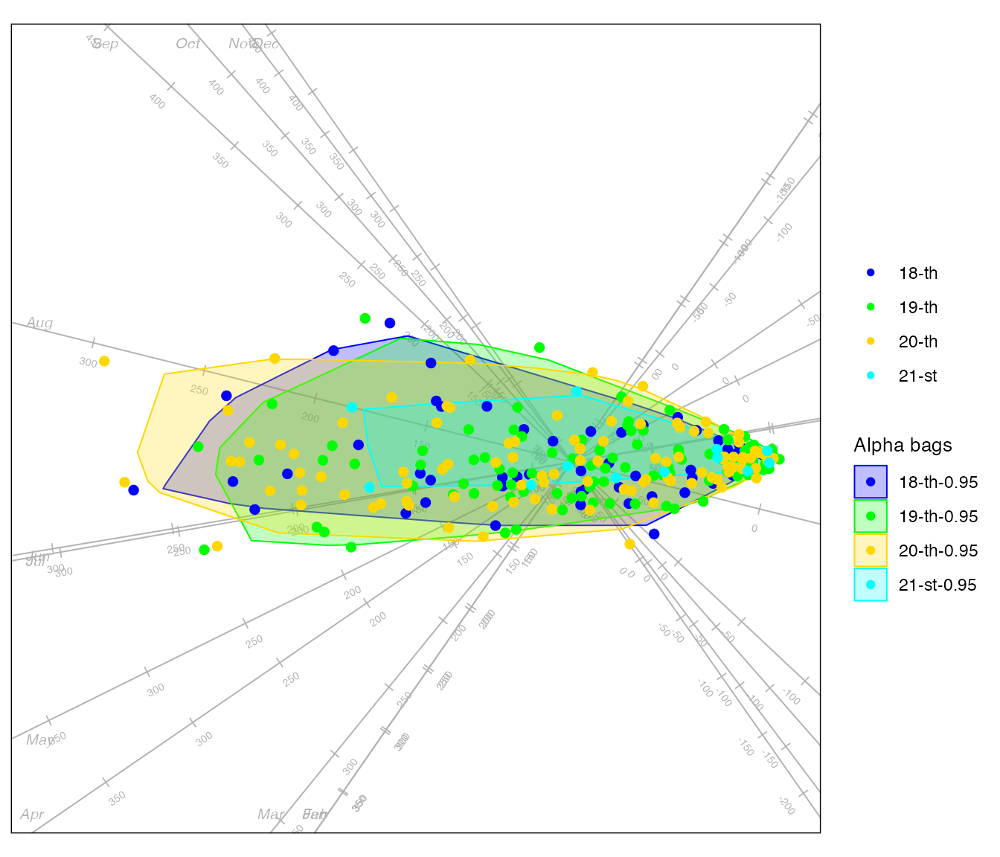

By default one $`95\%`$-bag is constructed for each group. In general,
the [`alpha.bags()`](../reference/alpha.bags.md) function accepts an
object of class biplot as first argument. The next argument `alpha` can
be specified as a single value, or to construct a series of
$`\alpha`$-bags for a group, `alpha` can be a vector argument. The
argument `which` specifies the groups to be fitted with $`\alpha`$-bags.
By default the `opacity` argument is set to $`0.25`$, but by setting
`opacity = 0` removes the fill of the $`\alpha`$-bags.

[`biplot`](../reference/biplot.md)`(``sunspots``, group.aes``=``century``)`` ``|>`` `[`PCA`](../reference/PCA.md)`(``)`` ``|>`` `` `[`axes`](../reference/axes.md)` ``(``label.dir ``=`` ``"Hor"``, label.line ``=`` `[`c`](https://rdrr.io/r/base/c.html)`(``0.8``, `[`rep`](https://rdrr.io/r/base/rep.html)`(``0``,``10``)``, ``0.8``)``)`` ``|>`` `` `[`alpha.bags`](../reference/alpha.bags.md)` ``(``alpha ``=`` `[`c`](https://rdrr.io/r/base/c.html)`(``0.9``, ``0.95``, ``0.99``)``, which ``=`` `[`c`](https://rdrr.io/r/base/c.html)`(``1``,``4``)``, opacity ``=`` ``0``)`` ``|>`` `` `` `[`legend.type`](../reference/legend.type.md)`(``bags ``=`` ``TRUE``)`` ``|>`` `[`plot`](https://rdrr.io/r/graphics/plot.default.html)`(``)`` ``#> Computing 0.9 -bag for 18-th `` ``#> Computing 0.9 -bag for 21-st `` ``#> Computing 0.95 -bag for 18-th `` ``#> Computing 0.95 -bag for 21-st `` ``#> Computing 0.99 -bag for 18-th `` ``#> Computing 0.99 -bag for 21-st`

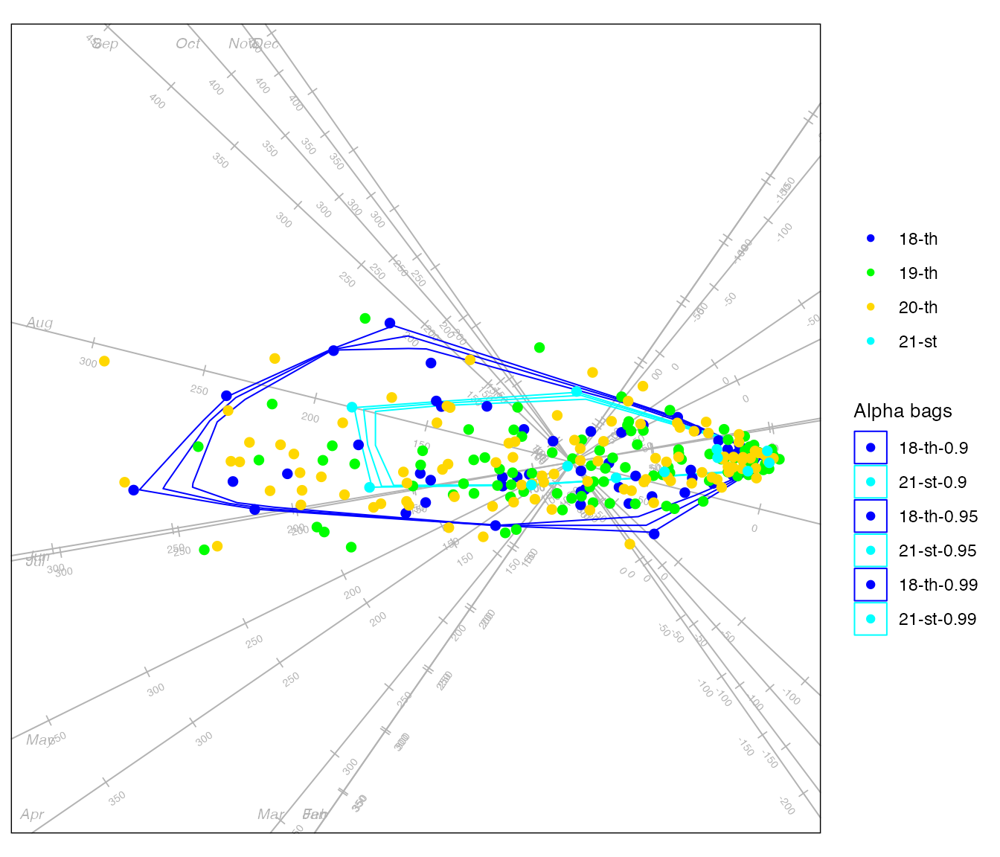

In the biplot above, the colours were recycled for each alpha value. To
specify differential colours, we can use the `col` argument and
similarly the `lty` and or `lwd` arguments. Since we are mostly
interested in the location and overlap of the clouds of points we can
remove the indivdiual samples by setting `samples (which = NULL)`. The
default colours will still be used for the $`\alpha`$-bags and we chose
to specify different line types for different $`\alpha`$ values. Here
the `opacity` is set to $`0.05`$ which plots a lighter shade inside the
$`\alpha`$-bags.

[`biplot`](../reference/biplot.md)`(``sunspots``, group.aes``=``century``)`` ``|>`` `[`PCA`](../reference/PCA.md)`(``)`` ``|>`` `` `[`axes`](../reference/axes.md)` ``(``label.dir ``=`` ``"Hor"``, label.line ``=`` `[`c`](https://rdrr.io/r/base/c.html)`(``0.8``, `[`rep`](https://rdrr.io/r/base/rep.html)`(``0``,``10``)``, ``0.8``)``)`` ``|>`` `` `[`samples`](../reference/samples.md)` ``(``which ``=`` ``NULL``)`` ``|>`` `` `[`alpha.bags`](../reference/alpha.bags.md)` ``(``alpha ``=`` `[`c`](https://rdrr.io/r/base/c.html)`(``0.9``, ``0.95``, ``0.99``)``, lty ``=`` `[`c`](https://rdrr.io/r/base/c.html)`(``1``,``3``,``5``)``, opacity``=``0.05``)`` ``|>`` `` `` `[`legend.type`](../reference/legend.type.md)`(``bags ``=`` ``TRUE``, new ``=`` ``TRUE``)`` ``|>`` `[`plot`](https://rdrr.io/r/graphics/plot.default.html)`(``)`` ``#> Computing 0.9 -bag for 18-th `` ``#> Computing 0.9 -bag for 19-th `` ``#> Computing 0.9 -bag for 20-th `` ``#> Computing 0.9 -bag for 21-st `` ``#> Computing 0.95 -bag for 18-th `` ``#> Computing 0.95 -bag for 19-th `` ``#> Computing 0.95 -bag for 20-th `` ``#> Computing 0.95 -bag for 21-st `` ``#> Computing 0.99 -bag for 18-th `` ``#> Computing 0.99 -bag for 19-th `` ``#> Computing 0.99 -bag for 20-th `` ``#> Computing 0.99 -bag for 21-st`` ``#> Warning: The ggplot2 engine does not yet support legend.type(new = TRUE);`` ``#> falling back to base graphics.`

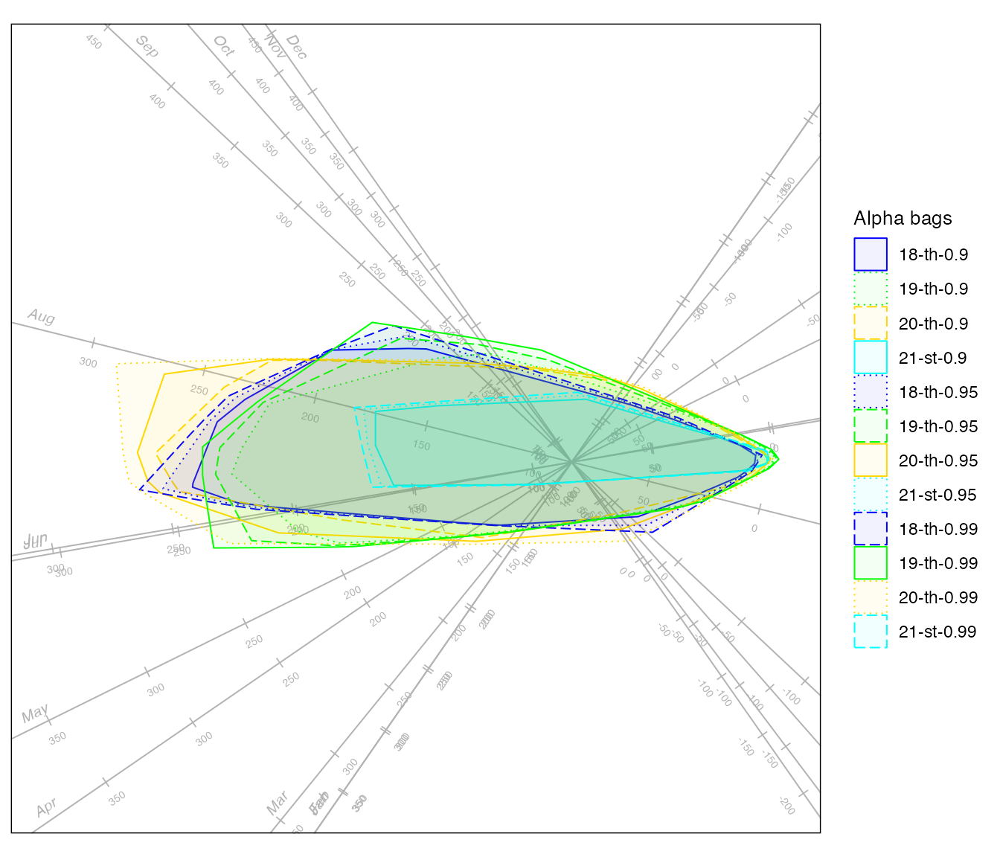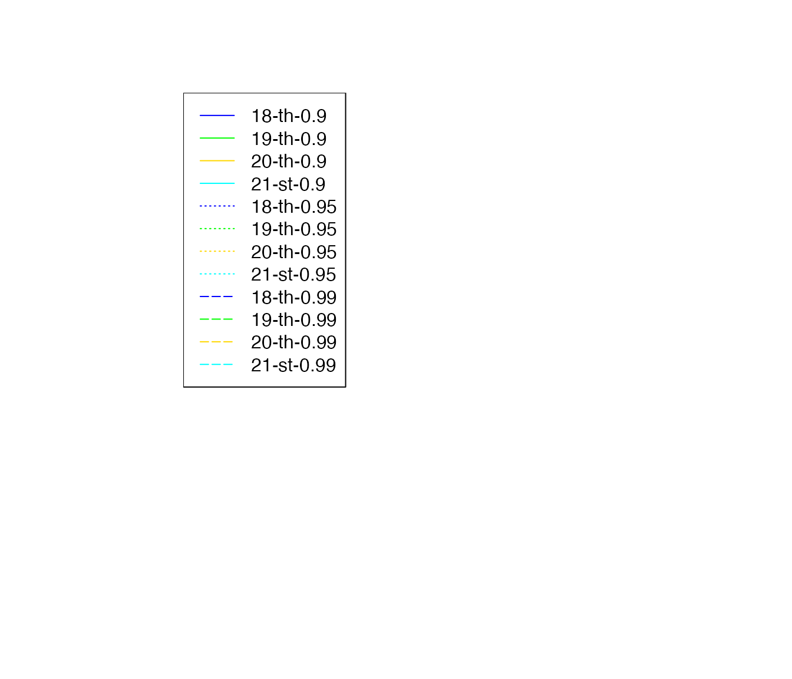

For a completely custom combination of $`\alpha`$-bags, we do not rely
on any recycling and specify each of the arguments `alpha`, `which`,
`col`, `lty`, `lwd` as a vector. Since the calculation of halfspace
location depth is very computationally intensive, a random sample of
size 2500 is chosen for each group to construct the $`\alpha`$-bag. This
sample size can be changed with the argument `max`. Setting
`trace = FALSE` will suppress the message “Computing $`\alpha`$” -bag
for groupX.”

[`biplot`](../reference/biplot.md)`(``sunspots``, group.aes``=``century``)`` ``|>`` `[`PCA`](../reference/PCA.md)`(``)`` ``|>`` `` `[`axes`](../reference/axes.md)` ``(``label.dir ``=`` ``"Hor"``, label.line ``=`` `[`c`](https://rdrr.io/r/base/c.html)`(``0.8``, `[`rep`](https://rdrr.io/r/base/rep.html)`(``0``,``10``)``, ``0.8``)``)`` ``|>`` `` `[`samples`](../reference/samples.md)` ``(``which ``=`` ``NULL``)`` ``|>`` `` `[`alpha.bags`](../reference/alpha.bags.md)` ``(``alpha ``=`` `[`c`](https://rdrr.io/r/base/c.html)`(`` ``0.9``, ``0.95``, ``0.99``, ``0.5``, ``0.6``, ``0.7``)``, `` `` which ``=`` `[`c`](https://rdrr.io/r/base/c.html)`(`` ``1``, ``1``, ``2``, ``3``, ``3``, ``3``)``,`` `` col ``=`` `[`c`](https://rdrr.io/r/base/c.html)`(``"brown"``, ``"red"``, ``"gold"``, ``"deepskyblue2"``, ``"steelblue3"``,``"blue"``)``,`` `` lty ``=`` `[`c`](https://rdrr.io/r/base/c.html)`(`` ``1``, ``2``, ``10``, ``2``, ``2``, ``0``)``,`` `` lwd ``=`` `[`c`](https://rdrr.io/r/base/c.html)`(`` ``1``, ``1``, ``3``, ``1``, ``2``, ``1``)``,`` `` opacity ``=`` ``0.1``)`` ``|>`` `[`plot`](https://rdrr.io/r/graphics/plot.default.html)`(``)`` ``#> Computing 0.9 -bag for 18-th `` ``#> Computing 0.95 -bag for 18-th `` ``#> Computing 0.99 -bag for 19-th `` ``#> Computing 0.5 -bag for 20-th `` ``#> Computing 0.6 -bag for 20-th `` ``#> Computing 0.7 -bag for 20-th`

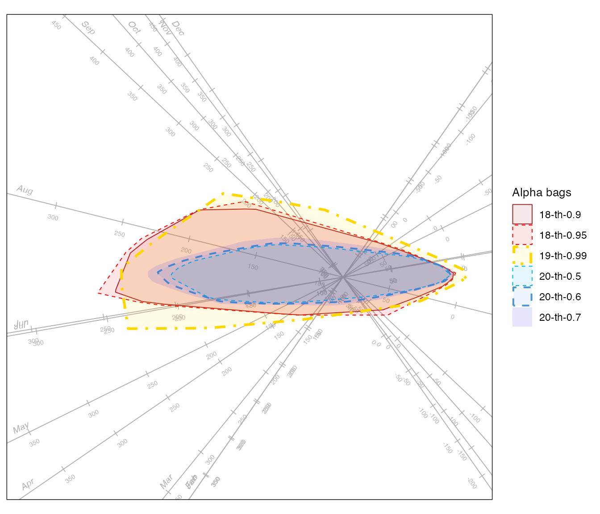

The function `alpha.bags` provides the option to only plot the samples
that sit outside the $`\alpha`$-bags. This is done by setting the
argument `outlying=TRUE`. Note the `which` argument may be overwritten
when `outlying` is set to `TRUE`. This happens in particular when
`which` in the [`samples()`](../reference/samples.md) function differs
from the `which` in the `alpha_bags()` function.

[`biplot`](../reference/biplot.md)`(``sunspots``, group.aes``=``century``)`` ``|>`` `[`PCA`](../reference/PCA.md)`(``)`` ``|>`` `` `[`alpha.bags`](../reference/alpha.bags.md)` ``(``col ``=`` `[`c`](https://rdrr.io/r/base/c.html)`(``"brown"``, ``"red"``, ``"gold"``,``"deepskyblue2"``)``,`` `` opacity ``=`` ``0.1``,outlying ``=`` ``TRUE``)`` ``|>`` `[`plot`](https://rdrr.io/r/graphics/plot.default.html)`(``)`` ``#> Computing 0.95 -bag for 18-th `` ``#> Computing 0.95 -bag for 19-th `` ``#> Computing 0.95 -bag for 20-th `` ``#> Computing 0.95 -bag for 21-st`

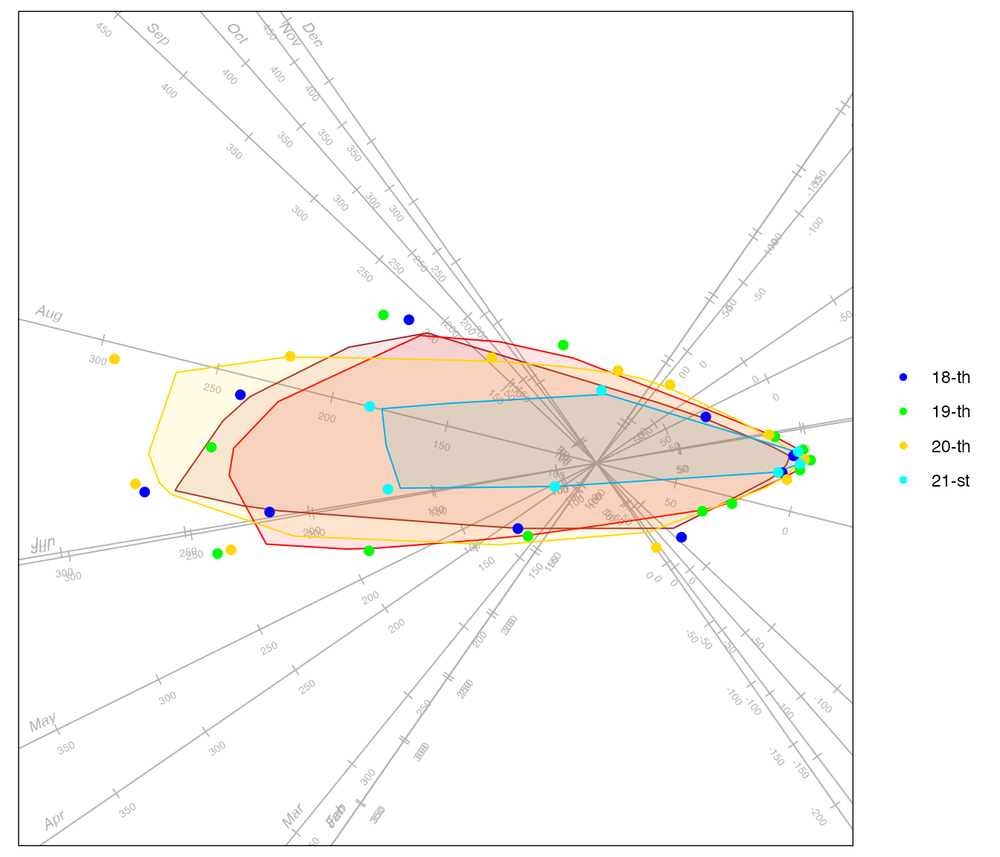

## The function `ellipses()`

If we observe a random sample from a $`p`$-variate normal distribution
with $`\bar{\mathbf{x}}`$ and $`\mathbf{S}`$ the usual unbaised
estimates of the mean vector and covariance matrix, then

``` math
(\mathbf{x} - \bar{\mathbf{x}})' \mathbf{S}^{-1} (\mathbf{x} - \bar{\mathbf{x}}) = \kappa^2
```

traces an ellipsoid in $`p`$ dimensions. For $`p=2`$, choosing
$`\kappa = {(\chi^{2}_{2,1-\alpha})}^{\frac{1}{2}}`$ where
$`\chi^{2}_{2,1-\alpha}`$ denotes the $`(1-\alpha)100`$-th percentage
point of the $`\chi^2_2`$ distribution results in an ellipse covering
approximately $`100\alpha\%`$ of the configuration of two-dimensional
points. With default arguments `df = 2` and `alpha = 0.95`, the value of
$`\kappa`$ is $`2.447747`$ and the ellipse function constructs an
ellipse that would enclose approximately $`95\%`$ of the observations
from a bivariate normal distribution. The argument `kappa` can be
specified directly, and will take precedence over the specification of
`alpha`. The other arguments of the
[`ellipses()`](../reference/ellipses.md) function operates identically
to the corresponding arguments of the function
[`alpha.bags()`](../reference/alpha.bags.md). Using $`\alpha`$-bags,
rather than ellipses is recommended in general, since the construction
of the ellipses are based on the underlying assumption of a random
sample observed from a normal distribution.

[`biplot`](../reference/biplot.md)`(``sunspots``, group.aes``=``century``)`` ``|>`` `[`PCA`](../reference/PCA.md)`(``)`` ``|>`` `` `[`axes`](../reference/axes.md)` ``(``label.dir ``=`` ``"Hor"``, label.line ``=`` `[`c`](https://rdrr.io/r/base/c.html)`(``0.8``, `[`rep`](https://rdrr.io/r/base/rep.html)`(``0``,``10``)``, ``0.8``)``)`` ``|>`` `` `[`samples`](../reference/samples.md)` ``(``which ``=`` ``NULL``)`` ``|>`` `` `[`ellipses`](../reference/ellipses.md)` ``(``alpha ``=`` `[`c`](https://rdrr.io/r/base/c.html)`(``0.9``, ``0.95``)``, lty ``=`` `[`c`](https://rdrr.io/r/base/c.html)`(``1``,``3``,``5``)``, opacity ``=`` ``0.1``)`` ``|>`` `` `` `[`legend.type`](../reference/legend.type.md)`(``ellipses ``=`` ``TRUE``)`` ``|>`` `[`plot`](https://rdrr.io/r/graphics/plot.default.html)`(``)`` ``#> Computing 2.15 -ellipse for 18-th `` ``#> Computing 2.15 -ellipse for 19-th `` ``#> Computing 2.15 -ellipse for 20-th `` ``#> Computing 2.15 -ellipse for 21-st `` ``#> Computing 2.45 -ellipse for 18-th `` ``#> Computing 2.45 -ellipse for 19-th `` ``#> Computing 2.45 -ellipse for 20-th `` ``#> Computing 2.45 -ellipse for 21-st`

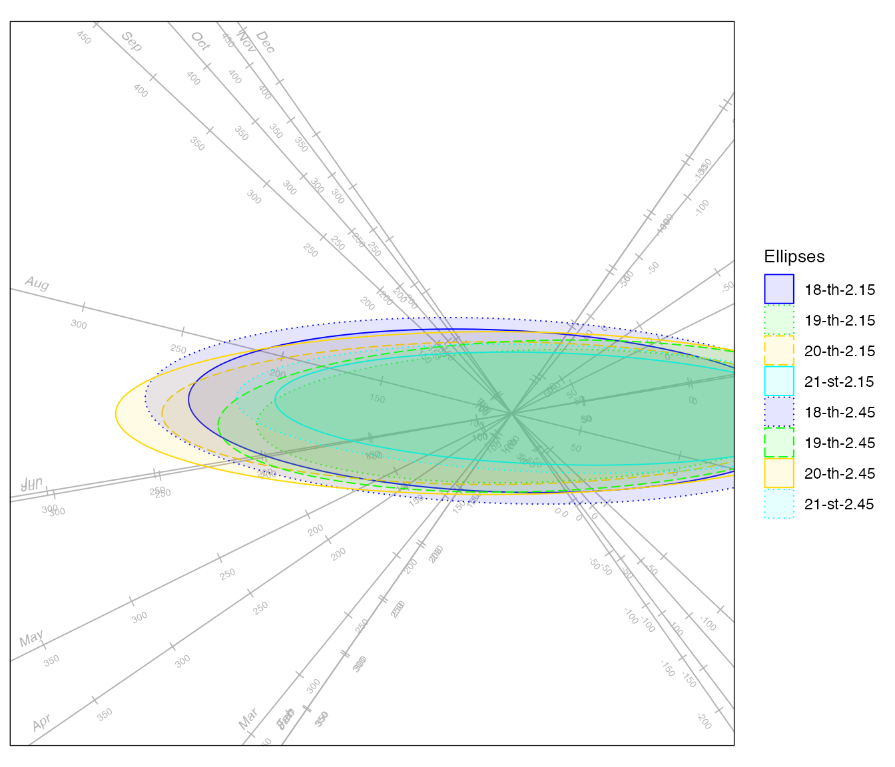

` `[`biplot`](../reference/biplot.md)`(``sunspots``, group.aes``=``century``)`` ``|>`` `[`PCA`](../reference/PCA.md)`(``)`` ``|>`` `` `[`axes`](../reference/axes.md)` ``(``label.dir ``=`` ``"Hor"``, label.line ``=`` `[`c`](https://rdrr.io/r/base/c.html)`(``0.8``, `[`rep`](https://rdrr.io/r/base/rep.html)`(``0``,``10``)``, ``0.8``)``)`` ``|>`` `` `[`samples`](../reference/samples.md)` ``(``which ``=`` ``NULL``)`` ``|>`` `` `[`ellipses`](../reference/ellipses.md)` ``(``kappa ``=`` ``1``:``2``, lty ``=`` `[`c`](https://rdrr.io/r/base/c.html)`(``1``,``3``,``5``)``, opacity ``=`` ``0.1``)`` ``|>`` `` `` `[`legend.type`](../reference/legend.type.md)`(``ellipses ``=`` ``TRUE``)`` ``|>`` `[`plot`](https://rdrr.io/r/graphics/plot.default.html)`(``)`` ``#> Computing 1 -ellipse for 18-th `` ``#> Computing 1 -ellipse for 19-th `` ``#> Computing 1 -ellipse for 20-th `` ``#> Computing 1 -ellipse for 21-st `` ``#> Computing 2 -ellipse for 18-th `` ``#> Computing 2 -ellipse for 19-th `` ``#> Computing 2 -ellipse for 20-th `` ``#> Computing 2 -ellipse for 21-st`

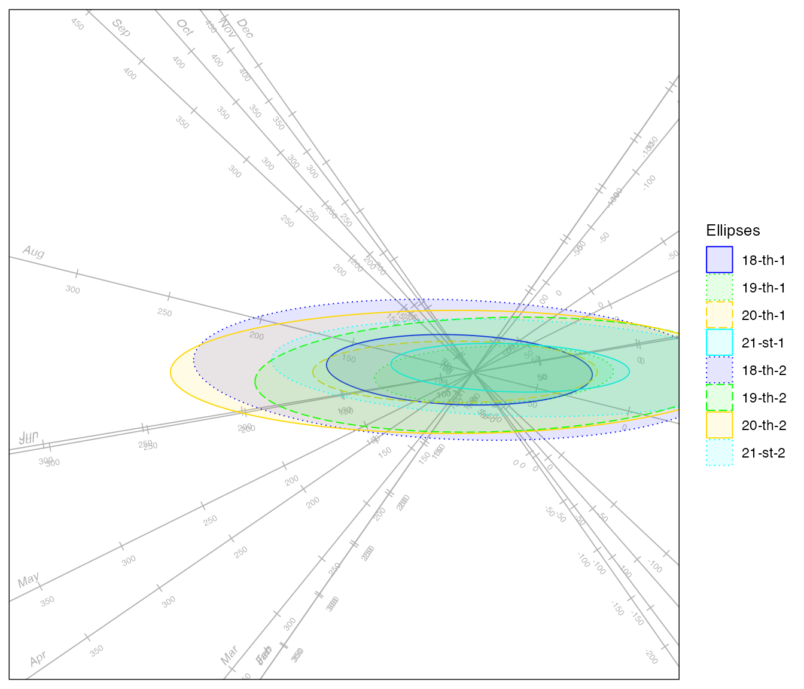

## The function `density2D()`

This is a function for constructing two-dimensional PCA biplots on top
of a density plot of a two-dimensional PCA approximation of the input
matrix. The R function `kde2d` described by Venables and Ripley (2002)
and available in the package `MASS` is used to perform two-dimensional
kernel density estimation with an axis-aligned bivariate normal kernel,
evaluated on a square grid.

The function plots the density for each group (specified in the argument
`which`) in the data. In the following case, the second group’s density
is plotted with `contours=TRUE`. A vector of at least two components
should be specified in the `col` argument to display the colours of the
density response surface. There are `cuts`-1 colours interpolated
between the components of the `col`. The default is
`c("green", "yellow", "red")`.

[`biplot`](../reference/biplot.md)`(``state.x77``,group.aes ``=`` ``state.region``,scaled ``=`` ``TRUE``)`` ``|>`` `[`PCA`](../reference/PCA.md)`(``)`` ``|>`` `` `[`density2D`](../reference/density2D.md)`(``which``=``2``,col``=`[`c`](https://rdrr.io/r/base/c.html)`(``"white"``,``"purple"``,``"blue"``,``"cyan"``)``,contours``=``TRUE``)`` ``|>`` `[`plot`](https://rdrr.io/r/graphics/plot.default.html)`(``)`

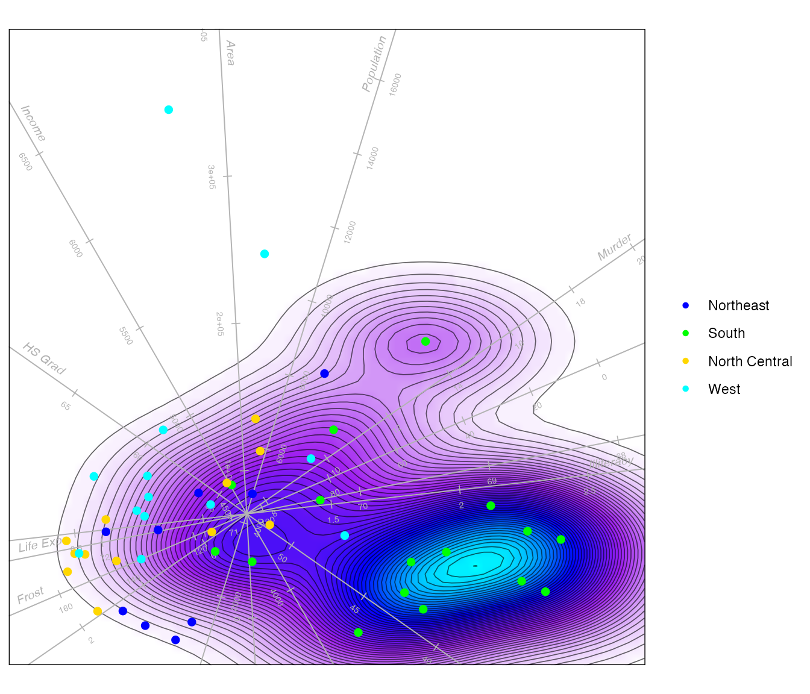

In this case, the vector `group.aes` is not specified, so all samples
form under one group.

[`biplot`](../reference/biplot.md)`(``state.x77``,scaled ``=`` ``TRUE``)`` ``|>`` `[`PCA`](../reference/PCA.md)`(``)`` ``|>`` `[`samples`](../reference/samples.md)`(``which``=``NULL``)`` ``|>`` `` `[`density2D`](../reference/density2D.md)`(``which``=``1``,col``=`[`c`](https://rdrr.io/r/base/c.html)`(``"white"``,``"purple"``,``"blue"``,``"cyan"``)``,contours ``=`` ``TRUE``,cuts ``=`` ``20``)`` ``|>`` `[`plot`](https://rdrr.io/r/graphics/plot.default.html)`(``)`

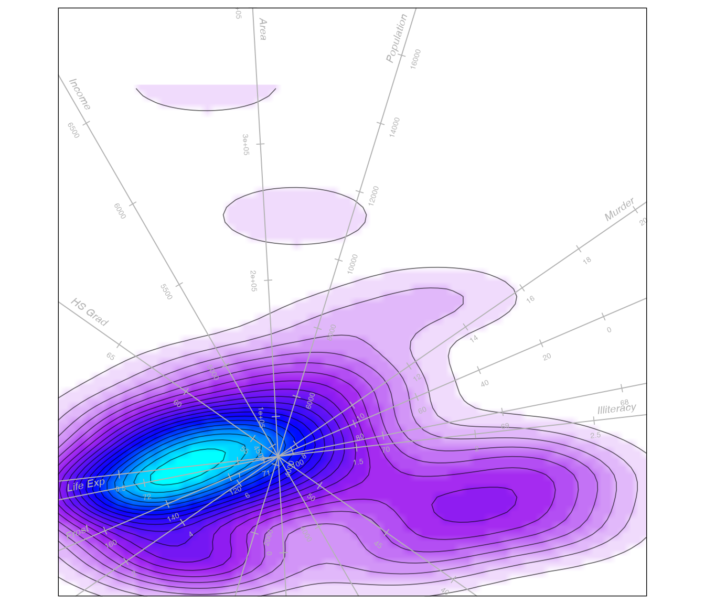

## The functions `interpolate()` with `newsamples()` and `newaxes()`

The process of interpolation is described by Gower and Hand (1996) as
the process of finding the coordinates of a $`p`$-dimensional sample in
the lower dimensional biplot space. For PCA we showed in section 1 in
the biplotEZ vignette that the sample points are represented by
$`\mathbf{G}=\mathbf{UDJ}_2`$ which can be written as
$`\mathbf{G}=\mathbf{UDV'VJ}_2=\mathbf{XVJ}_2`$. Finding the position of
a new sample $`\mathbf{x}^*:p \times 1`$ make use of the same
transformation so that the 2D coordinates is given by
$`{\mathbf{z}^*}':2 \times 1 ={\mathbf{x}^*}' \mathbf{VJ}_2`$.
Similarly, the position of a new variable $`\mathbf{x}^*:n \times 1`$ is
added using a regression method that assumes that $`\mathbf{x}^*`$ is
approximately a linear function
$`\mathbf{x}^* = \mathbf{XV}_r\mathbf{b}_r`$ with solution
$`\hat{\mathbf{b}}_r :r \times 1 = (\mathbf{V}'_r\mathbf{X}'\mathbf{XV}_r)^{-1}\mathbf{V}_r\mathbf{X}'\mathbf{x}^*`$.

Adding samples and variables to the plot is facilitated by the function
[`interpolate()`](../reference/interpolate.md). Note that the samples
and variables to be interpolated did not contribute to the construction
of the biplot. This is the reason why Greenacre (2017) term these
supplementary points or axes.

The function [`interpolate()`](../reference/interpolate.md) accepts a
matrix or data frame containing the samples and variables to be
interpolated. The argument `newdata` containing the samples to be
interpolated needs to have a similar structure to the data set sent to
[`biplot()`](../reference/biplot.md). If
[`biplot()`](../reference/biplot.md) received a data frame, `newdata`
can be either another data frame or a matrix containing the subset of
numerical variables. Similarly, the argument `newvariable` containing
the new variables to be interpolated needs to have the same number of
samples in the data sent to [`biplot()`](../reference/biplot.md).

Suppose we construct a PCA biplot of the first $`40`$ samples in the
data set `rock` and then $`8`$ new samples is to be interpolated the
call will be:

[`biplot`](../reference/biplot.md)`(``rock``[``1``:``40``,``]``, scale ``=`` ``TRUE``)`` ``|>`` `[`PCA`](../reference/PCA.md)`(``)`` ``|>`` `` `` `[`interpolate`](../reference/interpolate.md)` ``(``newdata``=``rock``[``41``:``48``,``]``)`` ``|>`` `[`plot`](https://rdrr.io/r/graphics/plot.default.html)`(``)`

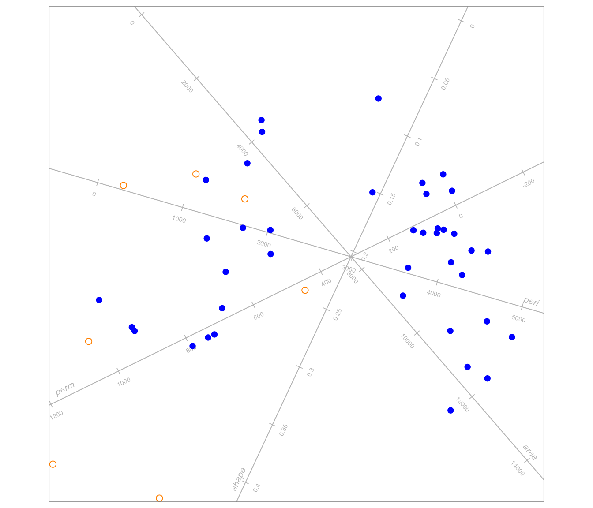

The function [`newsamples()`](../reference/newsamples.md) operates
similar to samples, allowing changes to the aesthetics of the
interpolated new samples. There is no argument `which` for
[`newsamples()`](../reference/newsamples.md) since it is assumed that
samples are interpolated to be represented in the biplot. All the other
arguments are vectors of length similar to the number of samples in
`newdata`. To change the colour of the interpolated samples and add
labels, the following call will be used:

[`biplot`](../reference/biplot.md)`(``rock``[``1``:``40``,``]``, scale ``=`` ``TRUE``)`` ``|>`` `[`PCA`](../reference/PCA.md)`(``)`` ``|>`` `` `` `[`interpolate`](../reference/interpolate.md)` ``(``rock``[``41``:``48``,``]``)`` ``|>`` `` `[`newsamples`](../reference/newsamples.md)` ``(``label ``=`` ``TRUE``, label.side ``=`` ``"top"``, col ``=`` `[`rainbow`](https://rdrr.io/r/grDevices/palettes.html)`(``10``)``)`` ``|>`` `[`plot`](https://rdrr.io/r/graphics/plot.default.html)`(``)`

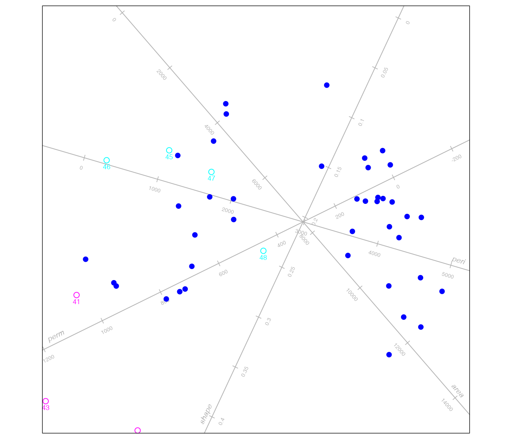

Suppose constructing a PCA biplot using the three variables in the
`rock` data, and interpolating the other variable.

[`biplot`](../reference/biplot.md)`(``rock``[``,`[`c`](https://rdrr.io/r/base/c.html)`(``1``,``2``,``4``)``]``, scale ``=`` ``TRUE``)`` ``|>`` `[`PCA`](../reference/PCA.md)`(``)`` ``|>`` `` `` `[`interpolate`](../reference/interpolate.md)` ``(``newvariable ``=``rock``[``,``3``]``)`` ``|>`` `[`plot`](https://rdrr.io/r/graphics/plot.default.html)`(``)`

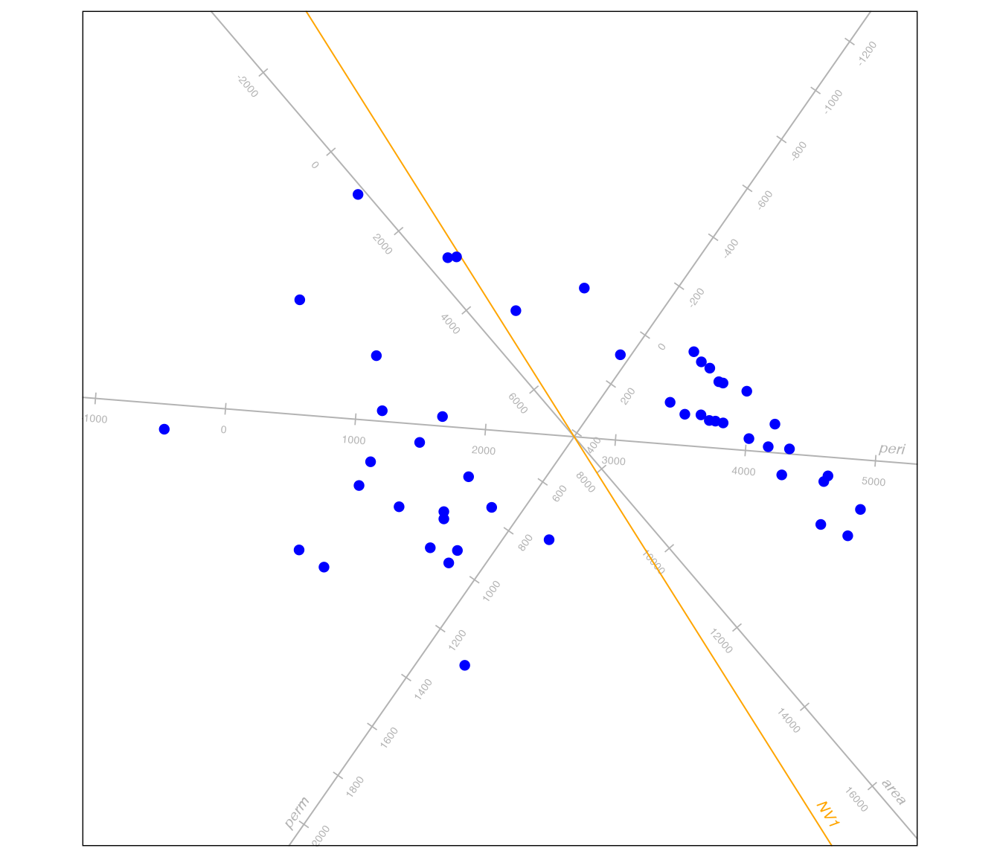

We can change the aesthetics of the new variables with the
[`newaxes()`](../reference/newaxes.md) function which operates similarly
to the [`axes()`](../reference/axes.md) function.

[`biplot`](../reference/biplot.md)`(``rock``[``,`[`c`](https://rdrr.io/r/base/c.html)`(``1``,``2``,``4``)``]``, scale ``=`` ``TRUE``)`` ``|>`` `[`PCA`](../reference/PCA.md)`(``)`` ``|>`` `` `` `[`interpolate`](../reference/interpolate.md)` ``(``newvariable ``=``rock``[``,``3``]``)`` ``|>`` `` `` `[`newaxes`](../reference/newaxes.md)`(``col``=``"red"``,ticks ``=`` ``50``,X.new.names ``=`` ``"shape"``)`` ``|>`` `[`plot`](https://rdrr.io/r/graphics/plot.default.html)`(``)`

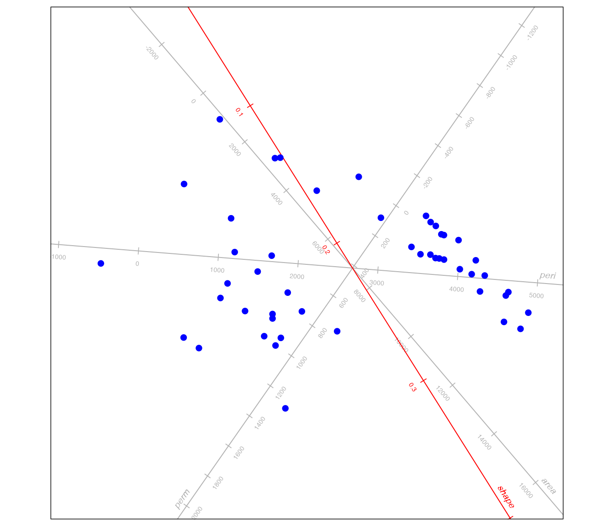

The function [`interpolate()`](../reference/interpolate.md) will also
work if new samples and new variables need to be interpolated at the
same time. For example:

[`biplot`](../reference/biplot.md)`(``rock``[``1``:``40``,`[`c`](https://rdrr.io/r/base/c.html)`(``1``,``2``,``4``)``]``, scale ``=`` ``TRUE``)`` ``|>`` `[`PCA`](../reference/PCA.md)`(``)`` ``|>`` `` `` `[`interpolate`](../reference/interpolate.md)` ``(``newdata``=``rock``[``41``:``48``,`[`c`](https://rdrr.io/r/base/c.html)`(``1``,``2``,``4``)``]``,newvariable ``=``rock``[``1``:``40``,``3``]``)`` ``|>`` `` `` `[`newaxes`](../reference/newaxes.md)`(``col``=``"red"``,ticks ``=`` ``100``,X.new.names ``=`` ``"shape"``)`` ``|>`` `[`plot`](https://rdrr.io/r/graphics/plot.default.html)`(``)`

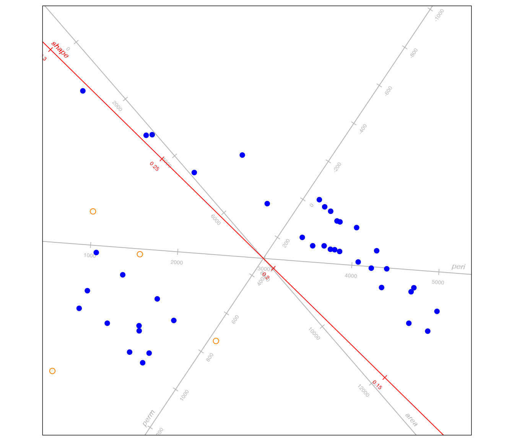

Notice that `newdata` has the same number of variables as the data sent
to [`biplot()`](../reference/biplot.md) and `newvariable` has the same
number of samples as the data sent to
[`biplot()`](../reference/biplot.md).

## The function `prediction()`

To add prediction of the sample points to the biplot, the function
[`prediction()`](../reference/prediction.md) is used.

`out`` ``<-`` `[`biplot`](../reference/biplot.md)`(``rock``, scale ``=`` ``TRUE``)`` ``|>`` `[`PCA`](../reference/PCA.md)`(``)`` ``|>`` `` `` `[`prediction`](../reference/prediction.md)` ``(``predict.samples ``=`` ``TRUE``)`` ``|>`` `[`plot`](https://rdrr.io/r/graphics/plot.default.html)`(``)`

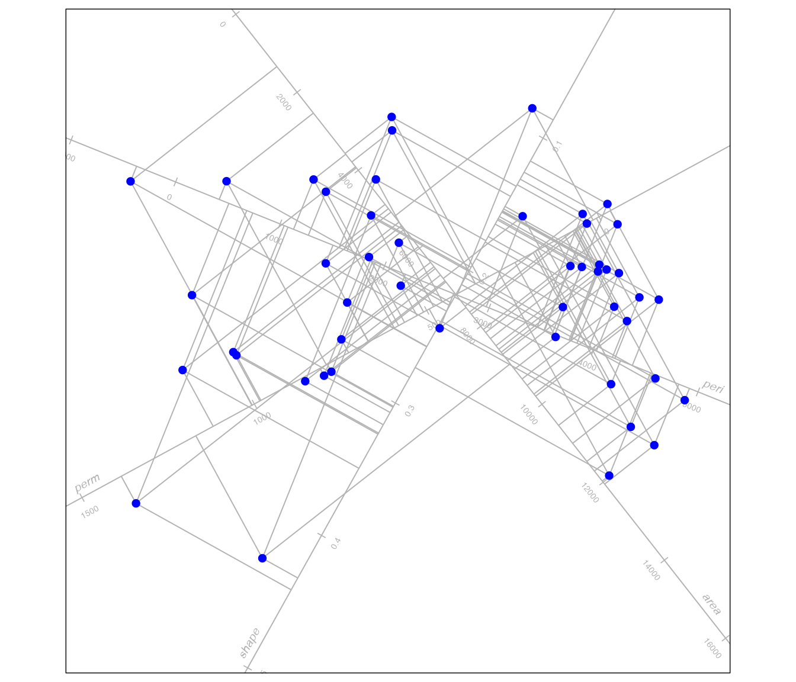

    #> Sample predictions for samples 1, 2, 3, 4, 5, 6, 7, 8, 9, 10, 11, 12, 13, 14, 15, 16, 17, 18, 19, 20, 21, 22, 23, 24, 25, 26, 27, 28, 29, 30, 31, 32, 33, 34, 35, 36, 37, 38, 39, 40, 41, 42, 43, 44, 45, 46, 47, 48:
    #>         area     peri shape     perm
    #> 1   5182.518 2694.668 0.086   17.426
    #> 2   7691.949 3526.494 0.135   35.517
    #> 3   8318.033 3628.700 0.162   99.695
    #> 4   7636.831 3630.891 0.117  -34.365
    #> 5   8084.856 3781.500 0.126  -32.323
    #> 6   8499.105 3765.037 0.155   57.771
    #> 7   9738.891 4180.153 0.178   64.357
    #> 8   8877.364 3954.756 0.153   24.056
    #> 9   8718.501 3605.532 0.191  190.899
    #> 10  6776.004 2972.989 0.152  170.463
    #> 11  9517.287 4203.798 0.161    7.757
    #> 12  8667.626 3841.427 0.155   47.358
    #> 13 10542.328 4258.150 0.220  176.827
    #> 14  9102.060 3644.408 0.211  243.663
    #> 15  9351.922 4027.159 0.174   75.571
    #> 16  8590.817 3776.896 0.159   68.935
    #> 17 11002.857 4604.087 0.202   70.663
    #> 18 11465.727 4562.156 0.238  184.664
    #> 19 11713.492 4918.011 0.205   31.398
    #> 20  9794.836 4371.196 0.156  -32.951
    #> 21  7486.756 3459.784 0.131   33.298
    #> 22 11970.162 4545.578 0.273  292.407
    #> 23 12048.397 4816.307 0.241  154.307
    #> 24  8161.391 3531.763 0.165  124.063
    #> 25  6473.046 1887.111 0.281  726.488
    #> 26  3937.319 1270.405 0.201  581.415
    #> 27  6361.245 2198.963 0.231  528.041
    #> 28  4364.754 1641.882 0.177  454.332
    #> 29  5961.529 1813.404 0.258  668.506
    #> 30  5419.192 1075.240 0.324  980.896
    #> 31  6687.830 1728.179 0.316  858.393
    #> 32  6862.484 1912.204 0.303  788.206
    #> 33  5072.364 1506.645 0.242  668.904
    #> 34  5330.680 1039.172 0.323  984.069
    #> 35  5510.961 1842.252 0.224  564.315
    #> 36  6834.394 1864.972 0.307  809.483
    #> 37  3788.048 1612.781 0.144  358.372
    #> 38  3912.089  510.009 0.303 1007.222
    #> 39  3569.066 1564.615 0.136  342.960
    #> 40  5655.233 2040.800 0.207  479.977
    #> 41  4984.153  680.945 0.349 1119.422
    #> 42  1341.442 -373.144 0.257 1006.269
    #> 43  6519.731  738.717 0.441 1386.098
    #> 44  8964.500 1961.991 0.432 1169.847
    #> 45  3589.848 1128.435 0.197  594.085
    #> 46  2533.721  417.055 0.226  791.127
    #> 47  4876.168 1721.456 0.200  508.970
    #> 48  7521.495 2660.643 0.243  492.744

In addition the predictions are computed and can be accessed with the
`summary.method`.

[`summary`](https://rdrr.io/r/base/summary.html)`(``out``)`` ``#> Object of class biplot, based on 48 samples and 4 variables.`` ``#> 4 numeric variables.`` ``#> `` ``#> Sample predictions`` ``#> area peri shape perm`` ``#> 1 5182.518 2694.6678 0.08624348 17.426253`` ``#> 2 7691.949 3526.4942 0.13514234 35.517473`` ``#> 3 8318.033 3628.6997 0.16177613 99.694598`` ``#> 4 7636.831 3630.8908 0.11725845 -34.364599`` ``#> 5 8084.856 3781.5005 0.12570117 -32.323140`` ``#> 6 8499.105 3765.0371 0.15484655 57.771249`` ``#> 7 9738.891 4180.1532 0.17843607 64.357324`` ``#> 8 8877.364 3954.7565 0.15340118 24.056153`` ``#> 9 8718.501 3605.5323 0.19094566 190.899483`` ``#> 10 6776.004 2972.9886 0.15153800 170.463202`` ``#> 11 9517.287 4203.7977 0.16081144 7.756551`` ``#> 12 8667.626 3841.4265 0.15531722 47.357938`` ``#> 13 10542.328 4258.1501 0.21989947 176.826997`` ``#> 14 9102.060 3644.4083 0.21051537 243.662966`` ``#> 15 9351.922 4027.1591 0.17428339 75.571235`` ``#> 16 8590.817 3776.8963 0.15917449 68.935190`` ``#> 17 11002.857 4604.0870 0.20238688 70.663421`` ``#> 18 11465.727 4562.1556 0.23817832 184.664030`` ``#> 19 11713.492 4918.0115 0.20549573 31.397809`` ``#> 20 9794.836 4371.1960 0.15588772 -32.950729`` ``#> 21 7486.756 3459.7842 0.13096481 33.297702`` ``#> 22 11970.162 4545.5777 0.27319335 292.407085`` ``#> 23 12048.397 4816.3066 0.24117196 154.306887`` ``#> 24 8161.391 3531.7628 0.16489230 124.063184`` ``#> 25 6473.046 1887.1108 0.28067750 726.488443`` ``#> 26 3937.319 1270.4047 0.20059243 581.415341`` ``#> 27 6361.245 2198.9634 0.23068527 528.041307`` ``#> 28 4364.754 1641.8821 0.17743170 454.331807`` ``#> 29 5961.529 1813.4043 0.25757496 668.505918`` ``#> 30 5419.192 1075.2405 0.32352672 980.895692`` ``#> 31 6687.830 1728.1793 0.31639877 858.392956`` ``#> 32 6862.484 1912.2039 0.30251759 788.205529`` ``#> 33 5072.364 1506.6448 0.24189571 668.903853`` ``#> 34 5330.680 1039.1725 0.32272399 984.068789`` ``#> 35 5510.961 1842.2520 0.22437503 564.315264`` ``#> 36 6834.394 1864.9721 0.30716675 809.483177`` ``#> 37 3788.048 1612.7808 0.14398515 358.372419`` ``#> 38 3912.089 510.0085 0.30315670 1007.222092`` ``#> 39 3569.066 1564.6150 0.13637128 342.959576`` ``#> 40 5655.233 2040.8001 0.20653151 479.977300`` ``#> 41 4984.153 680.9452 0.34932075 1119.421832`` ``#> 42 1341.442 -373.1439 0.25731781 1006.268880`` ``#> 43 6519.731 738.7171 0.44107961 1386.097805`` ``#> 44 8964.500 1961.9907 0.43213873 1169.846628`` ``#> 45 3589.848 1128.4355 0.19749274 594.085244`` ``#> 46 2533.721 417.0546 0.22642373 791.127217`` ``#> 47 4876.168 1721.4564 0.19972344 508.970410`` ``#> 48 7521.495 2660.6426 0.24273124 492.744256`

The other arguments to [`prediction()`](../reference/prediction.md) are
`predict.means` to also (or only) predict the group means and `which` to
indicate which axes’ predictions are shown on the biplot. By specifying
`predict.samples = TRUE` and/or `predict.means = TRUE` all samples
and/or means are predicted. Alternatively either of these arguments
accepts a vector indicating which samples and/or means to predict. In
the example below, only the mean values of the Central and West regions
are predicted.

`out`` ``<-`` `[`biplot`](../reference/biplot.md)`(``state.x77``, scale ``=`` ``TRUE``)`` ``|>`` `[`PCA`](../reference/PCA.md)`(``group.aes ``=`` ``state.region``, show.class.means ``=`` ``TRUE``)`` ``|>`` `` `` `[`prediction`](../reference/prediction.md)` ``(``predict.means ``=`` ``3``:``4``, which ``=`` `[`c`](https://rdrr.io/r/base/c.html)`(``"Income"``,``"Murder"``,``"Population"``)``)`` ``|>`` `[`plot`](https://rdrr.io/r/graphics/plot.default.html)`(``)`

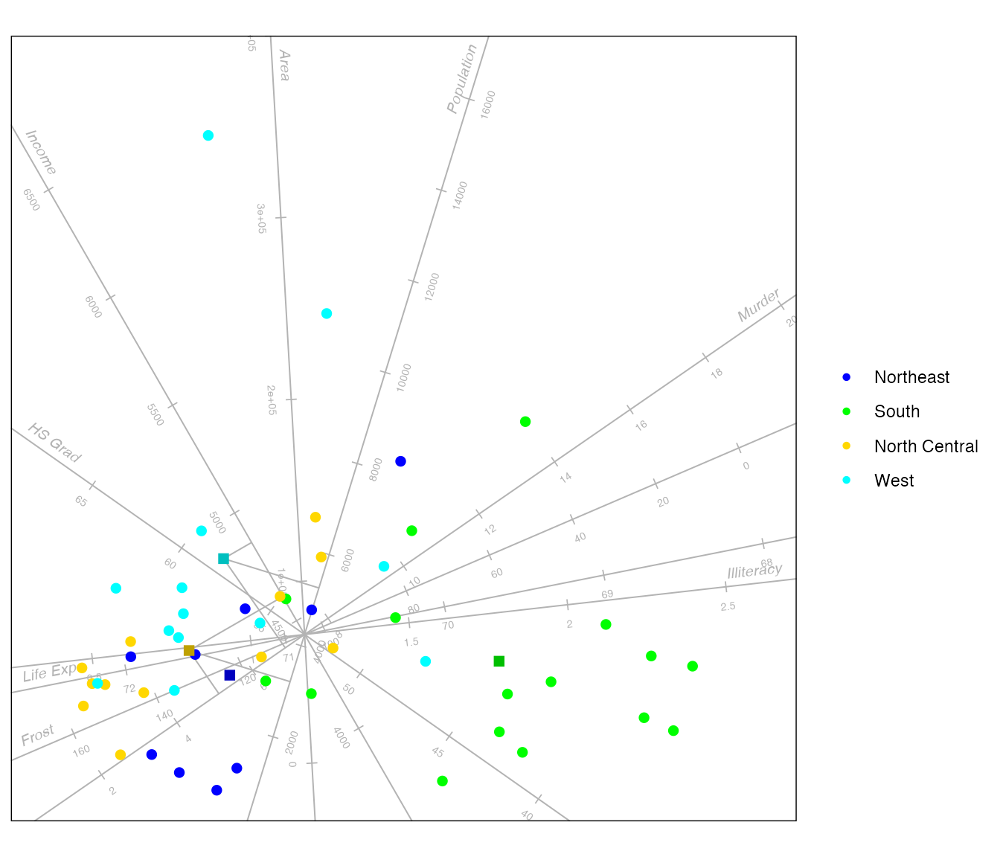

    #> Class mean predictions for classes North Central, West:
    #>               Population   Income Illiteracy Life Exp Murder HS Grad   Frost
    #> North Central   3211.604 4611.672      0.804   71.596  5.108  57.016 129.322
    #> West            5268.183 4862.927      0.944   71.277  6.866  58.147 114.290
    #>                   Area
    #> North Central  65529.0
    #> West          114849.8
    summary(out)
    #> Object of class biplot, based on 50 samples and 8 variables.
    #> 8 numeric variables.
    #> 
    #> Class mean predictions
    #>                 Income   Murder Population
    #> North Central 4611.672 5.108174   3211.604
    #> West          4862.927 6.865661   5268.183

## The functions `reflect()` and `rotate()`

The function [`reflect()`](../reference/reflect.md) allows for the user
to reflect the biplot display about the x-axis or y-axis or both. The
argument `reflect.axis` offers the options `"FALSE"`,`"x"`,`"y"`,`"xy"`.

Here the biplot is reflected about the x-axis.

[`biplot`](../reference/biplot.md)`(``state.x77``, scale ``=`` ``TRUE``)`` ``|>`` `[`PCA`](../reference/PCA.md)`(``group.aes ``=`` ``state.division``)`` ``|>`` `[`reflect`](../reference/reflect.md)`(``"x"``)`` ``|>`` `[`plot`](https://rdrr.io/r/graphics/plot.default.html)`(``)`

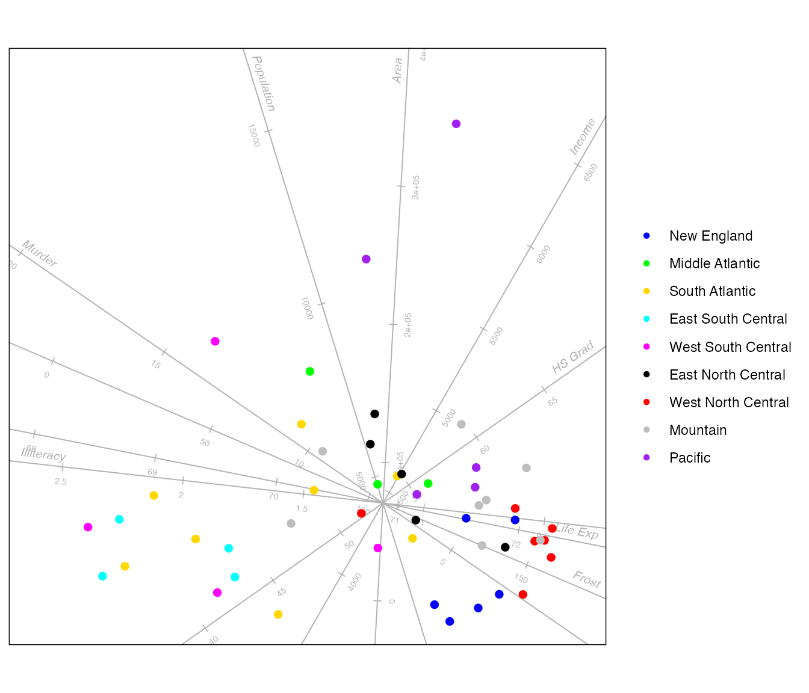

Here the biplot is reflected about the y-axis.

[`biplot`](../reference/biplot.md)`(``state.x77``, scale ``=`` ``TRUE``)`` ``|>`` `[`PCA`](../reference/PCA.md)`(``group.aes ``=`` ``state.division``)`` ``|>`` `[`reflect`](../reference/reflect.md)`(``"y"``)`` ``|>`` `[`plot`](https://rdrr.io/r/graphics/plot.default.html)`(``)`

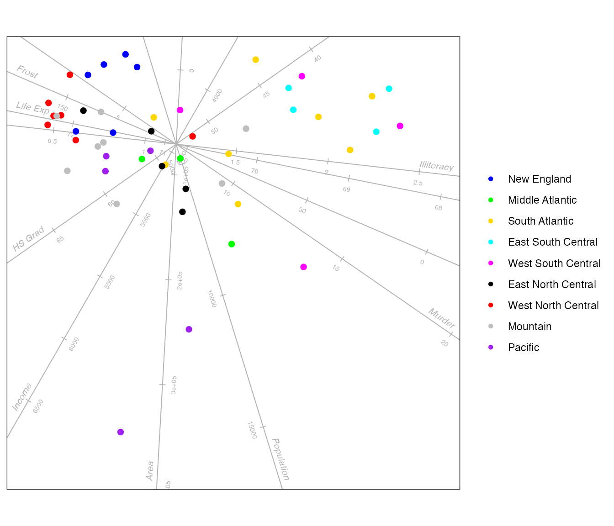

The function [`rotate()`](../reference/rotate.md) allows for the user to
rotate the biplot display by a certain value of degrees. The default is
0 and positive value results in anti-clockwise rotation and negative
value in clockwise rotation. For example when `rotate.degrees` is set to
100 degrees, then the biplot is rotated by 100 degrees in the
anticlockwise direction.

[`biplot`](../reference/biplot.md)`(``state.x77``, scale ``=`` ``TRUE``)`` ``|>`` `[`PCA`](../reference/PCA.md)`(``group.aes ``=`` ``state.division``)`` ``|>`` `[`rotate`](../reference/rotate.md)`(``100``)`` ``|>`` `[`plot`](https://rdrr.io/r/graphics/plot.default.html)`(``)`

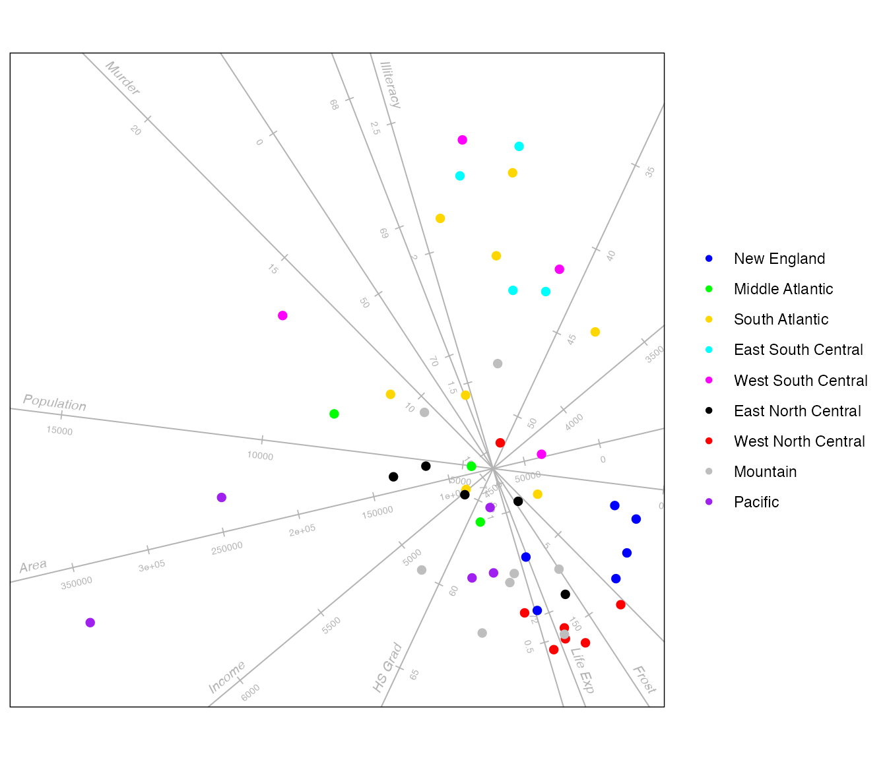

## Zooming in on the biplot with `zoom = TRUE` in `plot()`

The [`plot()`](https://rdrr.io/r/graphics/plot.default.html) function
has built-in functionality to zoom in on the plot. This is done through
the [`locator()`](https://rdrr.io/r/graphics/locator.html) function
which alters the `xlim` and `ylim` paramaters of the plot. The
implementation opens up a new graphics window before promting the
locator function. It is illustrated below:

[`biplot`](../reference/biplot.md)`(``state.x77``,scaled ``=`` ``TRUE``)`` ``|>`` `` `` `[`PCA`](../reference/PCA.md)`(``)`` ``|>`` `` `` `[`samples`](../reference/samples.md)`(``which``=``NULL``)`` ``|>`` `` `[`density2D`](../reference/density2D.md)`(``which``=``1``,col``=`[`c`](https://rdrr.io/r/base/c.html)`(``"white"``,``"purple"``,``"blue"``,``"cyan"``)``,contours ``=`` ``TRUE``,cuts ``=`` ``20``)`` ``|>`` `` `` `[`plot`](https://rdrr.io/r/graphics/plot.default.html)`(``zoom``=``TRUE``)`

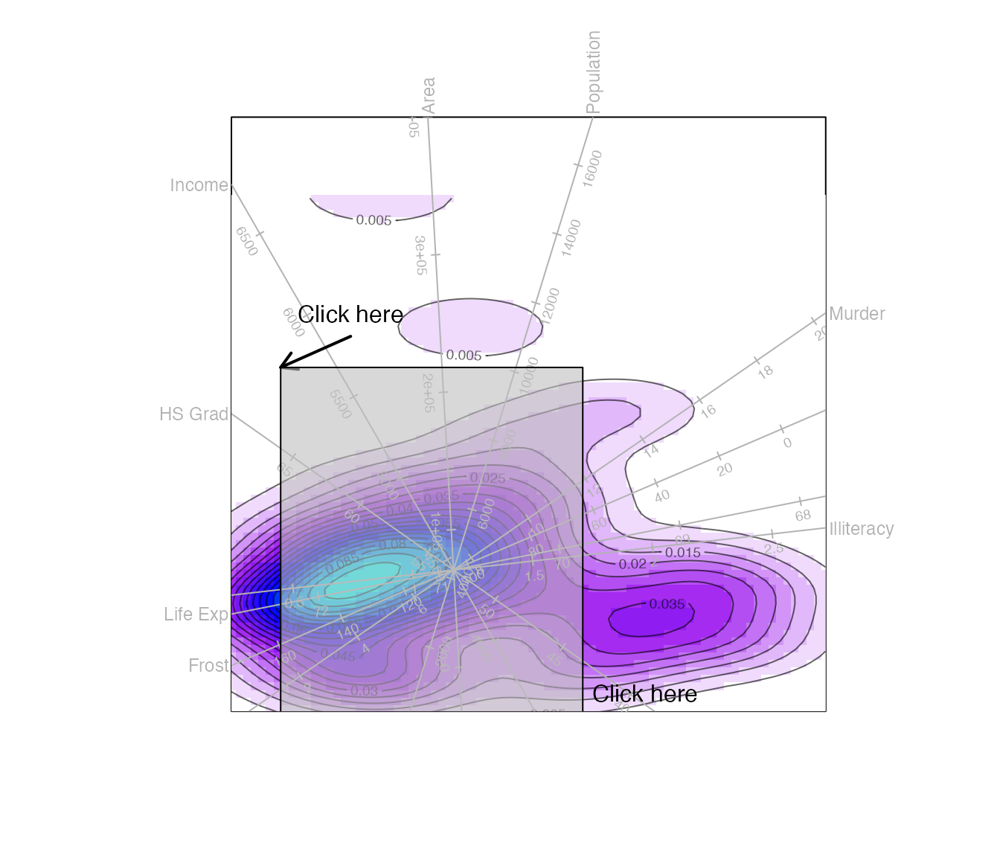 With
the final plot then rendered as:

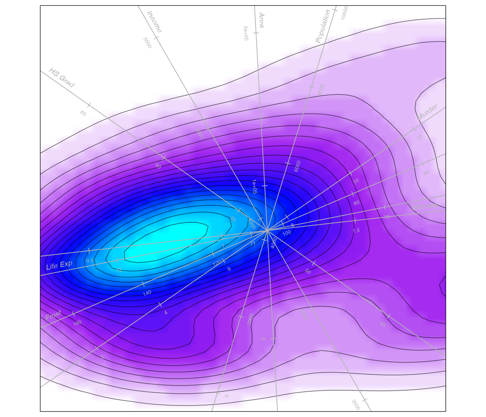

## The function `translate_axes()`

This function implements the same algorithm as the `TDAbiplot()` in the
`bipl5` package. It allows to translate the axes out of the plot center
to the boundary using orthogonal parallel translation. The axes can be
translated manually by setting the distance in the `distance` argument.

[`biplot`](../reference/biplot.md)`(``state.x77``,scaled``=``TRUE``)`` ``|>`` `` `` `[`PCA`](../reference/PCA.md)`(``)`` ``|>`` `` `[`translate_axes`](../reference/translate_axes.md)`(``delta ``=`` ``0.02``)`` ``|>`` `` `[`plot`](https://rdrr.io/r/graphics/plot.default.html)`(``exp.factor``=``3``)`

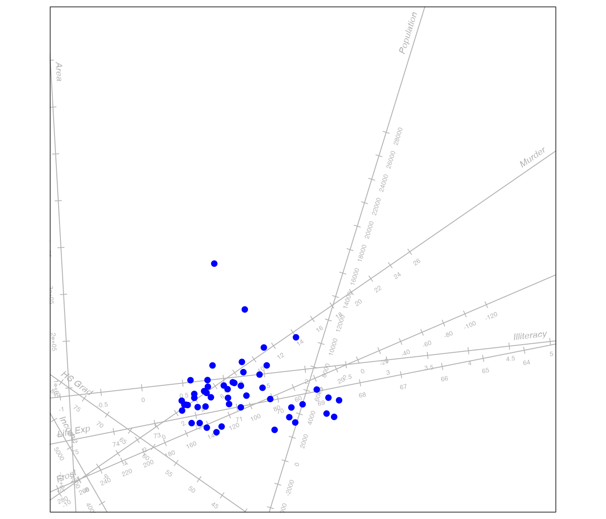

Gower, J. C., and D. J. Hand. 1996. *Biplots.* Chapman & Hall.

Gower, J. C., S. Lubbe, and N. J. le Roux. 2011. *Understanding
Biplots.* Wiley.

Greenacre, M. J. 2017. *Correspondence Analysis in Practice.* CRC press.

Rousseeuw, P. J, I Ruts, and J. W. Tukey. 1999. “The Bagplot: A
Bivaraite Boxplot.” *American Statistician*, 382–87.

Tukey, J. W. 1975. “Mathematics and the Picturing of Data.” *Proceedings
of the International Congress of Mathematicians*, 523–31.

Venables, W. N., and B. D Ripley. 2002. *Modern Applied Statistics with
s (4th Edition).* New York: Springer.
