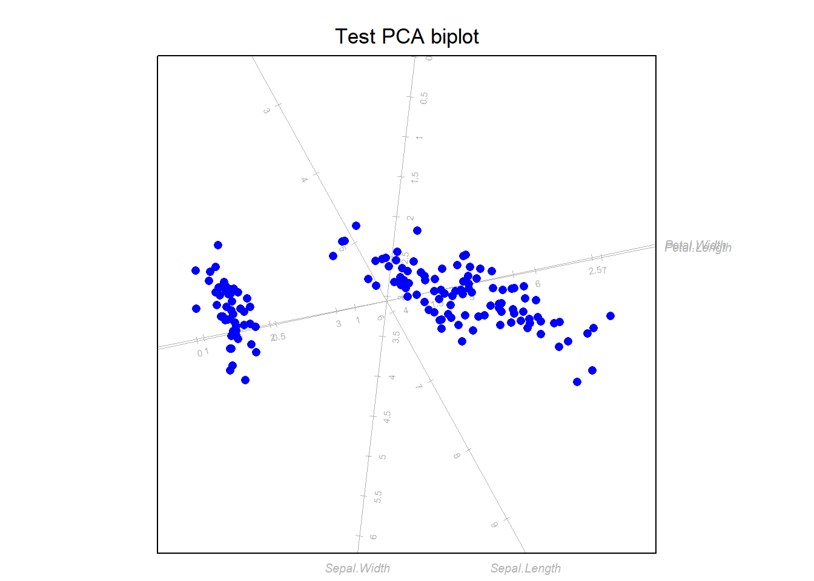
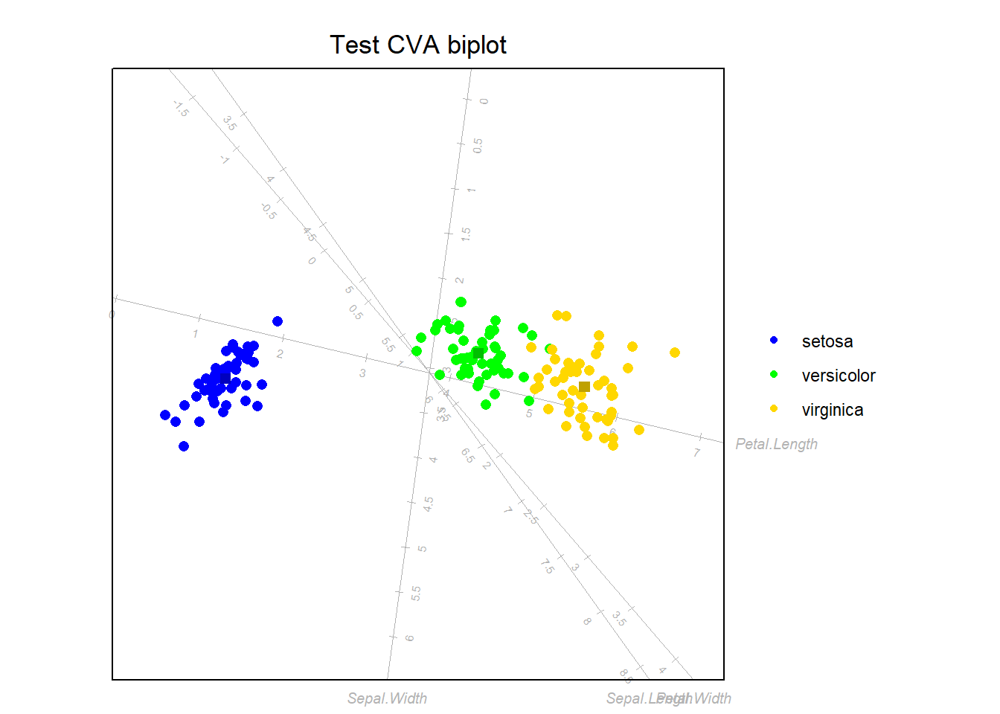
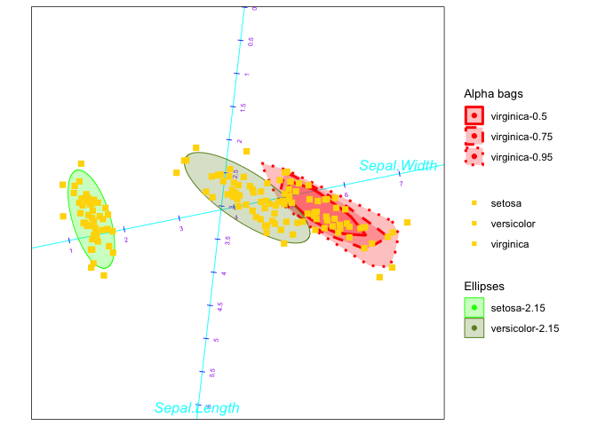
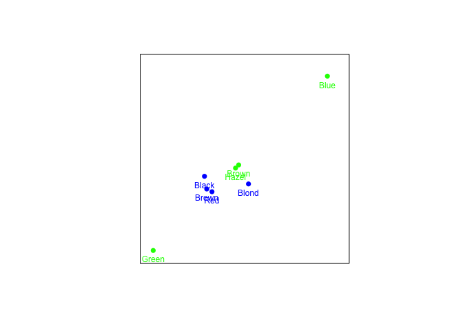
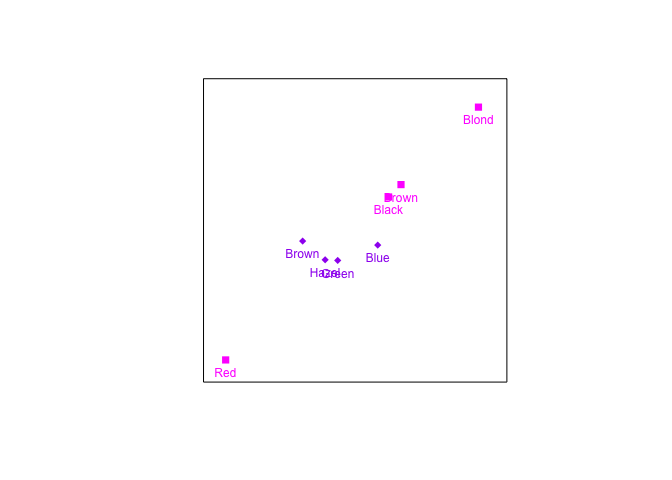
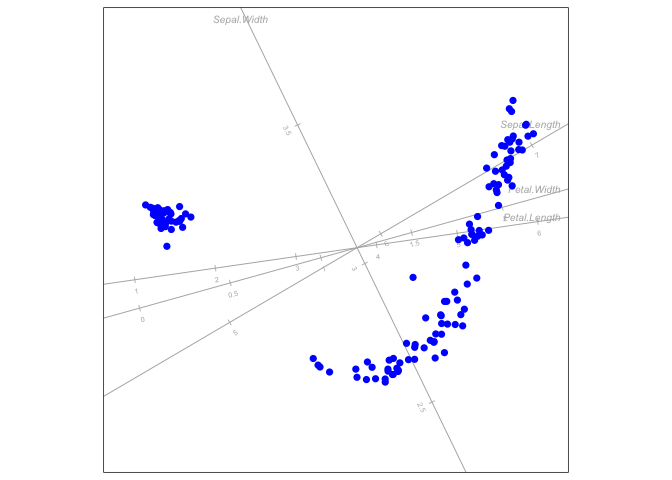

# biplotEZ

The goal of biplotEZ is to provide users an EZ-to-use platform for
visually representing their data with biplots. Currently, this package
includes principal component analysis (PCA) and canonical variate
analysis (CVA) biplots. This is accompanied by various formatting
options for the samples and axes. Alpha-bags and concentration ellipses
are included for visual enhancements and interpretation.

## Installation

You can install the development version of biplotEZ like this:

[`library`](https://rdrr.io/r/base/library.html)`(`[`devtools`](https://devtools.r-lib.org/)`)`` ``devtools``::`[`install_github`](https://devtools.r-lib.org/reference/install-deprecated.html)`(``"MuViSU/biplotEZ"``)`

## Example

This is a basic example which shows you how to construct a PCA biplot:

[`library`](https://rdrr.io/r/base/library.html)`(``biplotEZ``)`` `[`biplot`](reference/biplot.md)` ``(``iris``[``,``1``:``4``]``, Title``=``"Test PCA biplot"``)`` ``|>`` `[`PCA`](reference/PCA.md)`(``)`` ``|>`` `[`plot`](https://rdrr.io/r/graphics/plot.default.html)`(``)`

While the PCA biplot provides a visual representation of the overall
data set, optimally representing the variance in 1, 2 or 3 dimensions,
the CVA biplot aims to optimally separate specified groups in the data.
This is a basic example which shows you how to construct a CVA biplot:

[`biplot`](reference/biplot.md)` ``(``iris``[``,``1``:``4``]``, Title``=``"Test CVA biplot"``)`` ``|>`` `[`CVA`](reference/CVA.md)`(``classes``=``iris``[``,``5``]``)`` ``|>`` `[`plot`](https://rdrr.io/r/graphics/plot.default.html)`(``)`

An over-the-top example of changing all the formatting and adding all
the bells and whistles:

[`biplot`](reference/biplot.md)` ``(``iris``[``,``1``:``4``]``, group.aes``=``iris``[``,``5``]``)`` ``|>`` `[`PCA`](reference/PCA.md)`(``)`` ``|>`` `` `` `[`samples`](reference/samples.md)`(``col``=``"gold"``, pch``=``15``)`` ``|>`` `` `[`axes`](reference/axes.md)`(``which``=``2``:``3``, col``=``"cyan"``, label.cex``=``1.2``, tick.col``=``"blue"``, `` `` tick.label.col``=``"purple"``)`` ``|>`` `` `[`alpha.bags`](reference/alpha.bags.md)` ``(``alpha``=`[`c`](https://rdrr.io/r/base/c.html)`(``0.5``,``0.75``,``0.95``)``, which``=``3``, col``=``"red"``, lty``=``1``:``3``, lwd``=``3``)`` ``|>`` `` `[`ellipses`](reference/ellipses.md)`(``alpha``=``0.9``, which``=``1``:``2``, col``=`[`c`](https://rdrr.io/r/base/c.html)`(``"green"``,``"olivedrab"``)``)`` ``|>`` `` `[`legend.type`](reference/legend.type.md)`(``bags ``=`` ``TRUE``, ellipses``=``TRUE``)`` ``|>`` `` `[`plot`](https://rdrr.io/r/graphics/plot.default.html)`(``)`` ``#> Computing 0.5 -bag for virginica `` ``#> Computing 0.75 -bag for virginica `` ``#> Computing 0.95 -bag for virginica `` ``#> Computing 2.15 -ellipse for setosa `` ``#> Computing 2.15 -ellipse for versicolor`

## CA biplot

The default CA biplots represents row principal coordinates with a call
such as:

[`biplot`](reference/biplot.md)`(``HairEyeColor``[``,,``2``]``, center ``=`` ``FALSE``)`` ``|>`` `[`CA`](reference/CA.md)`(``)`` ``|>`` `[`plot`](https://rdrr.io/r/graphics/plot.default.html)`(``)`` ``#> Warning: The ggplot2 engine does not yet support CA maps; falling back to base graphics.`

To change to row standard coordinates use a call such as:

[`biplot`](reference/biplot.md)`(``HairEyeColor``[``,,``2``]``, center ``=`` ``FALSE``)`` ``|>`` `` `` `[`CA`](reference/CA.md)`(``variant ``=`` ``"Stand"``)`` ``|>`` `[`samples`](reference/samples.md)`(``col``=`[`c`](https://rdrr.io/r/base/c.html)`(``"magenta"``,``"purple"``)``, pch``=`[`c`](https://rdrr.io/r/base/c.html)`(``15``,``18``)``)`` ``|>`` `[`plot`](https://rdrr.io/r/graphics/plot.default.html)`(``)`` ``#> Warning: The ggplot2 engine does not yet support CA maps; falling back to base graphics.`

## Regression biplot

With the function `regress` linear regression biplot axes can be fitted
to a biplot

`out`` ``<-`` `[`biplot`](reference/biplot.md)`(``iris``)`` ``|>`` `[`PCO`](reference/PCO.md)`(``dist.func ``=`` ``sqrtManhattan``)`` `` `[`biplot`](reference/biplot.md)`(``iris``)`` ``|>`` `[`regress`](reference/regress.md)`(``out``$``Z``)`` ``|>`` `[`plot`](https://rdrr.io/r/graphics/plot.default.html)`(``)`

## Report Bugs and Support

If you encounter any issues or have questions, please open an issue on
the GitHub repository.
