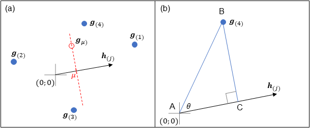

```{r, include = FALSE}
knitr::opts_chunk$set(
  collapse = TRUE,
  comment = "#>"
)
```

```{r setup, include=FALSE}
library(biplotEZ)
```

The package \pkg{biplotEZ} provides users with an *EZ*-to-use way of constructing multi-dimensional scatterplots of their data. The simplest form of a biplot is the principal component analysis (PCA) biplot which will be used for illustration in this vignette.

## 1. What is a PCA biplot
Consider a data matrix $\mathbf{X}^{*}:n \times p$ containing data on $n$ objects and $p$ variables. To produce a 2D biplot, we need to optimally approximate $\mathbf{X} = (\mathbf{I}_n-\frac{1}{n}\mathbf{11}')\mathbf{X}^{*}$ (typically of rank $p$ with $p<n$) with a rank $2$ matrix. In terms of the least squares error, we want to

$$
min \| \hat{\mathbf{X}}-\mathbf{X} \|^2
$$
where $rank(\hat{\mathbf{X}})=2$. It was shown by @EckartYoung1936 that if the singular value decomposition of $\mathbf{X} = \mathbf{UDV'}$ then
$$
\hat{\mathbf{X}} = \mathbf{UJDJV'}
$$
with 
$$
\mathbf{J} = \begin{bmatrix}
              \mathbf{I}_2 & \mathbf{0}\\
              \mathbf{0} & \mathbf{0}
             \end{bmatrix}
$$
essentially selecting only the first two columns of $\mathbf{U}$, the diagonal matrix of the first (largest) two singular values and the first two rows of $\mathbf{V}'$. Define 
$$
\mathbf{J}_2 = \begin{bmatrix}
                \mathbf{I}_2\\
                \mathbf{0}
               \end{bmatrix}
$$
then $\mathbf{J}_2\mathbf{J}_2' = \mathbf{J}$ and we can write $\hat{\mathbf{X}} = (\mathbf{UDJ}_2)(\mathbf{VJ}_2)'$.

@Gabriel1971 shows that any rank $2$ matrix can be written as
\begin{equation}
  \hat{\mathbf{X}} = \mathbf{G} \mathbf{H}' \tag{1}
\end{equation}
where $\mathbf{G}:n \times 2$ and $\mathbf{H}:p \times 2$.The $n$ rows of $\mathbf{G}$ provide the $n$ pairs of 2D coordinates 
representing the rows of $\hat{\mathbf{X}}$ and the $p$ rows of $\mathbf{H}$ provide the $p$ pairs of 2D coordinates representing 
the columns of $\hat{\mathbf{X}}$. Since $\hat{\mathbf{X}} = (\mathbf{UDJ}_2)(\mathbf{VJ}_2)'$, by setting $\mathbf{G}=\mathbf{UDJ}_2$ 
and $\mathbf{H}=\mathbf{VJ}_2$ we obtains the best least squares approximation of $\mathbf{X}$. @Gabriel1971 further shows that the 
approximation of distances between the rows are optimal, while the approximation of correlations by the cosines between the angles of 
the rows of $\mathbf{H}$ is sub-optimal.

The rows of $\mathbf{G}$ is plotted as points, representing the samples. The rows of $\mathbf{H}$ provide the directions of the axes 
for the variables. Since we have
$$
x^{*}_{ij}-\bar{x}_j = x_{ij} \approx \hat{x}_{ij} = \mathbf{g}_{(i)}'\mathbf{h}_{(j)}
$$
all the values that will predict $\mu$ for variable $j$ is of the form
$$
\mu = \mathbf{g}'_{\mu}\mathbf{h}_{(j)}
$$
which defines a straight line orthogonal to $\mathbf{h}_{(j)}$ in the biplot space (see the dotted red line in Figure 1(a)). To find 
the intersection of this prediction line with $\mathbf{h}_{(j)}$ we note that
$$
\mathbf{g}'_{(i)}\mathbf{h}_{(j)} = \| \mathbf{g}_{(i)} \|^2 \| \mathbf{h}_{(j)} \|^2 cos(\mathbf{g}_{(i)},\mathbf{h}_{(j)}) = 
\| \mathbf{p} \|^2 \| \mathbf{h}_{(j)} \|^2 
$$
where $\mathbf{p}$ is the length of the orthogonal projection of $\mathbf{g}_{(i)}$ on $\mathbf{h}_{(j)}$. This is illustrated in 
Figure 1(b) with triangle ABC: $cos(\theta) = \frac{AC}{AB}$ or $AC = AB cos(\theta)$ The length of $AC$, written as 
$\| \mathbf{p} \|^2$ is equal to the cosine times the length of $AB$, i.e. $cos(\mathbf{g}_{(i)},\mathbf{h}_{(j)}) \| \mathbf{g}_{(i)} \|^2$.

```{r out.width='100%', echo = FALSE, fig.cap="Figure 1: Calibration of biplot axes."}

```


Since $\mathbf{p}$ is along $\mathbf{h}_{(j)}$ we can write 
$\mathbf{p} = c\mathbf{h}_{(j)}$ and all points on the prediction line $\mu = \mathbf{g}'_{\mu}\mathbf{h}_{(j)}$ project on the 
same point $c_{\mu}\mathbf{h}_{(j)}$. We solve for $c_{\mu}$ from
$$
\mu = \mathbf{g}'_{\mu}\mathbf{h}_{(j)}=\| \mathbf{p} \|^2 \| \mathbf{h}_{(j)} \|^2 = 
\| c_{\mu}\mathbf{h}_{j} \|^2 \| \mathbf{h}_{(j)} \|^2 
$$

$$
c_{\mu} = \frac{\mu}{\mathbf{h}_{(j)}'\mathbf{h}_{(j)}}.
$$
If we select 'nice' scale markers $\tau_{1}, \tau_{2}, \cdots \tau_{k}$ for variable $j$, then $\tau_{h}-\bar{x}_j = \mu_{h}$ and positions of these scale markers on $\mathbf{h}_{(j)}$ are given by $p_{\mu_{1}}, p_{\mu_{2}}, \cdots p_{\mu_{k}}$ with
$$
p_{\mu_h} = c_{\mu_h}\mathbf{h}_{(j)} =  \frac{\mu_h}{\mathbf{h}_{(j)}'\mathbf{h}_{(j)}}\mathbf{h}_{(j)} \tag{2}
$$
To obtain a PCA biplot of the $48\times 4$ rock data in `R` we call

```{r, fig.height = 6, fig.width = 7}
biplot(rock, scale = TRUE) |> PCA() |> plot()
```

## 2. The function `biplot()`

The function `biplot()` takes a data set (usually) and outputs an object of class `biplot`. 

```{r, }
state.data <- data.frame (state.region, state.x77)
biplot(state.data)
```

Apart from specifying a data set, we can specify a single variable for classification purposes.

```{r, }
biplot(state.x77, classes=state.region)
```

If we want to use the variable `state.region` for formatting, say colour coding the samples according to region, we instead specify 
`grouping.aes` to indicate it pertains to the aesthetics, rather than data structure. We can include or exclude the aestethics variable 
from the data set.

```{r, }
biplot(state.x77, group.aes=state.region)
```

Next, we look at centring and scaling of the numeric data matrix. As we saw in section 1 above, PCA is computed from the centred data 
matrix. For most methods, centring is either required or has no effect on the methodology, therefore the default is `center = TRUE`. 
Since centring is usually assumed, you will get a warning message, should you explicitly choose to set `center = FALSE`. The default 
for `scaled` is `FALSE`, but often when variables are in different units of measurement, it is advisable to divide each variable by its 
standard deviation which is accomplished by setting `scale = TRUE'.

```{r, }
biplot(state.data)                 # centred, but no scaling
biplot(state.data, scale = TRUE)   # centered and scaled
biplot(state.data, center = FALSE) # no centring (usually not recommended) or scaling
```

The final optional argument to the function is specifying a title for your plot. We notice in the output above, that centring and / or scaling has no effect on the `print method`. It does however have an effect on the components of the object of class `biplot` in the output.

```{r, }
out <- biplot(state.data)                 # centred, but no scaling
out$center
out$scaled
out$means
out$sd
out <- biplot(state.data, scale = TRUE)   # centered and scaled
out$center
out$scaled
out$means
out$sd
out <- biplot(state.data, center = FALSE) # no centring (usually not recommended) or scaling
out$center
out$scaled
out$means
out$sd
```

Note that the components `means` and `sd` only contain the sample means and sample sds when either/or `center` and `scaled` is `TRUE`. For values of `FALSE`, these components contain zeros for the `means` and/or ones for the `sd` to ensure back transformation will not have any affect.

### 1.1 Using `biplot()` with `princomp()` or `prcomp()`

Should the user wish to construct a PCA biplot after performing principal component analysis via the built in functions in the `stats` package, the output from either of these functions can be piped into the biplot function, where the piping implies that the argument `data` now takes the value of an object of class `prcomp` or `princomp`.

```{r, }
princomp(state.x77) |> biplot()
out <- prcomp(state.x77, scale.=TRUE) |> biplot()
rbind (head(out$raw.X,3),tail(out$raw.X,3))
rbind (head(out$X,3),tail(out$X,3))
out$center
out$scaled
out$means
out$sd
```

## 3. The functions `PCA()`, `plot()` and `legend.type()` 

The first argument to the function `PCA()` is an object of class `biplot`, i.e. the output of the `biplot()` function. By default we construct a 2D biplot (argument `dim.biplot = 2`) of the first two principal components (argument `e.vects = 1:2`). The `group.aes` argument, if not specified in the function `biplot()`, allows a grouping argument for the sample aesthetics. A PCA biplot of the `state.x77` data with colouring according to `state.region` is obtained as follows:

```{r, fig.height = 6, fig.width = 7}
biplot(state.x77, scaled = T) |> 
  PCA(group.aes = state.region) |> plot()
```

The output of `PCA()` is an object of class `PCA` which inherits from the class `biplot`. Four additional components are present in the 
`PCA` object. The matrix `Z` contains the coordinates of the sample points, while the matrix `Vr` contains the "coordinates" for the 
variables. In the notation of equation (1), Z=$\mathbf{G}:n \times 2$ and Vr=$\mathbf{H}:p \times 2$. The component `Xhat` is the 
matrix $\hat{\mathbf{X}}$ on the left hand side of equation (1). The final component `ax.one.unit` contains as rows the expression in 
equation (2) with $\mu_h=1$, in other words, one unit in the positive direction of the biplot axis.

By piping the `PCA` class object (inheriting from class `biplot`) to the generic `plot()` function, the `plot.biplot()` function 
constructs the biplot on the graphical device. To add a legend to the biplot, we call

```{r, fig.height = 6, fig.width = 7}
biplot(state.x77, scaled = T) |> 
  PCA(group.aes = state.region) |> 
  legend.type(samples = TRUE) |> plot()
```

It was mentioned in section 1 that the default choice $\mathbf{G}=\mathbf{UDJ}_2$ and $\mathbf{H}=\mathbf{VJ}_2$ provides an exact
representation of the distances between the rows of $\mathbf{\hat{X}}$ which is an optimal approximation in the least squares sense 
of the distances between the rows of $\mathbf{X}$ (samples). Alternatively, the correlations between the variables (columns of $\mathbf{X}$)
can be optimally approximated by the cosines of the angles between the axes, leaving the approximation of the distances between the samples 
to be suboptimal. In this case $\mathbf{G}=\mathbf{UJ}_2$ and $\mathbf{H}=\mathbf{VDJ}_2$ and this biplot is obtained by setting the 
argument `correlation.biplot = TRUE`.

```{r, fig.height = 6, fig.width = 7}
biplot(state.x77, scaled = T) |> 
  PCA(group.aes = state.region, correlation.biplot = TRUE) |> 
  legend.type(samples = TRUE) |> plot()
```

## 4. The function `samples()`

This function controls the aesthetics of the sample points in the biplot. The function accepts as first argument an object of class 
`biplot` where the aesthetics should be applied. Let us first construct a PCA biplot of the `state.x77` data with samples coloured 
according to `state.division`. 

```{r, fig.height = 6, fig.width = 7}
biplot(state.x77, scaled = T) |> 
  PCA(group.aes = state.division) |> 
  legend.type(samples = TRUE) |> plot()
```

Since the legend interferes with the sample points, we choose to place the legend on a new page, by setting `new = TRUE` in the 
`legend.type` function. Furthermore, we wish to select colours, other than the defaults, for the divisions.

```{r, fig.height = 6, fig.width = 7}
biplot(state.x77, scaled = T) |> 
  PCA(group.aes = state.division) |> 
  samples (col = c("red", "darkorange", "gold", "chartreuse4", 
                   "green", "salmon", "magenta", "black", "blue")) |>
  legend.type(samples = TRUE, new = TRUE) |> plot()
```

Furthermore we want to use a different plotting character for the central regions.

```{r, }
levels (state.division)
```
We want to use `pch = 15` for the first three and final two divisions and `pch = 1` for the remaining four divisions.

```{r, fig.height = 6, fig.width = 7}
biplot(state.x77, scaled = T) |> 
  PCA(group.aes = state.division) |> 
  samples (col = c("red", "darkorange", "gold", "chartreuse4", 
                   "green", "salmon", "magenta", "black", "blue"),
           pch = c(15, 15, 15, 1, 1, 1, 1, 15, 15)) |>
  legend.type(samples = TRUE, new = TRUE) |> plot()
```

To increase the size of the plotting characters of the eastern states, we add the following:

```{r, fig.height = 6, fig.width = 7}
biplot(state.x77, scaled = T) |> 
  PCA(group.aes = state.division) |> 
  samples (col = c("red", "darkorange", "gold", "chartreuse4", 
                   "green", "salmon", "magenta", "black", "blue"),
           pch = c(15, 15, 15, 1, 1, 1, 1, 15, 15),
           cex = c(rep(1.5,4), c(1,1.5,1,1.5))) |>
  legend.type(samples = TRUE, new = TRUE) |> plot()
```

If we choose to only show the samples for the central states, the argument `which`  is used either indicating the number(s) in the 
sequence of levels (`which = 4:7`), or as shown below, the levels themselves:

```{r, fig.height = 6, fig.width = 7}
biplot(state.x77, scaled = T) |> 
  PCA(group.aes = state.division) |> 
  samples (col = c("red", "darkorange", "gold", "chartreuse4", 
                   "green", "salmon", "magenta", "black", "blue"),
           which = c("West North Central", "West South Central", "East South Central", 
                     "East North Central")) |>
  legend.type(samples = TRUE, new = TRUE) |> plot()
```

Note that since four regions are selected, the colour (and other aesthetics) is applied to these regions in the order they are 
specified in `which`. To add the sample names, the `label` argument is set to `TRUE`. For large sample sizes, this is not 
recommended, as overplotting will render the plot unusable. The size of the labels is controlled with `label.cex` which can be 
specified either as a single value (for all samples) or a vector indicating size values for each individual sample.

```{r, fig.height = 6, fig.width = 7}
biplot(state.x77, scaled = T) |> PCA() |> 
  samples (label = TRUE) |> plot()
```

We can use the arguments `label.cex`, `label.side` and `label.offset` to make the plot more legible with a little effort.

```{r, fig.height = 6, fig.width = 7}
rownames(state.x77)[match(c("Pennsylvania", "New Jersey", "Massachusetts",
                            "Minnesota"), rownames(state.x77))] <- c("PA", "NJ", "MA", "MN")
above <- match(c("Alaska", "California", "Texas", "New York", "Nevada", "Georgia", "Alabama",
                 "North Carolina", "Colorado", "Washington", "Illinois", "Michigan", "Arizon",
                 "Florida", "Ohio", "NJ", "Kansas"), rownames(state.x77))
right.side <- match(c("South Carolina", "Kentucky", "Rhode Island", "New Hampshire", "Virginia",
                      "Missouri", "Delaware", "Hawaii", "Oregon", "PA", "Nebraska", "Montana",
                      "Maryland", "Indiana", "Idaho"), rownames(state.x77))
left.side <- match(c("Wyoming", "Iowa", "MN", "Connecticut"), rownames(state.x77))
label.offset <- rep(0.3, nrow(state.x77))
label.offset[match(c("Colorado", "Kansas", "Idaho"), rownames(state.x77))] <- c(0.8, 0.5, 0.8)
label.side <- rep("bottom", nrow(state.x77))
label.side[above] <- "top"
label.side[right.side] <- "right"
label.side[left.side] <- "left"
biplot (state.x77, scaled=TRUE) |> PCA() |>
  samples (label=TRUE, label.cex=0.6, label.side=label.side, label.offset=label.offset) |>
  plot()
```

We can also make use of the functionality of the `ggrepel` package to place the labels.

```{r, fig.height = 6, fig.width = 7}
biplot(state.x77, scaled = T) |> PCA() |> 
  samples (label = "ggrepel", label.cex=0.65) |> plot()
```

## 4. The function `axes()`

Similar to the `samples()` function, this function allows for changing the aestethics of the biplot axes. The first argument to 
`axes()` is an object of class `biplot`. The `X.names` argument is typically not specified by the user, but is required for the 
function to allow specifying which axes to display in the `which` argument, by either speficying the column numbers of \mathbf{X} 
or the column names. The arguments `col`, `lwd` and `lty` pertains to the axes themselves and can be specified either as a scaler 
value (to be recycled) or a vector with length equal to that of `which`.

To construct a PCA biplot of the rock data, displaying only the axes for peri and shape with different colours for the two axes, 
different line widths and line type 2, we need to following code:

```{r, fig.height = 6, fig.width = 7}
biplot(rock, scaled = TRUE) |> PCA() |> 
                               axes(which = c("shape","peri"), 
                                    col=c("lightskyblue","slategrey"),
                                    lwd = c(1,2), lty=2) |>
                plot()
```

The following four arguments deal with the axis labels. The argument `label.dir` is based on the graphics parameter `las` and 
allows for labels to be either orthogonal to the axis direction (`Orthog`), horisontal (`Hor`) or parallel to the plot `Paral`. The 
argument `label.line` fulfill the role of the `line` argument in `mtext()` to determine on which margin line (how far from the plot) 
the label is placed while `label.col` and `label.cex` is self-explanatory and defaults to the axis colour. Note in the code below 
that the colour vector has only three components, so that recycling is applied.

```{r, fig.height = 6, fig.width = 7}
biplot(rock, scaled = TRUE) |> PCA() |> 
                               axes(col=c("lightskyblue","slategrey","blue"),
                                    label.dir="Hor", label.line=c(0,0.5,1,1.5)) |>
                                    plot()
```

The function `pretty()` finds 'nice' tick marks where the value specified in the argument `ticks` determine the **desired** number 
of tick marks, although the observed number could be different. The other `tick.*` arguments are similar to their naming counterparts 
in `par()` or `text()`. Since the tick labels are important to follow the direction of increasing values of the axes, setting 
`tick.label = FALSE` does not remove the tick marks completely, but limits the labels to the smallest and largest value visible in 
the plot. If the user would like to specify alternative names for the axes, this can be done in the argument `ax.names`. 

```{r, fig.height = 6, fig.width = 7}
biplot(rock, scaled = TRUE) |> PCA() |> 
                               axes(label.dir="Paral",
                                    ticks = c(3, 5, 5, 10), tick.label=c(F, F, T, T),
                                    ax.names = c("area", "perimeter", "shape", 
                                                 "permeability in milli-Darcies")) |>
                               plot()
```

## 5. The function `alpha.bags()`

An alpha-bag encloses the $\alpha100\%$ inner data points in a cloud of points. It is based on the concept of halfspace location depth as defined 
by  @Tukey1975. @RousseeuwRutsTukey1999 generalised a boxplot to a two-dimensional bagplot where the box is replaced by a bag containing 
the inner $50\%$ of the observations. @UB2011 replaces the $50$-bag contour by a general $\alpha100\%$ contour referred to as an alpha-bag.

When the number of samples in the biplot is larger, it becomes difficult to isolate individual observations. Often, when a grouping 
variable is present, the interest is not so much in the indivdiual samples, but rather in the location and spread of the groups. In the 
plot below, we enclose each centrury's number of sunspots by a $95\%$-bag where the months are used as 12 different variables for
each year (sample point). Note that the legend displays the alpha-bags while `samples = FALSE` is left as the default. Both can be displayed,
but since the alpha-bags' colour defaults to the colour of the sample points, both are not necessary here.

```{r, fig.height = 6, fig.width = 7}
sunspots <- matrix (sunspot.month[1:(264*12)], ncol = 12, byrow = TRUE)
years <- 1749:2012
rownames(sunspots) <- years
colnames(sunspots) <- c("Jan", "Feb", "Mar", "Apr", "May", "Jun",
                        "Jul", "Aug", "Sep", "Oct", "Nov", "Dec")
century <-floor((years-1)/100)+1
biplot(sunspots, group.aes=century) |> PCA() |>
        axes (label.dir = "Hor", label.line = c(0.8, rep(0,10), 0.8)) |>
        alpha.bags () |> 
        legend.type(bags = TRUE) |> plot()
```


## References
